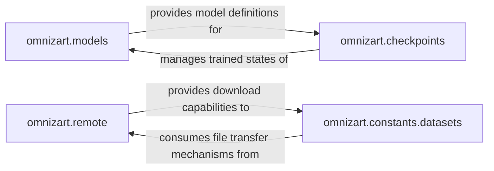

## Details

The `omnizart` architecture for music information retrieval is structured around distinct, interacting components. At its foundation, the `omnizart.models` component defines the neural network architectures, serving as the blueprint for all deep learning models. Complementing this, `omnizart.checkpoints` handles the persistence and retrieval of trained model states, effectively managing the lifecycle of models defined by `omnizart.models`. For data provisioning, `omnizart.constants.datasets` is responsible for dataset acquisition and preparation, critically depending on `omnizart.remote` for secure and efficient file downloads from external sources. This modular design ensures clear responsibilities, enabling robust model development, deployment, and data management within the `omnizart` ecosystem.

### omnizart.models
This component is the core of neural network architecture definition. It encapsulates the design and implementation of various deep learning models used for music information retrieval tasks, including their layers, internal structures, and forward pass logic.

**Related Classes/Methods**:

- <a href="https://github.com/Music-and-Culture-Technology-Lab/omnizart/blob/master/omnizart/models" target="_blank" rel="noopener noreferrer">`omnizart.models`</a>
- <a href="https://github.com/Music-and-Culture-Technology-Lab/omnizart/blob/master/omnizart/models/chord_model.py" target="_blank" rel="noopener noreferrer">`omnizart.models.chord_model`</a>

### omnizart.checkpoints
Manages the persistence and retrieval of trained model states. This component is crucial for saving models after training and loading them for inference, fine-tuning, or transfer learning, ensuring model reusability and deployment.

**Related Classes/Methods**:

- <a href="https://github.com/Music-and-Culture-Technology-Lab/omnizart/blob/master/omnizart/checkpoints" target="_blank" rel="noopener noreferrer">`omnizart.checkpoints`</a>

### omnizart.remote
Provides robust and secure utilities for downloading files from remote sources, particularly large files from platforms like Google Drive. It handles the technical aspects of file transfer, progress tracking, and error management.

**Related Classes/Methods**:

- <a href="https://github.com/Music-and-Culture-Technology-Lab/omnizart/blob/master/omnizart/remote" target="_blank" rel="noopener noreferrer">`omnizart.remote`</a>

### omnizart.constants.datasets
Specializes in the acquisition and initial preparation of datasets required for training and evaluating Omnizart's models. It acts as a client for the `omnizart.remote` component, ensuring datasets are correctly downloaded, organized, and verified.

**Related Classes/Methods**:

- <a href="https://github.com/Music-and-Culture-Technology-Lab/omnizart/blob/master/omnizart/constants/datasets.py" target="_blank" rel="noopener noreferrer">`omnizart.constants.datasets`</a>

### [FAQ](https://github.com/CodeBoarding/GeneratedOnBoardings/tree/main?tab=readme-ov-file#faq)