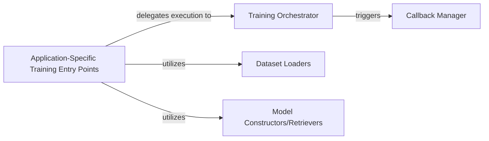

## Details

The Training Engine subsystem in omnizart is responsible for orchestrating the entire machine learning model training lifecycle. It encompasses components for dataset iteration, model optimization, loss calculation, and progress monitoring, all while utilizing defined model architectures and providing extensibility through callbacks.

### Training Orchestrator
Manages the overall training loop, including epoch progression, step execution, loss calculation, and optimization. It acts as the central coordinator for the training process.

**Related Classes/Methods**:

- <a href="https://github.com/Music-and-Culture-Technology-Lab/omnizart/blob/master/omnizart/train.py#L1-L100" target="_blank" rel="noopener noreferrer">`omnizart.train:train_epochs`:1-100</a>
- <a href="https://github.com/Music-and-Culture-Technology-Lab/omnizart/blob/master/omnizart/train.py#L1-L100" target="_blank" rel="noopener noreferrer">`omnizart.train:train_steps`:1-100</a>
- <a href="https://github.com/Music-and-Culture-Technology-Lab/omnizart/blob/master/omnizart/train.py#L1-L100" target="_blank" rel="noopener noreferrer">`omnizart.train:execute_callbacks`:1-100</a>
- <a href="https://github.com/Music-and-Culture-Technology-Lab/omnizart/blob/master/omnizart/train.py#L1-L100" target="_blank" rel="noopener noreferrer">`omnizart.train:gen_bar_postfix`:1-100</a>

### Callback Manager
Provides a flexible mechanism to execute custom logic at specific points during training, such as saving models, logging metrics, or adjusting learning rates.

**Related Classes/Methods**:

- <a href="https://github.com/Music-and-Culture-Technology-Lab/omnizart/blob/master/omnizart/callbacks.py#L1-L100" target="_blank" rel="noopener noreferrer">`omnizart.callbacks:on_epoch_end`:1-100</a>
- <a href="https://github.com/Music-and-Culture-Technology-Lab/omnizart/blob/master/omnizart/callbacks.py#L1-L100" target="_blank" rel="noopener noreferrer">`omnizart.callbacks:_save_model`:1-100</a>
- <a href="https://github.com/Music-and-Culture-Technology-Lab/omnizart/blob/master/omnizart/callbacks.py#L1-L100" target="_blank" rel="noopener noreferrer">`omnizart.callbacks:_get_monitor_value`:1-100</a>
- <a href="https://github.com/Music-and-Culture-Technology-Lab/omnizart/blob/master/omnizart/callbacks.py#L1-L100" target="_blank" rel="noopener noreferrer">`omnizart.callbacks:_ensure_path_exists`:1-100</a>

### Application-Specific Training Entry Points
Serve as the initializers for training a particular model type. They are responsible for setting up the specific model architecture and preparing the corresponding dataset for a given MIR task.

**Related Classes/Methods**:

- <a href="https://github.com/Music-and-Culture-Technology-Lab/omnizart/blob/master/omnizart/beat/app.py#L1-L100" target="_blank" rel="noopener noreferrer">`omnizart.beat.app:train`:1-100</a>
- <a href="https://github.com/Music-and-Culture-Technology-Lab/omnizart/blob/master/omnizart/chord/app.py#L1-L100" target="_blank" rel="noopener noreferrer">`omnizart.chord.app:train`:1-100</a>
- <a href="https://github.com/Music-and-Culture-Technology-Lab/omnizart/blob/master/omnizart/drum/app.py#L1-L100" target="_blank" rel="noopener noreferrer">`omnizart.drum.app:train`:1-100</a>
- <a href="https://github.com/Music-and-Culture-Technology-Lab/omnizart/blob/master/omnizart/music/app.py#L1-L100" target="_blank" rel="noopener noreferrer">`omnizart.music.app:train`:1-100</a>
- <a href="https://github.com/Music-and-Culture-Technology-Lab/omnizart/blob/master/omnizart/patch_cnn/app.py#L1-L100" target="_blank" rel="noopener noreferrer">`omnizart.patch_cnn.app:train`:1-100</a>
- <a href="https://github.com/Music-and-Culture-Technology-Lab/omnizart/blob/master/omnizart/vocal/app.py#L1-L100" target="_blank" rel="noopener noreferrer">`omnizart.vocal.app:train`:1-100</a>
- <a href="https://github.com/Music-and-Culture-Technology-Lab/omnizart/blob/master/omnizart/vocal_contour/app.py#L1-L100" target="_blank" rel="noopener noreferrer">`omnizart.vocal_contour.app:train`:1-100</a>

### Dataset Loaders
Abstract the process of loading, preprocessing, and providing training and validation datasets in a format suitable for the models. Each application has its specific dataset loader.

**Related Classes/Methods**:

- <a href="https://github.com/Music-and-Culture-Technology-Lab/omnizart/blob/master/omnizart/beat/app.py#L1-L100" target="_blank" rel="noopener noreferrer">`omnizart.beat.app:BeatDatasetLoader`:1-100</a>
- <a href="https://github.com/Music-and-Culture-Technology-Lab/omnizart/blob/master/omnizart/chord/app.py#L1-L100" target="_blank" rel="noopener noreferrer">`omnizart.chord.app:McGillDatasetLoader`:1-100</a>
- <a href="https://github.com/Music-and-Culture-Technology-Lab/omnizart/blob/master/omnizart/drum/app.py#L1-L100" target="_blank" rel="noopener noreferrer">`omnizart.drum.app:PopDatasetLoader`:1-100</a>
- <a href="https://github.com/Music-and-Culture-Technology-Lab/omnizart/blob/master/omnizart/music/app.py#L1-L100" target="_blank" rel="noopener noreferrer">`omnizart.music.app:MusicDatasetLoader`:1-100</a>
- <a href="https://github.com/Music-and-Culture-Technology-Lab/omnizart/blob/master/omnizart/patch_cnn/app.py#L1-L100" target="_blank" rel="noopener noreferrer">`omnizart.patch_cnn.app:PatchCNNDatasetLoader`:1-100</a>
- <a href="https://github.com/Music-and-Culture-Technology-Lab/omnizart/blob/master/omnizart/vocal/app.py#L1-L100" target="_blank" rel="noopener noreferrer">`omnizart.vocal.app:VocalDatasetLoader`:1-100</a>
- <a href="https://github.com/Music-and-Culture-Technology-Lab/omnizart/blob/master/omnizart/vocal_contour/app.py#L1-L100" target="_blank" rel="noopener noreferrer">`omnizart.vocal_contour.app:VocalContourDatasetLoader`:1-100</a>

### Model Constructors/Retrievers
Define or load the specific neural network architecture that will be trained for a given task.

**Related Classes/Methods**:

- <a href="https://github.com/Music-and-Culture-Technology-Lab/omnizart/blob/master/omnizart/beat/app.py#L1-L100" target="_blank" rel="noopener noreferrer">`omnizart.beat.app:_construct_blstm_model`:1-100</a>
- <a href="https://github.com/Music-and-Culture-Technology-Lab/omnizart/blob/master/omnizart/beat/app.py#L1-L100" target="_blank" rel="noopener noreferrer">`omnizart.beat.app:_construct_blstm_attn_model`:1-100</a>
- <a href="https://github.com/Music-and-Culture-Technology-Lab/omnizart/blob/master/omnizart/chord/app.py#L1-L100" target="_blank" rel="noopener noreferrer">`omnizart.chord.app:get_model`:1-100</a>
- <a href="https://github.com/Music-and-Culture-Technology-Lab/omnizart/blob/master/omnizart/vocal/app.py#L1-L100" target="_blank" rel="noopener noreferrer">`omnizart.vocal.app:get_model`:1-100</a>

### [FAQ](https://github.com/CodeBoarding/GeneratedOnBoardings/tree/main?tab=readme-ov-file#faq)