```mermaid
graph LR
    CLI_Orchestrator["CLI Orchestrator"]
    Data_Preparation_Feature_Extraction["Data Preparation & Feature Extraction"]
    Model_Management["Model Management"]
    Training_Engine["Training Engine"]
    Inference_Post_processing["Inference & Post-processing"]
    Configuration_Utilities["Configuration & Utilities"]
    CLI_Orchestrator -- "Initiates data loading & feature generation" --> Data_Preparation_Feature_Extraction
    CLI_Orchestrator -- "Triggers model training workflow" --> Training_Engine
    CLI_Orchestrator -- "Initiates transcription process" --> Inference_Post_processing
    Data_Preparation_Feature_Extraction -- "Supplies prepared datasets & features" --> Training_Engine
    Data_Preparation_Feature_Extraction -- "Provides features for prediction" --> Inference_Post_processing
    Model_Management -- "Provides model architectures" --> Training_Engine
    Model_Management -- "Supplies pre-trained models" --> Inference_Post_processing
    Training_Engine -- "Saves trained model checkpoints" --> Model_Management
    Inference_Post_processing -- "Returns transcription results" --> CLI_Orchestrator
    Configuration_Utilities -- "Provides configuration settings" --> CLI_Orchestrator
    Configuration_Utilities -- "Provides configuration settings" --> Data_Preparation_Feature_Extraction
    Configuration_Utilities -- "Provides configuration settings" --> Model_Management
    Configuration_Utilities -- "Provides configuration settings" --> Training_Engine
    Configuration_Utilities -- "Provides configuration settings" --> Inference_Post_processing
    Model_Management -- "Downloads raw datasets" --> Data_Preparation_Feature_Extraction
    click CLI_Orchestrator href "https://github.com/CodeBoarding/GeneratedOnBoardings/blob/main/omnizart/CLI_Orchestrator.md" "Details"
    click Data_Preparation_Feature_Extraction href "https://github.com/CodeBoarding/GeneratedOnBoardings/blob/main/omnizart/Data_Preparation_Feature_Extraction.md" "Details"
    click Model_Management href "https://github.com/CodeBoarding/GeneratedOnBoardings/blob/main/omnizart/Model_Management.md" "Details"
    click Training_Engine href "https://github.com/CodeBoarding/GeneratedOnBoardings/blob/main/omnizart/Training_Engine.md" "Details"
    click Inference_Post_processing href "https://github.com/CodeBoarding/GeneratedOnBoardings/blob/main/omnizart/Inference_Post_processing.md" "Details"
    click Configuration_Utilities href "https://github.com/CodeBoarding/GeneratedOnBoardings/blob/main/omnizart/Configuration_Utilities.md" "Details"
```

## Details

The Omnizart project is structured around a clear separation of concerns, facilitating a modular and extensible design for music transcription tasks. The CLI Orchestrator serves as the central entry point, managing user interactions and directing the overall workflow. It initiates processes such as data preparation, model training, and inference. The Data Preparation & Feature Extraction component is responsible for transforming raw audio into suitable features and labels for machine learning, supplying these to both the Training Engine and Inference & Post-processing components. The Model Management component handles the definition, storage, and retrieval of neural network models, providing architectures to the Training Engine and pre-trained models for inference. The Training Engine orchestrates the model training lifecycle, saving trained models back to Model Management. Finally, the Inference & Post-processing component takes model outputs and refines them into structured, human-readable musical transcriptions, which are then returned to the CLI Orchestrator. A pervasive Configuration & Utilities component provides essential settings and helper functions across all major components, ensuring consistent behavior and parameter management. This architecture promotes a clear data flow, from initial user command and data ingestion, through model training and inference, to the final output of musical transcriptions.

### CLI Orchestrator [[Expand]](./CLI_Orchestrator.md)
The primary user interface and control hub, responsible for initiating and coordinating all major operations (feature generation, training, transcription). It acts as the central orchestrator for various workflows.

**Related Classes/Methods**:

- <a href="https://github.com/Music-and-Culture-Technology-Lab/omnizart/blob/master/omnizart/cli/cli.py" target="_blank" rel="noopener noreferrer">`omnizart.cli.cli`</a>
- <a href="https://github.com/Music-and-Culture-Technology-Lab/omnizart/blob/master/omnizart/cli/beat/generate_feature.py" target="_blank" rel="noopener noreferrer">`omnizart.cli.beat.generate_feature`</a>
- <a href="https://github.com/Music-and-Culture-Technology-Lab/omnizart/blob/master/omnizart/cli/beat/train_model.py" target="_blank" rel="noopener noreferrer">`omnizart.cli.beat.train_model`</a>
- <a href="https://github.com/Music-and-Culture-Technology-Lab/omnizart/blob/master/omnizart/cli/beat/transcribe.py" target="_blank" rel="noopener noreferrer">`omnizart.cli.beat.transcribe`</a>

### Data Preparation & Feature Extraction [[Expand]](./Data_Preparation_Feature_Extraction.md)
Handles the loading of raw audio files, performs initial signal preprocessing, extracts various domain-specific musical features, and processes ground truth labels to prepare datasets for machine learning tasks.

**Related Classes/Methods**:

- <a href="https://github.com/Music-and-Culture-Technology-Lab/omnizart/blob/master/omnizart/io.py" target="_blank" rel="noopener noreferrer">`omnizart.io`</a>
- <a href="https://github.com/Music-and-Culture-Technology-Lab/omnizart/blob/master/omnizart/beat/features.py" target="_blank" rel="noopener noreferrer">`omnizart.beat.features`</a>
- <a href="https://github.com/Music-and-Culture-Technology-Lab/omnizart/blob/master/omnizart/constants/datasets.py" target="_blank" rel="noopener noreferrer">`omnizart.constants.datasets`</a>

### Model Management [[Expand]](./Model_Management.md)
Encapsulates the definition of neural network architectures, the storage and retrieval of pre-trained models (checkpoints), and the secure downloading of models and datasets from remote sources.

**Related Classes/Methods**:

- <a href="https://github.com/Music-and-Culture-Technology-Lab/omnizart/blob/master/omnizart/models/chord_model.py" target="_blank" rel="noopener noreferrer">`omnizart.models.chord_model`</a>
- <a href="https://github.com/Music-and-Culture-Technology-Lab/omnizart/blob/master/omnizart/checkpoints" target="_blank" rel="noopener noreferrer">`omnizart.checkpoints`</a>
- <a href="https://github.com/Music-and-Culture-Technology-Lab/omnizart/blob/master/omnizart/remote.py" target="_blank" rel="noopener noreferrer">`omnizart.remote`</a>

### Training Engine [[Expand]](./Training_Engine.md)
Manages the entire machine learning model training lifecycle, including dataset iteration, optimization, loss calculation, and progress monitoring, utilizing defined model architectures.

**Related Classes/Methods**:

- <a href="https://github.com/Music-and-Culture-Technology-Lab/omnizart/blob/master/omnizart/train.py" target="_blank" rel="noopener noreferrer">`omnizart.train`</a>
- <a href="https://github.com/Music-and-Culture-Technology-Lab/omnizart/blob/master/omnizart/callbacks.py" target="_blank" rel="noopener noreferrer">`omnizart.callbacks`</a>

### Inference & Post-processing [[Expand]](./Inference_Post_processing.md)
Takes the raw outputs from trained models and transforms them into structured, human-readable musical representations (e.g., MIDI notes, chord sequences, beat timings) through domain-specific post-processing algorithms.

**Related Classes/Methods**:

- <a href="https://github.com/Music-and-Culture-Technology-Lab/omnizart/blob/master/omnizart/beat/inference.py" target="_blank" rel="noopener noreferrer">`omnizart.beat.inference`</a>
- <a href="https://github.com/Music-and-Culture-Technology-Lab/omnizart/blob/master/omnizart/beat/prediction.py" target="_blank" rel="noopener noreferrer">`omnizart.beat.prediction`</a>
- <a href="https://github.com/Music-and-Culture-Technology-Lab/omnizart/blob/master/omnizart/base.py" target="_blank" rel="noopener noreferrer">`omnizart.base`</a>

### Configuration & Utilities [[Expand]](./Configuration_Utilities.md)
Provides centralized management for project-wide and domain-specific settings, parameters, and common helper functions used across various components.

**Related Classes/Methods**:

- <a href="https://github.com/Music-and-Culture-Technology-Lab/omnizart/blob/master/omnizart/setting_loaders.py" target="_blank" rel="noopener noreferrer">`omnizart.setting_loaders`</a>
- <a href="https://github.com/Music-and-Culture-Technology-Lab/omnizart/blob/master/omnizart/utils.py" target="_blank" rel="noopener noreferrer">`omnizart.utils`</a>
- <a href="https://github.com/Music-and-Culture-Technology-Lab/omnizart/blob/master/omnizart/cli/common_options.py" target="_blank" rel="noopener noreferrer">`omnizart.cli.common_options`</a>

### [FAQ](https://github.com/CodeBoarding/GeneratedOnBoardings/tree/main?tab=readme-ov-file#faq)