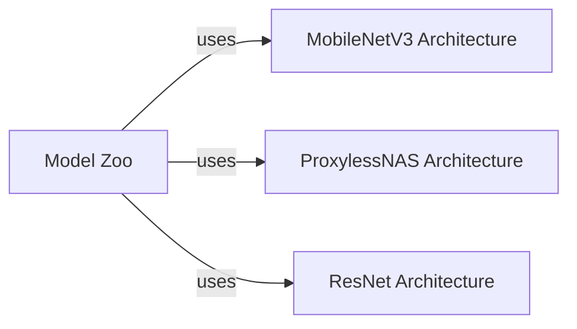

## Details

The `Base Network & Model Zoo` subsystem encompasses the foundational neural network architectures and a centralized repository for pre-trained models.

### MobileNetV3 Architecture
Encapsulates the definition and construction logic for the MobileNetV3 neural network architecture. It provides the blueprint for creating MobileNetV3 models, which are known for their efficiency on mobile and embedded devices.

**Related Classes/Methods**:

- <a href="https://github.com/mit-han-lab/once-for-all/blob/master/ofa/imagenet_classification/networks/mobilenet_v3.py" target="_blank" rel="noopener noreferrer">`mobilenet_v3`</a>

### ProxylessNAS Architecture
Defines the ProxylessNAS network architecture, a neural architecture search (NAS) derived model. This component provides the configurable structure for building ProxylessNAS models, often optimized for specific hardware constraints.

**Related Classes/Methods**:

- <a href="https://github.com/mit-han-lab/once-for-all/blob/master/ofa/imagenet_classification/networks/proxyless_nets.py" target="_blank" rel="noopener noreferrer">`proxyless_nets`</a>

### ResNet Architecture
Implements the ResNet (Residual Network) architecture, a widely used deep convolutional neural network known for its strong performance in image recognition tasks. This component provides the foundational structure for various ResNet variants.

**Related Classes/Methods**:

- <a href="https://github.com/mit-han-lab/once-for-all/blob/master/ofa/imagenet_classification/elastic_nn/networks/ofa_resnets.py#L17-L346" target="_blank" rel="noopener noreferrer">`resnets`:17-346</a>

### Model Zoo [[Expand]](./Model_Zoo.md)
Serves as a centralized factory and repository for pre-trained models. It provides methods to load and retrieve instances of various network architectures (e.g., MobileNetV3, ProxylessNAS, ResNet) that have been pre-trained, often for specific hardware targets or tasks. This component abstracts the loading mechanism for users.

**Related Classes/Methods**:

- <a href="https://github.com/mit-han-lab/once-for-all/blob/master/ofa/model_zoo.py" target="_blank" rel="noopener noreferrer">`model_zoo`</a>

### [FAQ](https://github.com/CodeBoarding/GeneratedOnBoardings/tree/main?tab=readme-ov-file#faq)