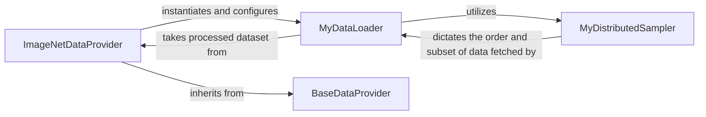

## Details

The Data Provisioning Module is a critical subsystem responsible for managing the entire data pipeline, from loading and preprocessing to augmentation and efficient delivery of large-scale image datasets like ImageNet. It ensures data is correctly formatted and accessible for both supernet training and subnet evaluation, adapting to dynamic input requirements.

### ImageNetDataProvider
Acts as the primary orchestrator for ImageNet data. It handles dataset-specific loading, applies necessary preprocessing and augmentation techniques (e.g., normalization, resizing), and provides structured access to training and validation subsets. It is critical for adapting image sizes based on active configurations, directly supporting the "Once-for-All" model's dynamic input requirements.

**Related Classes/Methods**:

- <a href="https://github.com/mit-han-lab/once-for-all/blob/master/ofa/imagenet_classification/data_providers/imagenet.py#L19-L310" target="_blank" rel="noopener noreferrer">`ImageNetDataProvider`:19-310</a>

### MyDataLoader
Responsible for the efficient creation of mini-batches from datasets. It provides an iterable interface for consumption by training and evaluation loops and manages parallel data loading through worker processes, mitigating I/O bottlenecks during intensive model training.

**Related Classes/Methods**:

- <a href="https://github.com/mit-han-lab/once-for-all/blob/master/ofa/utils/my_dataloader/my_data_loader.py#L67-L371" target="_blank" rel="noopener noreferrer">`MyDataLoader`:67-371</a>

### BaseDataProvider
Serves as an abstract base class, establishing a consistent interface for all data providers within the system. This promotes modularity, reusability, and extensibility, allowing for seamless integration of future datasets.

**Related Classes/Methods**:

- <a href="https://github.com/mit-han-lab/once-for-all/blob/master/ofa/imagenet_classification/data_providers/base_provider.py" target="_blank" rel="noopener noreferrer">`BaseDataProvider`</a>

### MyDistributedSampler
Essential for distributed training setups, ensuring that each participating process receives a unique and non-overlapping subset of the dataset. This guarantees correctness and efficiency in parallel training environments.

**Related Classes/Methods**:

- <a href="https://github.com/mit-han-lab/once-for-all/blob/master/ofa/utils/my_dataloader/my_distributed_sampler.py#L8-L38" target="_blank" rel="noopener noreferrer">`MyDistributedSampler`:8-38</a>

### [FAQ](https://github.com/CodeBoarding/GeneratedOnBoardings/tree/main?tab=readme-ov-file#faq)