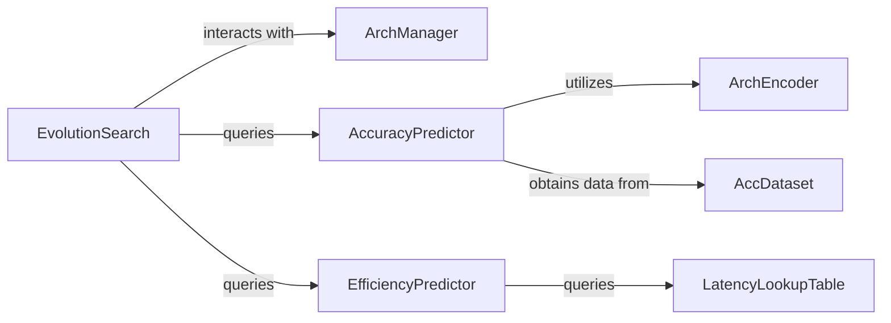

## Details

The Neural Architecture Search (NAS) Engine subsystem is primarily defined by the ofa.nas package, encompassing modules responsible for search algorithms, accuracy prediction, and efficiency prediction. Its core function is to automate the discovery of optimal neural network architectures.

### EvolutionSearch
Orchestrates the entire neural architecture search process. It iteratively generates, evaluates, and evolves candidate subnets to identify optimal architectures that meet specified performance and hardware constraints.

**Related Classes/Methods**:

- <a href="https://github.com/mit-han-lab/once-for-all/blob/master/ofa/nas/search_algorithm/evolution.py" target="_blank" rel="noopener noreferrer">`EvolutionSearch`</a>

### ArchManager
Defines and manages the architectural search space. It provides the mechanisms and rules for sampling new architectures and applying genetic operations (mutations, crossovers) within the defined constraints of the OFA Supernet.

**Related Classes/Methods**:

- <a href="https://github.com/mit-han-lab/once-for-all/blob/master/ofa/tutorial/evolution_finder.py#L9-L50" target="_blank" rel="noopener noreferrer">`ArchManager`:9-50</a>

### AccuracyPredictor
Offers a rapid estimation of a subnet's accuracy without requiring full training. This enables efficient evaluation of numerous candidate architectures during the search process.

**Related Classes/Methods**:

- <a href="https://github.com/mit-han-lab/once-for-all/blob/master/ofa/nas/accuracy_predictor/acc_predictor.py#L13-L62" target="_blank" rel="noopener noreferrer">`AccuracyPredictor`:13-62</a>

### ArchEncoder
Facilitates the conversion of complex architectural specifications into a standardized numerical feature representation. This encoding is crucial for machine learning models (like AccuracyPredictor) to process and predict properties of architectures. It also assists in architectural manipulation.

**Related Classes/Methods**:

- <a href="https://github.com/mit-han-lab/once-for-all/blob/master/ofa/nas/accuracy_predictor/arch_encoder.py#L13-L163" target="_blank" rel="noopener noreferrer">`ArchEncoder`:13-163</a>

### EfficiencyPredictor
Estimates the hardware-specific computational cost (e.g., latency, FLOPs) of a given subnet on target hardware. This is vital for hardware-aware neural architecture search.

**Related Classes/Methods**:

- <a href="https://github.com/mit-han-lab/once-for-all/blob/master/ofa/nas/efficiency_predictor/__init__.py" target="_blank" rel="noopener noreferrer">`EfficiencyPredictor`</a>

### LatencyLookupTable
Stores and provides pre-computed or estimated efficiency metrics (latency, FLOPs) for various network operations and configurations. It acts as a fast lookup mechanism to avoid costly on-the-fly computations.

**Related Classes/Methods**:

- <a href="https://github.com/mit-han-lab/once-for-all/blob/master/ofa/nas/efficiency_predictor/latency_lookup_table.py" target="_blank" rel="noopener noreferrer">`LatencyLookupTable`</a>

### AccDataset
Manages and provides the dataset necessary for training and evaluating the AccuracyPredictor model. This dataset typically consists of architecture-accuracy pairs.

**Related Classes/Methods**:

- <a href="https://github.com/mit-han-lab/once-for-all/blob/master/ofa/nas/accuracy_predictor/acc_dataset.py" target="_blank" rel="noopener noreferrer">`AccDataset`</a>

### [FAQ](https://github.com/CodeBoarding/GeneratedOnBoardings/tree/main?tab=readme-ov-file#faq)