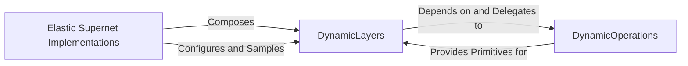

## Details

The `OFA Supernet Core` subsystem is the central elastic neural network responsible for defining, managing, and enabling the dynamic configuration and extraction of specialized subnets. It embodies the "Once-for-All" paradigm by providing a single, large model from which numerous smaller, specialized models can be derived.

### Elastic Supernet Implementations
These components serve as the high-level orchestrators and entry points for defining and managing specific elastic supernet architectures (e.g., MobileNetV3, ProxylessNAS, ResNet). They are responsible for constructing the overall network structure, enabling the dynamic adjustment of architectural parameters (depth, width, kernel size), and providing mechanisms to configure and sample specific subnets from a central elastic neural network. They embody the "Supernet" concept and are the primary interface for interacting with the supernet's overall structure.

**Related Classes/Methods**:

- <a href="https://github.com/mit-han-lab/once-for-all/blob/master/ofa/imagenet_classification/elastic_nn/networks/ofa_mbv3.py" target="_blank" rel="noopener noreferrer">`ofa/imagenet_classification/elastic_nn/networks/ofa_mbv3.py`</a>
- <a href="https://github.com/mit-han-lab/once-for-all/blob/master/ofa/imagenet_classification/elastic_nn/networks/ofa_proxyless.py" target="_blank" rel="noopener noreferrer">`ofa/imagenet_classification/elastic_nn/networks/ofa_proxyless.py`</a>
- <a href="https://github.com/mit-han-lab/once-for-all/blob/master/ofa/imagenet_classification/elastic_nn/networks/ofa_resnets.py" target="_blank" rel="noopener noreferrer">`ofa/imagenet_classification/elastic_nn/networks/ofa_resnets.py`</a>

### DynamicLayers
This component acts as an intermediary, providing the modular building blocks for constructing the elastic supernets. It encapsulates the logic for creating and managing individual dynamic layers (e.g., DynamicMBConvLayer, DynamicLinearLayer), which can adapt their configurations (e.g., kernel size, expansion ratio, depth) at runtime. Its primary role is to abstract the complexity of dynamic operations and present a consistent interface for building adaptable network layers, aligning with the "Modular Design" pattern by providing reusable, configurable components.

**Related Classes/Methods**:

- <a href="https://github.com/mit-han-lab/once-for-all/blob/master/ofa/imagenet_classification/elastic_nn/modules/dynamic_layers.py" target="_blank" rel="noopener noreferrer">`ofa/imagenet_classification/elastic_nn/modules/dynamic_layers.py`</a>

### DynamicOperations
This component provides the fundamental, low-level dynamic tensor operations (e.g., DynamicConv2d, DynamicBatchNorm2d, DynamicLinear). These are the core primitives that enable the "elasticity" of the network by allowing parameters to be dynamically selected or adjusted during runtime. It is the bedrock upon which `DynamicLayers` are built, representing the lowest level of modularity and reusability within the supernet architecture.

**Related Classes/Methods**:

- <a href="https://github.com/mit-han-lab/once-for-all/blob/master/ofa/imagenet_classification/elastic_nn/modules/dynamic_op.py" target="_blank" rel="noopener noreferrer">`ofa/imagenet_classification/elastic_nn/modules/dynamic_op.py`</a>

### [FAQ](https://github.com/CodeBoarding/GeneratedOnBoardings/tree/main?tab=readme-ov-file#faq)