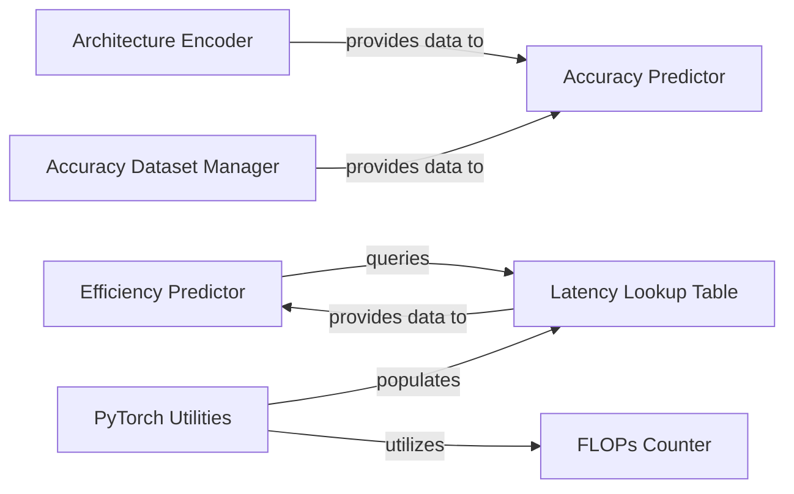

## Details

The Performance Predictors subsystem is crucial for accelerating the Neural Architecture Search (NAS) process by providing rapid estimations of subnet performance without full training or deployment. It encompasses mechanisms for predicting accuracy, FLOPs, and hardware efficiency (latency).

### Accuracy Predictor
Predicts the accuracy score of a given neural network architecture. This component is vital for filtering suboptimal architectures based on their expected performance.

**Related Classes/Methods**:

- <a href="https://github.com/mit-han-lab/once-for-all/blob/master/ofa/nas/accuracy_predictor/acc_predictor.py#L1-L1000" target="_blank" rel="noopener noreferrer">`ofa.nas.accuracy_predictor.acc_predictor`:1-1000</a>

### Architecture Encoder
Transforms symbolic neural network architectures into numerical feature vectors, making them suitable inputs for the Accuracy Predictor.

**Related Classes/Methods**:

- <a href="https://github.com/mit-han-lab/once-for-all/blob/master/ofa/nas/accuracy_predictor/arch_encoder.py#L1-L1000" target="_blank" rel="noopener noreferrer">`ofa.nas.accuracy_predictor.arch_encoder`:1-1000</a>

### Accuracy Dataset Manager
Manages and provides the dataset of architecture-accuracy pairs, which is essential for training and evaluating the Accuracy Predictor.

**Related Classes/Methods**:

- <a href="https://github.com/mit-han-lab/once-for-all/blob/master/ofa/nas/accuracy_predictor/acc_dataset.py#L1-L1000" target="_blank" rel="noopener noreferrer">`ofa.nas.accuracy_predictor.acc_dataset`:1-1000</a>

### Efficiency Predictor
Serves as the primary interface for querying the predicted hardware efficiency (latency) and computational cost (FLOPs) of a subnet configuration. It abstracts the underlying lookup mechanisms.

**Related Classes/Methods**:

- <a href="https://github.com/mit-han-lab/once-for-all/blob/master/ofa/nas/efficiency_predictor/__init__.py#L1-L1000" target="_blank" rel="noopener noreferrer">`ofa.nas.efficiency_predictor`:1-1000</a>

### Latency Lookup Table
Stores and provides pre-measured or calculated latency and FLOPs data for various network configurations and layers. It acts as a fast lookup mechanism to avoid re-computation.

**Related Classes/Methods**:

- <a href="https://github.com/mit-han-lab/once-for-all/blob/master/ofa/nas/efficiency_predictor/latency_lookup_table.py#L1-L1000" target="_blank" rel="noopener noreferrer">`ofa.nas.efficiency_predictor.latency_lookup_table`:1-1000</a>

### PyTorch Utilities
Provides fundamental PyTorch utilities for dynamically measuring network latency (measure_net_latency) and counting FLOPs (count_net_flops) of PyTorch models. These are foundational for populating efficiency data.

**Related Classes/Methods**:

- <a href="https://github.com/mit-han-lab/once-for-all/blob/master/ofa/utils/pytorch_utils.py#L1-L1000" target="_blank" rel="noopener noreferrer">`ofa.utils.pytorch_utils`:1-1000</a>

### FLOPs Counter
Provides the core logic for calculating floating-point operations for neural network layers and models. It ensures consistent and accurate computational cost estimation.

**Related Classes/Methods**:

- <a href="https://github.com/mit-han-lab/once-for-all/blob/master/ofa/utils/flops_counter.py#L1-L1000" target="_blank" rel="noopener noreferrer">`ofa.utils.flops_counter`:1-1000</a>

### [FAQ](https://github.com/CodeBoarding/GeneratedOnBoardings/tree/main?tab=readme-ov-file#faq)