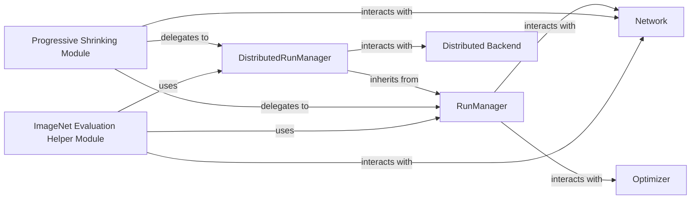

## Details

The OFA (Once-For-All) project's core training and evaluation subsystem is orchestrated by the RunManager and its distributed counterpart, DistributedRunManager. These managers oversee the training lifecycle, interacting with the Network component (represented by elastic neural networks like OFAMobileNetV3) and an abstract Optimizer to update model weights. The Progressive Shrinking Module leverages these run managers to implement the multi-stage training strategy for the supernet, dynamically adjusting network parameters. For evaluation, the ImageNet Evaluation Helper Module provides specialized utilities, utilizing the run managers and interacting directly with the Network to assess subnet performance on the ImageNet dataset. The Distributed Backend facilitates parallel processing, primarily through the DistributedRunManager, ensuring efficient and synchronized operations in distributed training environments. This architecture enables flexible and scalable neural architecture search and deployment.

### RunManager
The foundational orchestrator for standard (non-distributed) training and evaluation loops. It manages the core training process, validation, model checkpointing, and progress logging.

**Related Classes/Methods**:

- <a href="https://github.com/mit-han-lab/once-for-all/blob/master/ofa/imagenet_classification/run_manager/run_manager.py#L35-L456" target="_blank" rel="noopener noreferrer">`ofa.imagenet_classification.run_manager.run_manager.RunManager`:35-456</a>

### DistributedRunManager
Extends RunManager to coordinate training and evaluation across multiple devices or nodes, ensuring synchronized model updates and efficient data distribution in a distributed environment.

**Related Classes/Methods**:

- <a href="https://github.com/mit-han-lab/once-for-all/blob/master/ofa/imagenet_classification/run_manager/distributed_run_manager.py#L35-L480" target="_blank" rel="noopener noreferrer">`ofa.imagenet_classification.run_manager.distributed_run_manager.DistributedRunManager`:35-480</a>

### Progressive Shrinking Module
Implements the multi-stage progressive shrinking strategy, which is crucial for training the supernet. It orchestrates a sequence of training phases (e.g., elastic depth, width, kernel size) to gradually refine the supernet for elasticity.

**Related Classes/Methods**:

- <a href="https://github.com/mit-han-lab/once-for-all/blob/master/ofa/imagenet_classification/elastic_nn/training/progressive_shrinking.py" target="_blank" rel="noopener noreferrer">`ofa.imagenet_classification.elastic_nn.training.progressive_shrinking.ProgressiveShrinkingTrainer`</a>

### ImageNet Evaluation Helper Module
Provides specialized utilities for evaluating OFA subnets specifically on the ImageNet dataset. This includes pre-evaluation steps like BatchNorm calibration and specific subnet configuration for accurate performance measurement.

**Related Classes/Methods**:

- <a href="https://github.com/mit-han-lab/once-for-all/blob/master/ofa/tutorial/imagenet_eval_helper.py" target="_blank" rel="noopener noreferrer">`ofa.tutorial.imagenet_eval_helper.ImagenetEvalHelper`</a>

### Network
Represents the neural network model, specifically the elastic OFA networks that can be configured with varying architectural parameters.

**Related Classes/Methods**:

- <a href="https://github.com/mit-han-lab/once-for-all/blob/master/ofa/imagenet_classification/elastic_nn/networks/ofa_mbv3.py#L24-L400" target="_blank" rel="noopener noreferrer">`ofa.imagenet_classification.elastic_nn.networks.ofa_mbv3.OFAMobileNetV3`:24-400</a>

### Optimizer
Manages the optimization process for model weights during training. While not a single dedicated class within the OFA project, its functionality is integrated and managed by the RunManager and DistributedRunManager components, which typically leverage standard deep learning optimizers (e.g., from PyTorch).

**Related Classes/Methods**: _None_

### Distributed Backend
Handles communication and synchronization in distributed environments, enabling training across multiple devices or nodes. This component is primarily interacted with and abstracted by the DistributedRunManager.

**Related Classes/Methods**:

- <a href="https://github.com/mit-han-lab/once-for-all/blob/master/ofa/imagenet_classification/run_manager/distributed_run_manager.py#L35-L480" target="_blank" rel="noopener noreferrer">`ofa.imagenet_classification.run_manager.distributed_run_manager.DistributedRunManager`:35-480</a>

### [FAQ](https://github.com/CodeBoarding/GeneratedOnBoardings/tree/main?tab=readme-ov-file#faq)