```mermaid
graph LR
    OFA_Supernet_Core["OFA Supernet Core"]
    Data_Provisioning_Module["Data Provisioning Module"]
    Training_Evaluation_Orchestrator["Training & Evaluation Orchestrator"]
    Neural_Architecture_Search_NAS_Engine["Neural Architecture Search (NAS) Engine"]
    Performance_Predictors["Performance Predictors"]
    Base_Network_Model_Zoo["Base Network & Model Zoo"]
    Base_Network_Model_Zoo -- "provides foundational architectures to" --> OFA_Supernet_Core
    OFA_Supernet_Core -- "provides the elastic model/subnet to" --> Training_Evaluation_Orchestrator
    Training_Evaluation_Orchestrator -- "updates model parameters within" --> OFA_Supernet_Core
    Data_Provisioning_Module -- "supplies data for training and evaluation to" --> Training_Evaluation_Orchestrator
    OFA_Supernet_Core -- "defines the search space for" --> Neural_Architecture_Search_NAS_Engine
    Neural_Architecture_Search_NAS_Engine -- "requests subnet configurations from" --> OFA_Supernet_Core
    Neural_Architecture_Search_NAS_Engine -- "queries performance metrics from" --> Performance_Predictors
    Performance_Predictors -- "return predicted metrics to" --> Neural_Architecture_Search_NAS_Engine
    Training_Evaluation_Orchestrator -- "provides the model for profiling to" --> Performance_Predictors
    click OFA_Supernet_Core href "https://github.com/CodeBoarding/GeneratedOnBoardings/blob/main/once-for-all/OFA_Supernet_Core.md" "Details"
    click Data_Provisioning_Module href "https://github.com/CodeBoarding/GeneratedOnBoardings/blob/main/once-for-all/Data_Provisioning_Module.md" "Details"
    click Training_Evaluation_Orchestrator href "https://github.com/CodeBoarding/GeneratedOnBoardings/blob/main/once-for-all/Training_Evaluation_Orchestrator.md" "Details"
    click Neural_Architecture_Search_NAS_Engine href "https://github.com/CodeBoarding/GeneratedOnBoardings/blob/main/once-for-all/Neural_Architecture_Search_NAS_Engine.md" "Details"
    click Performance_Predictors href "https://github.com/CodeBoarding/GeneratedOnBoardings/blob/main/once-for-all/Performance_Predictors.md" "Details"
    click Base_Network_Model_Zoo href "https://github.com/CodeBoarding/GeneratedOnBoardings/blob/main/once-for-all/Base_Network_Model_Zoo.md" "Details"
```

## Details

The `once-for-all` project implements a sophisticated ML toolkit for efficient deep learning model specialization. Its core innovation lies in the **OFA Supernet Core**, an elastic neural network capable of dynamically configuring and extracting specialized subnets. The process begins with the **Base Network & Model Zoo** providing foundational architectures to construct this supernet. The **Data Provisioning Module** feeds preprocessed data to the **Training & Evaluation Orchestrator**, which manages the supernet's training, often employing progressive shrinking and distributed methods. Post-training, the **Neural Architecture Search (NAS) Engine** explores the supernet's vast architectural space, leveraging **Performance Predictors** to quickly estimate subnet accuracy and hardware efficiency (FLOPs, latency) without requiring full training. This iterative search identifies optimal subnets, which are then evaluated by the **Training & Evaluation Orchestrator** using data from the **Data Provisioning Module**, ultimately leading to specialized models optimized for diverse hardware targets.

### OFA Supernet Core [[Expand]](./OFA_Supernet_Core.md)
The central elastic neural network that defines and manages the supernet, enabling dynamic configuration and extraction of specialized subnets. It is the heart of the "Once-for-All" paradigm.

**Related Classes/Methods**:

- <a href="https://github.com/mit-han-lab/once-for-all/blob/master/ofa/imagenet_classification/elastic_nn/networks/ofa_mbv3.py" target="_blank" rel="noopener noreferrer">`ofa/imagenet_classification/elastic_nn/networks/ofa_mbv3.py`</a>
- <a href="https://github.com/mit-han-lab/once-for-all/blob/master/ofa/imagenet_classification/elastic_nn/networks/ofa_proxyless.py" target="_blank" rel="noopener noreferrer">`ofa/imagenet_classification/elastic_nn/networks/ofa_proxyless.py`</a>
- <a href="https://github.com/mit-han-lab/once-for-all/blob/master/ofa/imagenet_classification/elastic_nn/networks/ofa_resnets.py" target="_blank" rel="noopener noreferrer">`ofa/imagenet_classification/elastic_nn/networks/ofa_resnets.py`</a>
- <a href="https://github.com/mit-han-lab/once-for-all/blob/master/ofa/imagenet_classification/elastic_nn/modules/dynamic_layers.py" target="_blank" rel="noopener noreferrer">`ofa/imagenet_classification/elastic_nn/modules/dynamic_layers.py`</a>

### Data Provisioning Module [[Expand]](./Data_Provisioning_Module.md)
Responsible for handling the entire data pipeline, including loading, preprocessing, and augmentation of large-scale image datasets (e.g., ImageNet). It ensures efficient and correctly formatted data delivery for both supernet training and subnet evaluation.

**Related Classes/Methods**:

- <a href="https://github.com/mit-han-lab/once-for-all/blob/master/ofa/imagenet_classification/data_providers/imagenet.py" target="_blank" rel="noopener noreferrer">`ofa/imagenet_classification/data_providers/imagenet.py`</a>
- <a href="https://github.com/mit-han-lab/once-for-all/blob/master/ofa/imagenet_classification/data_providers/base_provider.py" target="_blank" rel="noopener noreferrer">`ofa/imagenet_classification/data_providers/base_provider.py`</a>
- <a href="https://github.com/mit-han-lab/once-for-all/blob/master/ofa/utils/my_dataloader/my_data_loader.py" target="_blank" rel="noopener noreferrer">`ofa.utils.my_dataloader.my_data_loader.py`</a>
- <a href="https://github.com/mit-han-lab/once-for-all/blob/master/ofa/utils/my_dataloader/my_distributed_sampler.py" target="_blank" rel="noopener noreferrer">`ofa/utils/my_dataloader/my_distributed_sampler.py`</a>

### Training & Evaluation Orchestrator [[Expand]](./Training_Evaluation_Orchestrator.md)
Manages the end-to-end training and evaluation workflows. This includes progressive shrinking (for supernet training), distributed training coordination (e.g., with Horovod/MPI), model checkpointing, and performance metric tracking. It oversees the entire lifecycle of model training and validation.

**Related Classes/Methods**:

- <a href="https://github.com/mit-han-lab/once-for-all/blob/master/ofa/imagenet_classification/run_manager/run_manager.py" target="_blank" rel="noopener noreferrer">`ofa/imagenet_classification/run_manager/run_manager.py`</a>
- <a href="https://github.com/mit-han-lab/once-for-all/blob/master/ofa/imagenet_classification/run_manager/distributed_run_manager.py" target="_blank" rel="noopener noreferrer">`ofa/imagenet_classification/run_manager/distributed_run_manager.py`</a>
- <a href="https://github.com/mit-han-lab/once-for-all/blob/master/ofa/imagenet_classification/elastic_nn/training/progressive_shrinking.py" target="_blank" rel="noopener noreferrer">`ofa/imagenet_classification/elastic_nn/training/progressive_shrinking.py`</a>
- <a href="https://github.com/mit-han-lab/once-for-all/blob/master/ofa/tutorial/imagenet_eval_helper.py" target="_blank" rel="noopener noreferrer">`ofa/tutorial/imagenet_eval_helper.py`</a>

### Neural Architecture Search (NAS) Engine [[Expand]](./Neural_Architecture_Search_NAS_Engine.md)
Implements search algorithms (e.g., evolutionary search) to efficiently explore the vast architectural space defined by the OFA Supernet Core. Its goal is to identify optimal subnets that meet specific performance (accuracy, latency, FLOPs) and hardware constraints.

**Related Classes/Methods**:

- <a href="https://github.com/mit-han-lab/once-for-all/blob/master/ofa/nas/search_algorithm/evolution.py" target="_blank" rel="noopener noreferrer">`ofa/nas/search_algorithm/evolution.py`</a>

### Performance Predictors [[Expand]](./Performance_Predictors.md)
Provides mechanisms to rapidly predict the accuracy, FLOPs, and hardware efficiency (latency) of candidate subnets without requiring full training or deployment. This is crucial for accelerating the NAS process by filtering out suboptimal architectures early.

**Related Classes/Methods**:

- <a href="https://github.com/mit-han-lab/once-for-all/blob/master/ofa/nas/accuracy_predictor/acc_predictor.py" target="_blank" rel="noopener noreferrer">`ofa/nas/accuracy_predictor/acc_predictor.py`</a>
- <a href="https://github.com/mit-han-lab/once-for-all/blob/master/ofa/nas/efficiency_predictor/latency_lookup_table.py" target="_blank" rel="noopener noreferrer">`ofa/nas/efficiency_predictor/latency_lookup_table.py`</a>
- <a href="https://github.com/mit-han-lab/once-for-all/blob/master/ofa/utils/pytorch_utils.py" target="_blank" rel="noopener noreferrer">`ofa/utils/pytorch_utils.py`</a>
- <a href="https://github.com/mit-han-lab/once-for-all/blob/master/ofa/utils/flops_counter.py" target="_blank" rel="noopener noreferrer">`ofa/utils/flops_counter.py`</a>

### Base Network & Model Zoo [[Expand]](./Base_Network_Model_Zoo.md)
Contains the foundational network architectures (e.g., MobileNetV3, ResNet, ProxylessNAS) that serve as the building blocks for constructing the Once-for-All supernet. It also includes pre-trained models that can be used as starting points or for transfer learning.

**Related Classes/Methods**:

- <a href="https://github.com/mit-han-lab/once-for-all/blob/master/ofa/imagenet_classification/networks/mobilenet_v3.py" target="_blank" rel="noopener noreferrer">`ofa/imagenet_classification/networks/mobilenet_v3.py`</a>
- <a href="https://github.com/mit-han-lab/once-for-all/blob/master/ofa/imagenet_classification/networks/proxyless_nets.py" target="_blank" rel="noopener noreferrer">`ofa/imagenet_classification/networks/proxyless_nets.py`</a>
- <a href="https://github.com/mit-han-lab/once-for-all/blob/master/ofa/imagenet_classification/networks/resnets.py" target="_blank" rel="noopener noreferrer">`ofa/imagenet_classification/networks/resnets.py`</a>
- <a href="https://github.com/mit-han-lab/once-for-all/blob/master/ofa/model_zoo.py" target="_blank" rel="noopener noreferrer">`ofa/model_zoo.py`</a>

### [FAQ](https://github.com/CodeBoarding/GeneratedOnBoardings/tree/main?tab=readme-ov-file#faq)