```mermaid
graph LR
    Audio_Input_Handler["Audio Input Handler"]
    Audio_Preprocessor_Feature_Extractor["Audio Preprocessor/Feature Extractor"]
    Speech_Embedding_Engine["Speech Embedding Engine"]
    Wake_Word_Detector_Classifier["Wake Word Detector/Classifier"]
    Configuration_Manager["Configuration Manager"]
    Command_Line_Interface_CLI_Parser["Command Line Interface (CLI) Parser"]
    Audio_Input_Handler -- "provides raw audio data to" --> Audio_Preprocessor_Feature_Extractor
    Audio_Preprocessor_Feature_Extractor -- "provides mel-spectrograms to" --> Speech_Embedding_Engine
    Speech_Embedding_Engine -- "provides speech embeddings to" --> Wake_Word_Detector_Classifier
    Command_Line_Interface_CLI_Parser -- "provides parsed arguments/commands to" --> Configuration_Manager
    Configuration_Manager -- "configures" --> Audio_Preprocessor_Feature_Extractor
    Configuration_Manager -- "configures" --> Speech_Embedding_Engine
    Configuration_Manager -- "configures" --> Wake_Word_Detector_Classifier
    click Speech_Embedding_Engine href "https://github.com/CodeBoarding/GeneratedOnBoardings/blob/main/openWakeWord-cpp/Speech_Embedding_Engine.md" "Details"
```

## Details

The `openWakeWord-cpp` system is designed as a real-time audio processing pipeline for wake word detection. The `Audio Input Handler` initiates the process by acquiring raw audio data, which is then fed into the `Audio Preprocessor/Feature Extractor`. This component transforms the raw audio into mel-spectrograms, a crucial step for machine learning inference. The `Speech Embedding Engine` subsequently processes these mel-spectrograms to generate high-dimensional speech embeddings using an ONNX model. These embeddings are then passed to the `Wake Word Detector/Classifier`, which makes the final decision on wake word presence. System-wide parameters are managed by the `Configuration Manager`, which receives initial settings from the `Command Line Interface (CLI) Parser` and distributes them to the `Audio Preprocessor/Feature Extractor`, `Speech Embedding Engine`, and `Wake Word Detector/Classifier` to ensure adaptable and flexible operation.

### Audio Input Handler
Manages the acquisition of raw audio data from the system's audio input devices (e.g., microphone). This component is fundamental for any real-time audio processing system, orchestrating the flow of audio samples into the processing pipeline.

**Related Classes/Methods**:

- `src/main.cpp`

### Audio Preprocessor/Feature Extractor
Performs initial signal processing on raw audio, including tasks like framing, windowing, and generating acoustic features such as mel-spectrograms, which are crucial for subsequent ML stages. It receives raw audio data and configuration parameters to produce processed mel-spectrograms.

**Related Classes/Methods**:

- `audioToMels`

### Speech Embedding Engine [[Expand]](./Speech_Embedding_Engine.md)
Generates high-dimensional speech embeddings from input mel-spectrograms. It utilizes a dedicated ONNX model (`embedding_model.onnx`) and the ONNX Runtime to perform efficient machine learning inference, preparing the data for wake word classification. This component is the core of the feature transformation.

**Related Classes/Methods**:

- `melsToFeatures`

### Wake Word Detector/Classifier
Takes the high-dimensional speech embeddings as input and applies a classification model to determine if a wake word has been detected. This is the final decision-making component of the pipeline, relying on configuration for its detection logic.

**Related Classes/Methods**:

- `featuresToOutput`

### Configuration Manager
Responsible for loading, parsing, and distributing system-wide configuration parameters to various components. This ensures flexibility and adaptability of the system in different environments or for different wake word models, receiving initial settings from the CLI.

**Related Classes/Methods**:

- `Settings`

### Command Line Interface (CLI) Parser
Handles the parsing of command-line arguments and options provided by the user, translating them into actionable commands or configuration overrides for the system. Essential for a CLI tool, it provides initial configuration data to the Configuration Manager.

**Related Classes/Methods**:

- `ensureArg`
- `printUsage`

### [FAQ](https://github.com/CodeBoarding/GeneratedOnBoardings/tree/main?tab=readme-ov-file#faq)