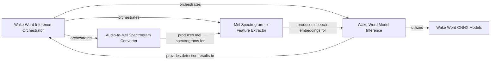

## Details

The `openWakeWord-cpp` system is structured around a multi-threaded pipeline for real-time wake word detection. The `Wake Word Inference Orchestrator` (represented by the `main` function) initializes the ONNX Runtime environment and coordinates three primary processing stages: `Audio-to-Mel Spectrogram Converter`, `Mel Spectrogram-to-Feature Extractor`, and `Wake Word Model Inference`. The `Audio-to-Mel Spectrogram Converter` transforms raw audio input into mel spectrograms, which are then consumed by the `Mel Spectrogram-to-Feature Extractor` to generate speech embeddings. Finally, the `Wake Word Model Inference` component utilizes these embeddings, along with pre-trained `Wake Word ONNX Models`, to determine the presence of wake words. Data flows sequentially through these components, with the orchestrator managing the overall execution and synchronization.

### Wake Word Inference Orchestrator
This component is the central coordinator for the wake word detection process. It initializes the ONNX Runtime environment, loads multiple wake word ONNX models, creates and manages `Ort::Session` instances for each model, and orchestrates the inference calls. It receives pre-processed speech embeddings and dispatches them for actual inference execution.

**Related Classes/Methods**:

- `main`

### Audio-to-Mel Spectrogram Converter
This component is responsible for converting raw audio samples into mel spectrograms, a frequency-domain representation suitable for further speech processing. It utilizes an ONNX model for this transformation.

**Related Classes/Methods**:

- `audioToMels`

### Mel Spectrogram-to-Feature Extractor
This component takes the generated mel spectrograms and extracts higher-level speech embeddings (features) that are used as input for the wake word detection models. It also uses an ONNX model for this process.

**Related Classes/Methods**:

- `melsToFeatures`

### Wake Word Model Inference
This component performs the actual wake word detection. It receives speech embeddings, prepares them for inference, executes the wake word ONNX models, and processes their outputs to determine wake word probabilities or scores.

**Related Classes/Methods**:

- `featuresToOutput`

### Wake Word ONNX Models
These are passive data components that represent the trained machine learning models for specific wake words. They are stored in the ONNX format and define the computational graph that the `Wake Word Model Inference` component executes. They are the "knowledge base" of the wake word detection system.

**Related Classes/Methods**:

- `models/*.onnx`

### [FAQ](https://github.com/CodeBoarding/GeneratedOnBoardings/tree/main?tab=readme-ov-file#faq)