```mermaid
graph LR
    CLI_Argument_Parser["CLI Argument Parser"]
    Configuration_Manager["Configuration Manager"]
    Audio_Input_Handler["Audio Input Handler"]
    Mel_Spectrogram_Processor["Mel Spectrogram Processor"]
    Speech_Embedding_Engine["Speech Embedding Engine"]
    Wake_Word_Inference_Engine["Wake Word Inference Engine"]
    Output_Handler["Output Handler"]
    CLI_Argument_Parser -- "configures" --> Configuration_Manager
    Configuration_Manager -- "provides settings to" --> Mel_Spectrogram_Processor
    Configuration_Manager -- "provides settings to" --> Speech_Embedding_Engine
    Configuration_Manager -- "provides settings to" --> Wake_Word_Inference_Engine
    Audio_Input_Handler -- "streams raw audio to" --> Mel_Spectrogram_Processor
    Mel_Spectrogram_Processor -- "outputs mel-spectrograms to" --> Speech_Embedding_Engine
    Speech_Embedding_Engine -- "outputs speech embeddings to" --> Wake_Word_Inference_Engine
    Wake_Word_Inference_Engine -- "sends detection events to" --> Output_Handler
    click Speech_Embedding_Engine href "https://github.com/CodeBoarding/GeneratedOnBoardings/blob/main/openWakeWord-cpp/Speech_Embedding_Engine.md" "Details"
    click Wake_Word_Inference_Engine href "https://github.com/CodeBoarding/GeneratedOnBoardings/blob/main/openWakeWord-cpp/Wake_Word_Inference_Engine.md" "Details"
```

## Details

The system operates as a real-time audio processing pipeline for wake word detection. It begins with a `CLI Argument Parser` that initializes the `Configuration Manager` with operational parameters and model paths. The `Audio Input Handler` continuously streams raw audio, which is then transformed into mel-spectrograms by the `Mel Spectrogram Processor` using a dedicated ONNX model. These mel-spectrograms are subsequently processed by the `Speech Embedding Engine` to generate speech embeddings, also via an ONNX model. The `Wake Word Inference Engine` then utilizes these embeddings with multiple wake word ONNX models to identify wake word occurrences. Finally, the `Output Handler` is responsible for presenting the detection results to the user.

### CLI Argument Parser
Parses command-line inputs to configure the application's operational parameters, including model paths, audio device settings, and detection thresholds.

**Related Classes/Methods**:

- `ensureArg`
- `printUsage`

### Configuration Manager
Centralizes and provides access to all application settings, ensuring consistent configuration across different processing stages.

**Related Classes/Methods**:

- `Settings`

### Audio Input Handler
Manages the acquisition of raw audio data from the system's microphone or a specified audio source, streaming it for further processing.

**Related Classes/Methods**: _None_

### Mel Spectrogram Processor
Transforms raw audio samples into mel-spectrogram features, utilizing an ONNX model (`melspectrogram.onnx`) for efficient signal processing.

**Related Classes/Methods**:

- `audioToMels`
- `Ort::Session (usage of)`
- `melspectrogram.onnx`

### Speech Embedding Engine [[Expand]](./Speech_Embedding_Engine.md)
Generates high-dimensional speech embeddings from mel-spectrograms using a dedicated ONNX model (`embedding_model.onnx`), preparing data for wake word classification.

**Related Classes/Methods**:

- `melsToFeatures`
- `Ort::Session (usage of)`
- `embedding_model.onnx`

### Wake Word Inference Engine [[Expand]](./Wake_Word_Inference_Engine.md)
Executes multiple wake word ONNX models on the speech embeddings to determine the probability of a wake word detection, acting as the core classifier.

**Related Classes/Methods**:

- `featuresToOutput`
- `Ort::Session (usage of)`
- `*.onnx (various wake word models)`

### Output Handler
Processes and presents the results of wake word detection, such as printing messages to the console or triggering further actions upon detection.

**Related Classes/Methods**:

- `featuresToOutput`

### [FAQ](https://github.com/CodeBoarding/GeneratedOnBoardings/tree/main?tab=readme-ov-file#faq)