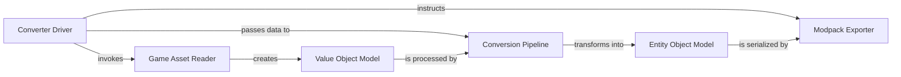

## Details

An analysis of the `openage.convert` class hierarchy reveals a structured and modular architecture for the Asset Converter subsystem. The components are designed to handle the complex process of reading proprietary game data, transforming it into an engine-specific format, and exporting it as a modpack.

### Converter Driver
The central orchestrator that manages the entire asset conversion workflow. It initializes the process, discovers the source game's version, and directs the flow of data between the other components.

**Related Classes/Methods**:

- `openage.convert.tool.driver.Driver`

### Game Asset Reader
A collection of specialized modules responsible for reading and parsing the various proprietary file formats used by the source game (e.g., Age of Empires). This component handles low-level data extraction from formats like `.dat`, `.drs`, and `.slp`.

**Related Classes/Methods**:

- `openage.convert.value_object.read.media.datfile.EmpiresDat`
- <a href="https://github.com/SFTtech/openage/blob/master/openage/convert/value_object/read/media/drs.py#L106-L171" target="_blank" rel="noopener noreferrer">`openage.convert.value_object.read.media.drs.DRS` (106:171)</a>
- <a href="https://github.com/SFTtech/openage/blob/master/openage/convert/value_object/read/genie_structure.py#L60-L673" target="_blank" rel="noopener noreferrer">`openage.convert.value_object.read.genie_structure.GenieStructure` (60:673)</a>

### Value Object Model
A set of Python classes that represent the raw data extracted from the game files. These objects mirror the structure of the original game's data and serve as the input for the conversion process.

**Related Classes/Methods**:

- <a href="https://github.com/SFTtech/openage/blob/master/openage/convert/value_object/read/media/datfile/unit.py#L263-L553" target="_blank" rel="noopener noreferrer">`openage.convert.value_object.read.media.datfile.unit.UnitObject` (263:553)</a>
- <a href="https://github.com/SFTtech/openage/blob/master/openage/convert/value_object/read/media/datfile/graphic.py#L119-L226" target="_blank" rel="noopener noreferrer">`openage.convert.value_object.read.media.datfile.graphic.Graphic` (119:226)</a>
- <a href="https://github.com/SFTtech/openage/blob/master/openage/convert/value_object/read/media/datfile/terrain.py#L136-L298" target="_blank" rel="noopener noreferrer">`openage.convert.value_object.read.media.datfile.terrain.Terrain` (136:298)</a>

### Conversion Pipeline
The heart of the converter, this component is responsible for transforming the `Value Objects` into `Entity Objects`. It contains the business logic for mapping the source game's data structures to the openage engine's data model.

**Related Classes/Methods**:

- <a href="https://github.com/SFTtech/openage/blob/master/openage/convert/entity_object/conversion/aoc/genie_object_container.py#L41-L125" target="_blank" rel="noopener noreferrer">`openage.convert.entity_object.conversion.aoc.genie_object_container.GenieObjectContainer` (41:125)</a>
- <a href="https://github.com/SFTtech/openage/blob/master/openage/convert/entity_object/conversion/converter_object.py#L24-L140" target="_blank" rel="noopener noreferrer">`openage.convert.entity_object.conversion.converter_object.ConverterObject` (24:140)</a>

### Entity Object Model
A set of Python classes that represent the game assets in a format that is compatible with the openage engine's data definition schema (`.nyan` files). These objects are the output of the `Conversion Pipeline`.

**Related Classes/Methods**:

- <a href="https://github.com/SFTtech/openage/blob/master/openage/convert/entity_object/export/formats/nyan_file.py#L20-L155" target="_blank" rel="noopener noreferrer">`openage.convert.entity_object.export.formats.nyan_file.NyanFile` (20:155)</a>
- <a href="https://github.com/SFTtech/openage/blob/master/openage/nyan/nyan_structs.py#L32-L469" target="_blank" rel="noopener noreferrer">`openage.nyan.nyan_structs.NyanObject` (32:469)</a>

### Modpack Exporter
This component takes the `Entity Objects` and packages them into a distributable modpack. This includes serializing the data to `.nyan` files, exporting media assets, and creating a manifest file.

**Related Classes/Methods**:

- <a href="https://github.com/SFTtech/openage/blob/master/openage/convert/entity_object/export/formats/modpack_info.py#L15-L284" target="_blank" rel="noopener noreferrer">`openage.convert.entity_object.export.formats.modpack_info.ModpackInfo` (15:284)</a>
- <a href="https://github.com/SFTtech/openage/blob/master/openage/convert/entity_object/export/formats/modpack_manifest.py#L11-L67" target="_blank" rel="noopener noreferrer">`openage.convert.entity_object.export.formats.modpack_manifest.ManifestFile` (11:67)</a>

### [FAQ](https://github.com/CodeBoarding/GeneratedOnBoardings/tree/main?tab=readme-ov-file#faq)