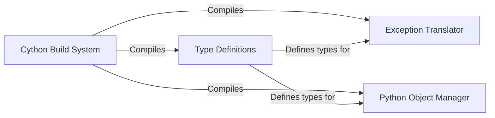

## Details

The openage/cppinterface subsystem is fundamental to the engine's architecture, acting as the glue between the high-performance C++ core and the flexible Python scripting layer. The choice of Cython indicates a focus on performance, allowing for near-native C speed while maintaining Python's ease of use.

### Cython Build System
Responsible for compiling the Cython .pyx and .pxd files into C++ and then into a Python extension module. It ensures that the C++ and Python layers can communicate by creating the necessary binary linkage.

**Related Classes/Methods**:

- `openage/cppinterface/setup.py`
- `openage/cppinterface/CMakeLists.txt`

### Type Definitions
A Cython header file that defines the shared C++ data types that are exposed to the Python layer. This is crucial for ensuring that both C++ and Python understand the structure of the data being passed between them, such as smart pointers for object lifetime management.

**Related Classes/Methods**:

- `openage/cppinterface/typedefs.pxd`

### Exception Translator
A critical component for robust error handling. It catches C++ exceptions and translates them into Python exceptions, and vice-versa. This prevents the engine from crashing due to unhandled errors in one language layer and allows for consistent error handling logic in Python.

**Related Classes/Methods**:

- `openage/cppinterface/exctranslate.pyx`

### Python Object Manager
Manages the lifecycle of Python objects that are passed to the C++ layer. It provides functions to safely acquire and release the Python Global Interpreter Lock (GIL) and to manage reference counts, preventing memory leaks and segmentation faults.

**Related Classes/Methods**:

- `openage/cppinterface/pyobject.pyx`

### [FAQ](https://github.com/CodeBoarding/GeneratedOnBoardings/tree/main?tab=readme-ov-file#faq)