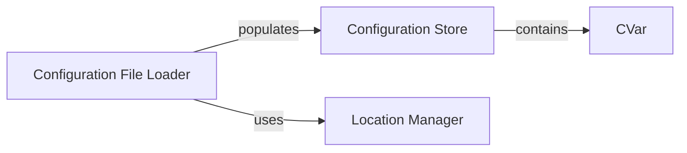

## Details

One paragraph explaining the functionality which is represented by this graph. What the main flow is and what is its purpose.

### CVar
The core component of the subsystem, representing a single configuration variable. It stores the variable's value, name, and metadata, and allows for runtime modifications. This is a fundamental data structure for the entire configuration system.

**Related Classes/Methods**:

- `openage/cvar/cvar.pyx`

### Configuration Store
A container that holds all the CVar instances. It provides a centralized location for accessing and managing all configuration variables, ensuring that they are globally accessible and unique.

**Related Classes/Methods**:

- `openage/cvar/cvar.pyx`

### Configuration File Loader
This component is responsible for parsing configuration files (e.g., .cfg files) and populating the Configuration Store with the values defined in them. It translates the on-disk representation of the configuration into in-memory CVar objects.

**Related Classes/Methods**:

- `openage/cvar/config_file.py`

### Location Manager
Responsible for determining the locations of configuration files. It abstracts the process of finding the correct configuration directories, which is crucial for supporting different operating systems and installation setups.

**Related Classes/Methods**:

- `openage/cvar/location.py`

### [FAQ](https://github.com/CodeBoarding/GeneratedOnBoardings/tree/main?tab=readme-ov-file#faq)