```mermaid
graph LR
    Conversion_Orchestrator["Conversion Orchestrator"]
    AoCProcessor["AoCProcessor"]
    AoCNyanSubprocessor["AoCNyanSubprocessor"]
    GenieGameEntityGroup["GenieGameEntityGroup"]
    ConverterObject["ConverterObject"]
    GenieStructure["GenieStructure"]
    DRS["DRS"]
    create_version_objects["create_version_objects"]
    Conversion_Orchestrator -- "orchestrates" --> AoCProcessor
    Conversion_Orchestrator -- "uses" --> create_version_objects
    AoCProcessor -- "orchestrates" --> AoCNyanSubprocessor
    AoCProcessor -- "processes data from" --> GenieStructure
    AoCProcessor -- "creates/manages" --> GenieGameEntityGroup
    AoCProcessor -- "uses" --> ConverterObject
    AoCNyanSubprocessor -- "transforms" --> GenieGameEntityGroup
    AoCNyanSubprocessor -- "creates" --> ConverterObject
    GenieGameEntityGroup -- "contains" --> ConverterObject
    GenieGameEntityGroup -- "is processed by" --> AoCProcessor
    ConverterObject -- "is contained within" --> GenieGameEntityGroup
    ConverterObject -- "is created by" --> GenieStructure
    GenieStructure -- "reads data for" --> ConverterObject
    GenieStructure -- "interacts with" --> DRS
    DRS -- "provides file data to" --> GenieStructure
    DRS -- "is used by" --> AoCProcessor
    create_version_objects -- "provides game version info to" --> Conversion_Orchestrator
    click Conversion_Orchestrator href "https://github.com/CodeBoarding/GeneratedOnBoardings/blob/main//openage/Conversion_Orchestrator.md" "Details"
```

## Component Details

This subsystem is responsible for the end-to-end conversion of game data from proprietary formats (like Age of Empires II's Genie engine files) into `openage`'s engine-readable Nyan format. It encompasses the high-level control, game-specific processing, data structuring, and low-level file reading.

### Conversion Orchestrator
This is the primary entry point and high-level coordinator for the entire game data conversion process. It initializes the environment, parses command-line arguments, sets up file system mounts, and orchestrates the main conversion logic by invoking the `convert_assets` function. It also handles interactive modes and update checks.

**Related Classes/Methods**:

- <a href="https://github.com/SFTtech/openage/blob/master/openage/convert/main.py#L253-L294" target="_blank" rel="noopener noreferrer">`openage.convert.main` (253:294)</a>
- <a href="https://github.com/SFTtech/openage/blob/master/openage/convert/main.py#L33-L143" target="_blank" rel="noopener noreferrer">`openage.convert.main:convert_assets` (33:143)</a>

### AoCProcessor
This class is the game-specific orchestrator for the Age of Empires II (AoC) data conversion. It manages the detailed conversion pipeline, which is typically divided into pre-processing (extracting raw Genie data), main processing (creating logical game entities and linking them), and post-processing (converting to Nyan objects).

**Related Classes/Methods**:

- <a href="https://github.com/SFTtech/openage/blob/master/openage/convert/processor/conversion/aoc/processor.py#L1-L1" target="_blank" rel="noopener noreferrer">`openage.convert.processor.conversion.aoc.processor` (1:1)</a>
- <a href="https://github.com/SFTtech/openage/blob/master/openage/convert/processor/conversion/aoc/processor.py#L1-L1" target="_blank" rel="noopener noreferrer">`openage.convert.processor.conversion.aoc.processor:_post_processor` (1:1)</a>
- <a href="https://github.com/SFTtech/openage/blob/master/openage/convert/processor/conversion/aoc/processor.py#L1-L1" target="_blank" rel="noopener noreferrer">`openage.convert.processor.conversion.aoc.processor:_pre_processor` (1:1)</a>
- <a href="https://github.com/SFTtech/openage/blob/master/openage/convert/processor/conversion/aoc/processor.py#L1-L1" target="_blank" rel="noopener noreferrer">`openage.convert.processor.conversion.aoc.processor:_processor` (1:1)</a>

### AoCNyanSubprocessor
A specialized subprocessor within the `AoCProcessor`'s pipeline. Its core responsibility is to transform processed game entities (represented by `GenieGameEntityGroup` and its subclasses) into Nyan objects, which are the engine-readable format for `openage`. It handles the creation of Nyan members and performs validation checks on the generated objects, ensuring data integrity for the game engine.

**Related Classes/Methods**:

- <a href="https://github.com/SFTtech/openage/blob/master/openage/convert/processor/conversion/aoc/nyan_subprocessor.py#L1-L1" target="_blank" rel="noopener noreferrer">`openage.convert.processor.conversion.aoc.nyan_subprocessor` (1:1)</a>
- <a href="https://github.com/SFTtech/openage/blob/master/openage/convert/processor/conversion/aoc/nyan_subprocessor.py#L1-L1" target="_blank" rel="noopener noreferrer">`openage.convert.processor.conversion.aoc.nyan_subprocessor:convert` (1:1)</a>

### GenieGameEntityGroup
This is a foundational base class (with numerous subclasses like `GenieUnitLineGroup`, `GenieBuildingLineGroup`) that represents logical groupings of game entities originating from the Genie engine (Age of Empires II's engine). These groups encapsulate related units, buildings, or other game objects, providing structured access and methods for querying their properties and relationships during conversion. They act as an intermediate representation between raw Genie data and the final Nyan objects.

**Related Classes/Methods**:

- <a href="https://github.com/SFTtech/openage/blob/master/openage/convert/entity_object/conversion/aoc/genie_unit.py#L52-L573" target="_blank" rel="noopener noreferrer">`openage.convert.entity_object.conversion.aoc.genie_unit.GenieGameEntityGroup` (52:573)</a>

### ConverterObject
Represents a single converted object within the `openage` entity model. It acts as a wrapper for the data being converted, providing methods for comparing objects (`diff`, `short_diff`) and accessing their members (`__getitem__`, `get_member`). This component ensures a standardized representation of converted data, typically holding raw data extracted from Genie files.

**Related Classes/Methods**:

- <a href="https://github.com/SFTtech/openage/blob/master/openage/convert/entity_object/conversion/converter_object.py#L24-L140" target="_blank" rel="noopener noreferrer">`openage.convert.entity_object.conversion.converter_object.ConverterObject` (24:140)</a>
- <a href="https://github.com/SFTtech/openage/blob/master/openage/convert/entity_object/conversion/converter_object.py#L118-L130" target="_blank" rel="noopener noreferrer">`openage.convert.entity_object.conversion.converter_object.ConverterObject:diff` (118:130)</a>
- <a href="https://github.com/SFTtech/openage/blob/master/openage/convert/entity_object/conversion/converter_object.py#L98-L116" target="_blank" rel="noopener noreferrer">`openage.convert.entity_object.conversion.converter_object.ConverterObject:short_diff` (98:116)</a>
- <a href="https://github.com/SFTtech/openage/blob/master/openage/convert/entity_object/conversion/converter_object.py#L132-L136" target="_blank" rel="noopener noreferrer">`openage.convert.entity_object.conversion.converter_object.ConverterObject:__getitem__` (132:136)</a>
- <a href="https://github.com/SFTtech/openage/blob/master/openage/convert/entity_object/conversion/converter_object.py#L76-L84" target="_blank" rel="noopener noreferrer">`openage.convert.entity_object.conversion.converter_object.ConverterObject:get_member` (76:84)</a>

### GenieStructure
This component is responsible for the low-level reading and interpretation of raw binary data structures from Genie game files. It defines how various data types (groups, multisubtypes, primitives) are read from the input stream, parsing the binary data into a more structured Python representation using `ValueMember` objects.

**Related Classes/Methods**:

- <a href="https://github.com/SFTtech/openage/blob/master/openage/convert/value_object/read/genie_structure.py#L60-L673" target="_blank" rel="noopener noreferrer">`openage.convert.value_object.read.genie_structure.GenieStructure` (60:673)</a>

### DRS
Handles the reading of `.drs` (Digital Resource System) archive files, which are used by Genie games to store media assets like sprites, sounds, and palettes. It reads the internal tables and entries within these archives, making media content available for conversion by providing file information (filename, offset, size).

**Related Classes/Methods**:

- <a href="https://github.com/SFTtech/openage/blob/master/openage/convert/value_object/read/media/drs.py#L106-L171" target="_blank" rel="noopener noreferrer">`openage.convert.value_object.read.media.drs.DRS` (106:171)</a>

### create_version_objects
This function is a crucial part of the initialization service. Its purpose is to detect the specific game version from the source directory and create appropriate game objects (e.g., `GameEdition` and `GameExpansion` instances) that represent the detected game. This information is vital for tailoring the conversion process to the correct game version, as different game versions might have different data structures.

**Related Classes/Methods**:

- <a href="https://github.com/SFTtech/openage/blob/master/openage/convert/service/init/version_detect.py#L131-L164" target="_blank" rel="noopener noreferrer">`openage.convert.service.init.version_detect:create_version_objects` (131:164)</a>

### [FAQ](https://github.com/CodeBoarding/GeneratedOnBoardings/tree/main?tab=readme-ov-file#faq)