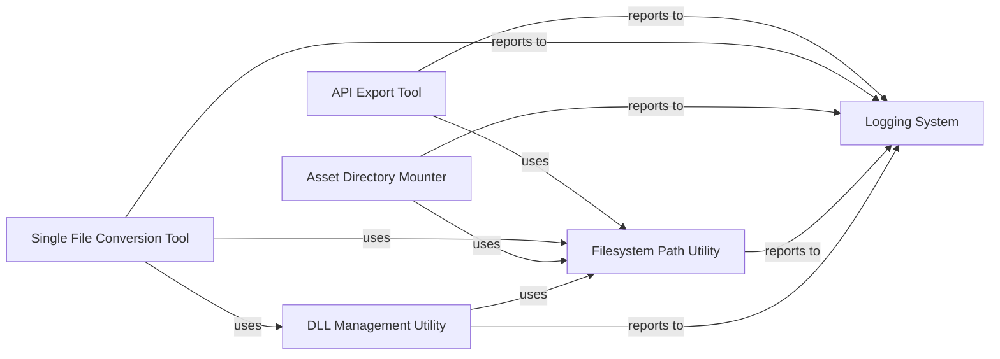

## Component Details

This component provides foundational services and auxiliary tools that support the entire conversion system. It encompasses abstracting filesystem interactions, managing dynamic link libraries for media codecs, offering a centralized logging mechanism for monitoring, and providing standalone utilities for development and debugging.

### Filesystem Path Utility
Provides a robust and abstract interface for interacting with the file system. It handles operations like iterating directories, resolving native paths (read/write), removing files/directories, and joining/manipulating paths. It acts as a foundational layer for all file-related operations within the openage project, abstracting away the underlying storage mechanism.

**Related Classes/Methods**:

- <a href="https://github.com/SFTtech/openage/blob/master/openage/util/fslike/path.py#L0-L0" target="_blank" rel="noopener noreferrer">`openage.util.fslike.path` (0:0)</a>

### DLL Management Utility
Manages the loading and unloading of Dynamic Link Libraries (DLLs) or shared objects. It provides mechanisms to add and remove directories from the system's DLL search path, which is crucial for loading native libraries required by certain conversion processes (e.g., media codecs). This ensures that the application can correctly locate and utilize external binary dependencies.

**Related Classes/Methods**:

- <a href="https://github.com/SFTtech/openage/blob/master/openage/util/dll.py#L0-L0" target="_blank" rel="noopener noreferrer">`openage.util.dll` (0:0)</a>

### Logging System
Provides a centralized and configurable logging mechanism for the entire openage project. It allows setting log levels and emitting structured log messages, integrating with both Python and C++ logging handlers for comprehensive system monitoring and debugging. This component is vital for tracking application flow, diagnosing issues, and providing user feedback.

**Related Classes/Methods**:

- <a href="https://github.com/SFTtech/openage/blob/master/openage/log/__init__.py#L0-L0" target="_blank" rel="noopener noreferrer">`openage.log.__init__` (0:0)</a>

### Asset Directory Mounter
Responsible for initializing the conversion service by locating and mounting various game asset directories. This makes original game resources accessible to the conversion pipeline for processing. It acts as a crucial setup component, ensuring that the converter has access to all necessary input data.

**Related Classes/Methods**:

- <a href="https://github.com/SFTtech/openage/blob/master/openage/convert/service/init/mount_asset_dirs.py#L18-L70" target="_blank" rel="noopener noreferrer">`openage.convert.service.init.mount_asset_dirs` (18:70)</a>

### API Export Tool
A high-level utility responsible for orchestrating the entire game API export process. This includes creating modpacks, exporting processed data, and generating manifest hashes to ensure data integrity. It serves as a primary entry point for full game data conversion and export, providing a comprehensive utility for developers.

**Related Classes/Methods**:

- <a href="https://github.com/SFTtech/openage/blob/master/openage/convert/tool/api_export.py#L0-L0" target="_blank" rel="noopener noreferrer">`openage.convert.tool.api_export` (0:0)</a>

### Single File Conversion Tool
A standalone utility designed for converting and reading individual game asset files (e.g., palettes, sprites, sounds). It leverages other core utilities like the DLL Management Utility for specific file format operations. This tool provides granular control and debugging capabilities for specific asset types.

**Related Classes/Methods**:

- <a href="https://github.com/SFTtech/openage/blob/master/openage/convert/tool/singlefile.py#L0-L0" target="_blank" rel="noopener noreferrer">`openage.convert.tool.singlefile` (0:0)</a>

### [FAQ](https://github.com/CodeBoarding/GeneratedOnBoardings/tree/main?tab=readme-ov-file#faq)