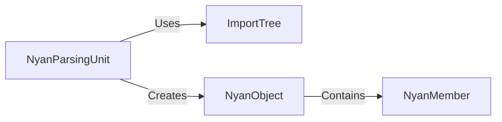

## Details

One paragraph explaining the functionality which is represented by this graph. What the main flow is and what is its purpose.

### NyanParsingUnit
The NyanParsingUnit is the core engine for processing .nyan files. It is a C++ component responsible for both lexical analysis and parsing of the Nyan language. It reads the raw .nyan text, processes it, and directly creates NyanObject instances in memory, effectively acting as both a parser and a factory. This integrated approach is efficient for handling the project's data-driven architecture.

**Related Classes/Methods**: _None_

### ImportTree
The ImportTree manages the complex web of dependencies between .nyan files. It builds a directed graph of imports, ensuring that all required data is loaded and available before it is used by the engine. This is critical for maintaining a modular and scalable data-driven architecture.

**Related Classes/Methods**:

- <a href="https://github.com/SFTtech/openage/blob/master/openage/nyan/import_tree.py#L134-L389" target="_blank" rel="noopener noreferrer">`nyan.import_tree.ImportTree` (134:389)</a>

### NyanObject
This is the in-memory Python representation of a Nyan entity. It stores the data and relationships defined in the .nyan files, providing a structured and accessible way for the engine to interact with the game's data after it has been processed by the NyanParsingUnit.

**Related Classes/Methods**:

- <a href="https://github.com/SFTtech/openage/blob/master/openage/nyan/nyan_structs.py#L32-L469" target="_blank" rel="noopener noreferrer">`nyan.nyan_structs.NyanObject` (32:469)</a>

### NyanMember
This component represents a single attribute or property of a NyanObject. It encapsulates the key-value pairs defined in the .nyan files, allowing for a flexible and extensible data model.

**Related Classes/Methods**:

- <a href="https://github.com/SFTtech/openage/blob/master/openage/nyan/nyan_structs.py#L856-L1258" target="_blank" rel="noopener noreferrer">`nyan.nyan_structs.NyanMember` (856:1258)</a>

### [FAQ](https://github.com/CodeBoarding/GeneratedOnBoardings/tree/main?tab=readme-ov-file#faq)