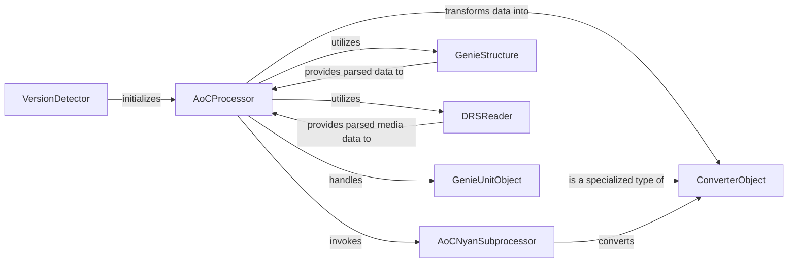

## Component Details

This component is central to `openage`'s ability to ingest and transform raw game data from various sources (like Genie engine files and media assets) into its internal, structured Nyan object representation. It encapsulates the game-specific logic required for accurate data interpretation and conversion, including version detection and the definition of intermediate data structures.

### AoCProcessor
The primary orchestrator for the entire Age of Empires II: The Conquerors (AoC) game data conversion process. It manages the three main phases: pre-processing (extracting raw Genie data), processing (transforming data into openage-friendly Python objects and linking them), and post-processing (converting to Nyan objects and preparing media exports). This component is fundamental as it defines the complete conversion workflow for AoC, ensuring all necessary data transformations and interconnections are handled.

**Related Classes/Methods**:

- `AoCProcessor` (1:1)

### AoCNyanSubprocessor
Responsible for the final stage of data conversion, specifically transforming the processed intermediate data (openage-friendly Python objects) into the universal `openage` Nyan object format. It acts as the bridge between game-specific data representations and `openage`'s generic data model.

**Related Classes/Methods**:

- `AoCNyanSubprocessor` (1:1)

### GenieStructure
Defines the structure and provides methods for reading and interpreting raw binary data from Genie engine files (e.g., `.dat` files). It's responsible for parsing the complex binary layouts into structured Python objects, making the raw game data accessible for further processing.

**Related Classes/Methods**:

- <a href="https://github.com/SFTtech/openage/blob/master/openage/convert/value_object/read/genie_structure.py#L60-L673" target="_blank" rel="noopener noreferrer">`GenieStructure` (60:673)</a>

### DRSReader
Handles the reading and parsing of Direct Resource System (DRS) archives, which are containers for various game media assets like graphics, sounds, and palettes. This component extracts these assets, making them available for conversion and integration into the `openage` engine.

**Related Classes/Methods**:

- `DRSReader` (1:1)

### ConverterObject
Serves as an abstract base class or a common interface for various game entities (e.g., units, buildings, technologies) during the conversion process. Specific game entities inherit from or are composed of this class, providing a standardized intermediate data model before the final Nyan conversion.

**Related Classes/Methods**:

- <a href="https://github.com/SFTtech/openage/blob/master/openage/convert/entity_object/conversion/converter_object.py#L24-L140" target="_blank" rel="noopener noreferrer">`ConverterObject` (24:140)</a>

### GenieUnitObject
Represents a specific implementation of a `ConverterObject` tailored for converting unit data from the Genie engine. It encapsulates the logic for extracting and structuring unit-specific attributes and behaviors from the raw Genie data.

**Related Classes/Methods**:

- `GenieUnitObject` (1:1)

### VersionDetector
A service responsible for identifying the specific version of the input game data (e.g., Age of Empires II: The Conquerors, Definitive Edition). This detection is crucial for selecting and applying the correct game-specific conversion logic and the appropriate `AoCProcessor` (or similar game-specific processor).

**Related Classes/Methods**:

- `VersionDetector` (1:1)

### [FAQ](https://github.com/CodeBoarding/GeneratedOnBoardings/tree/main?tab=readme-ov-file#faq)