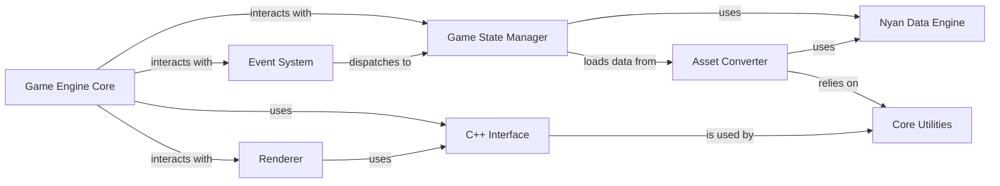

## Details

One paragraph explaining the functionality which is represented by this graph. What the main flow is and what is its purpose.

### Game Engine Core [[Expand]](./Game_Engine_Core.md)
The central orchestrator of the game. It initializes all systems, runs the main game loop, and manages the overall game state and flow. This component is the entry point for the game itself.

**Related Classes/Methods**:

- `openage/main/main.py`
- `openage/game/main.py`
- `openage/game/main_cpp.pyx`

### Event System
Implements an event-driven architecture for handling user input, system events, and internal game events. It allows for loose coupling between different parts of the engine.

**Related Classes/Methods**:

- `openage/event/__init__.py`
- `libopenage/event/`

### Game State Manager
Manages the state of all game objects and the overall game world, following an Entity-Component-System (ECS) pattern. It ensures data consistency and provides a centralized point of access for game state information.

**Related Classes/Methods**:

- `openage/gamestate/__init__.py`
- `libopenage/gamestate/`

### Renderer
Responsible for all rendering tasks, including drawing game objects, handling animations, and managing the viewport. It interfaces with the underlying graphics libraries (OpenGL).

**Related Classes/Methods**:

- `openage/renderer/renderer_cpp.pyx`
- `libopenage/renderer/`

### C++ Interface
Acts as a bridge between the Python scripting layer and the high-performance C++ core. It uses Cython to wrap C++ classes and functions for use in Python.

**Related Classes/Methods**:

- `openage/cppinterface/`
- `libopenage/pyinterface/`

### Asset Converter [[Expand]](./Asset_Converter.md)
A crucial component for converting game assets from their original formats (e.g., from Age of Empires) into a format that can be used by the openage engine.

**Related Classes/Methods**:

- `openage/convert/main.py`
- `openage/convert/processor/`

### Nyan Data Engine
A data templating engine used for defining game objects, abilities, and other game data in a structured and human-readable format. It is the backbone of the asset conversion process.

**Related Classes/Methods**:

- `openage/nyan/`
- `openage/nyan/nyan_structs.py`

### Core Utilities
A collection of utility modules that provide common functionalities such as file system abstraction, data structures, and threading support.

**Related Classes/Methods**:

- `openage/util/`
- `libopenage/util/`

### [FAQ](https://github.com/CodeBoarding/GeneratedOnBoardings/tree/main?tab=readme-ov-file#faq)