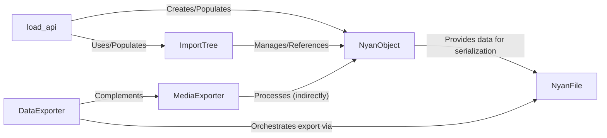

## Component Details

The Nyan Data Management component is crucial for defining, managing, and exporting the openage engine's internal Nyan data model and associated media assets. The selected components are fundamental because they represent the entire lifecycle of Nyan data within this subsystem: from its core definition and in-memory representation to its loading, dependency management, and final export into engine-compatible formats.

### NyanObject
The foundational data structure representing a single Nyan entity within the openage engine. It encapsulates properties, inheritance relationships, and child objects, forming the building blocks of the Nyan data model. It provides methods for data validation, processing inheritance, and preparing content for serialization.

**Related Classes/Methods**:

- `NyanObject` (1:1)

### ImportTree
Manages the hierarchical structure and dependencies of imported Nyan objects and their aliases. It is essential for resolving object references, handling inheritance, and ensuring the integrity of the Nyan data model during the loading and processing phases. It acts as a central registry for all loaded Nyan entities.

**Related Classes/Methods**:

- <a href="https://github.com/SFTtech/openage/blob/master/openage/nyan/import_tree.py#L134-L389" target="_blank" rel="noopener noreferrer">`ImportTree` (134:389)</a>

### load_api
A service function responsible for initializing the Nyan data model by reading Nyan API definitions. It parses source data, creates NyanObject instances, and populates their members, effectively constructing the in-memory representation of the Nyan data. This is the primary entry point for bringing Nyan data into the system.

**Related Classes/Methods**:

- `load_api` (1:1)

### NyanFile
Handles the serialization and management of processed NyanObject's for export into a specific file format. It ensures that Fully Qualified Object Names (FQONs) are correctly maintained and resolved, and it orchestrates the writing of Nyan data to disk in the target engine's format.

**Related Classes/Methods**:

- <a href="https://github.com/SFTtech/openage/blob/master/openage/convert/entity_object/export/formats/nyan_file.py#L20-L155" target="_blank" rel="noopener noreferrer">`NyanFile` (20:155)</a>

### DataExporter
Orchestrates the final export of all structured Nyan data. It manages the overall data export process, including the generation of manifest files and ensuring that all processed Nyan objects are correctly written to disk via NyanFile and other format-specific handlers.

**Related Classes/Methods**:

- <a href="https://github.com/SFTtech/openage/blob/master/openage/convert/processor/export/data_exporter.py#L16-L38" target="_blank" rel="noopener noreferrer">`DataExporter` (16:38)</a>

### MediaExporter
Responsible for converting and exporting various media assets (e.g., graphics, sounds, terrain) from source directories to target engine-compatible formats. It handles media caching, manages multi-threaded operations for efficiency, and reports progress during the conversion process, complementing the structured data export.

**Related Classes/Methods**:

- <a href="https://github.com/SFTtech/openage/blob/master/openage/convert/processor/export/media_exporter.py#L33-L618" target="_blank" rel="noopener noreferrer">`MediaExporter` (33:618)</a>

### [FAQ](https://github.com/CodeBoarding/GeneratedOnBoardings/tree/main?tab=readme-ov-file#faq)