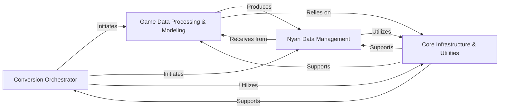

## Component Details

The `openage` converter's architecture is designed around a pipeline that transforms proprietary game data into a unified, engine-compatible format (Nyan). The analysis reveals four fundamental components, each with distinct responsibilities, working in concert to achieve this goal.

### Conversion Orchestrator
This is the central control unit that initiates, coordinates, and manages the entire game data conversion pipeline. It sets up the environment, handles high-level flow, and delegates tasks to other core components, acting as the primary entry point for the conversion process.

**Related Classes/Methods**:

- <a href="https://github.com/SFTtech/openage/blob/master/openage/convert/main.py#L253-L294" target="_blank" rel="noopener noreferrer">`openage.convert.main` (253:294)</a>

### Game Data Processing & Modeling
This component is responsible for the intricate process of reading, parsing, and transforming raw game data from various source formats (e.g., Genie engine files, raw media assets) into an intermediate, structured representation, and subsequently into Nyan objects. It incorporates game-specific logic, handles version detection to apply correct conversion rules, and defines the core data structures for game entities during conversion.

**Related Classes/Methods**:

- <a href="https://github.com/SFTtech/openage/blob/master/openage/convert/processor/conversion/aoc/processor.py#L0-L0" target="_blank" rel="noopener noreferrer">`openage.convert.processor.conversion.aoc.processor` (0:0)</a>
- <a href="https://github.com/SFTtech/openage/blob/master/openage/convert/processor/conversion/aoc/nyan_subprocessor.py#L0-L0" target="_blank" rel="noopener noreferrer">`openage.convert.processor.conversion.aoc.nyan_subprocessor` (0:0)</a>
- <a href="https://github.com/SFTtech/openage/blob/master/openage/convert/value_object/read/genie_structure.py#L60-L673" target="_blank" rel="noopener noreferrer">`openage.convert.value_object.read.genie_structure.GenieStructure` (60:673)</a>
- <a href="https://github.com/SFTtech/openage/blob/master/openage/convert/value_object/read/media/drs.py#L0-L0" target="_blank" rel="noopener noreferrer">`openage.convert.value_object.read.media.drs` (0:0)</a>
- <a href="https://github.com/SFTtech/openage/blob/master/openage/convert/entity_object/conversion/converter_object.py#L24-L140" target="_blank" rel="noopener noreferrer">`openage.convert.entity_object.conversion.converter_object.ConverterObject` (24:140)</a>
- <a href="https://github.com/SFTtech/openage/blob/master/openage/convert/entity_object/conversion/aoc/genie_unit.py#L0-L0" target="_blank" rel="noopener noreferrer">`openage.convert.entity_object.conversion.aoc.genie_unit` (0:0)</a>
- <a href="https://github.com/SFTtech/openage/blob/master/openage/convert/service/init/version_detect.py#L0-L0" target="_blank" rel="noopener noreferrer">`openage.convert.service.init.version_detect` (0:0)</a>

### Nyan Data Management
This component defines and manages the `openage` engine's internal Nyan data model, including its core structures (`NyanObject`, `NyanMember`), API definitions, and import mechanisms. Crucially, it also handles the final export of processed Nyan objects and converted media assets into the target engine-compatible formats, including generating manifest files.

**Related Classes/Methods**:

- <a href="https://github.com/SFTtech/openage/blob/master/openage/nyan/nyan_structs.py#L32-L469" target="_blank" rel="noopener noreferrer">`openage.nyan.nyan_structs.NyanObject` (32:469)</a>
- <a href="https://github.com/SFTtech/openage/blob/master/openage/convert/service/read/nyan_api_loader.py#L24-L34" target="_blank" rel="noopener noreferrer">`openage.convert.service.read.nyan_api_loader.load_api` (24:34)</a>
- <a href="https://github.com/SFTtech/openage/blob/master/openage/nyan/import_tree.py#L134-L389" target="_blank" rel="noopener noreferrer">`openage.nyan.import_tree.ImportTree` (134:389)</a>
- <a href="https://github.com/SFTtech/openage/blob/master/openage/convert/processor/export/media_exporter.py#L0-L0" target="_blank" rel="noopener noreferrer">`openage.convert.processor.export.media_exporter` (0:0)</a>
- <a href="https://github.com/SFTtech/openage/blob/master/openage/convert/processor/export/data_exporter.py#L0-L0" target="_blank" rel="noopener noreferrer">`openage.convert.processor.export.data_exporter` (0:0)</a>
- <a href="https://github.com/SFTtech/openage/blob/master/openage/convert/entity_object/export/formats/nyan_file.py#L20-L155" target="_blank" rel="noopener noreferrer">`openage.convert.entity_object.export.formats.nyan_file.NyanFile` (20:155)</a>

### Core Infrastructure & Utilities
This component provides foundational services and auxiliary tools that support the entire conversion system. This includes abstracting filesystem interactions (e.g., mounting asset directories, handling various archive types), managing dynamic link libraries for media codecs, offering a centralized logging mechanism for monitoring, and providing standalone utilities for development and debugging (e.g., API export, single file conversion).

**Related Classes/Methods**:

- <a href="https://github.com/SFTtech/openage/blob/master/openage/convert/service/init/mount_asset_dirs.py#L18-L70" target="_blank" rel="noopener noreferrer">`openage.convert.service.init.mount_asset_dirs.mount_asset_dirs` (18:70)</a>
- <a href="https://github.com/SFTtech/openage/blob/master/openage/util/fslike/path.py#L0-L0" target="_blank" rel="noopener noreferrer">`openage.util.fslike.path` (0:0)</a>
- <a href="https://github.com/SFTtech/openage/blob/master/openage/util/dll.py#L34-L95" target="_blank" rel="noopener noreferrer">`openage.util.dll.DllDirectoryManager` (34:95)</a>
- <a href="https://github.com/SFTtech/openage/blob/master/openage/convert/tool/api_export.py#L39-L63" target="_blank" rel="noopener noreferrer">`openage.convert.tool.api_export.export_api` (39:63)</a>
- <a href="https://github.com/SFTtech/openage/blob/master/openage/convert/tool/singlefile.py#L53-L99" target="_blank" rel="noopener noreferrer">`openage.convert.tool.singlefile.main` (53:99)</a>
- <a href="https://github.com/SFTtech/openage/blob/master/openage/log/__init__.py#L0-L0" target="_blank" rel="noopener noreferrer">`openage.log.__init__` (0:0)</a>

### [FAQ](https://github.com/CodeBoarding/GeneratedOnBoardings/tree/main?tab=readme-ov-file#faq)