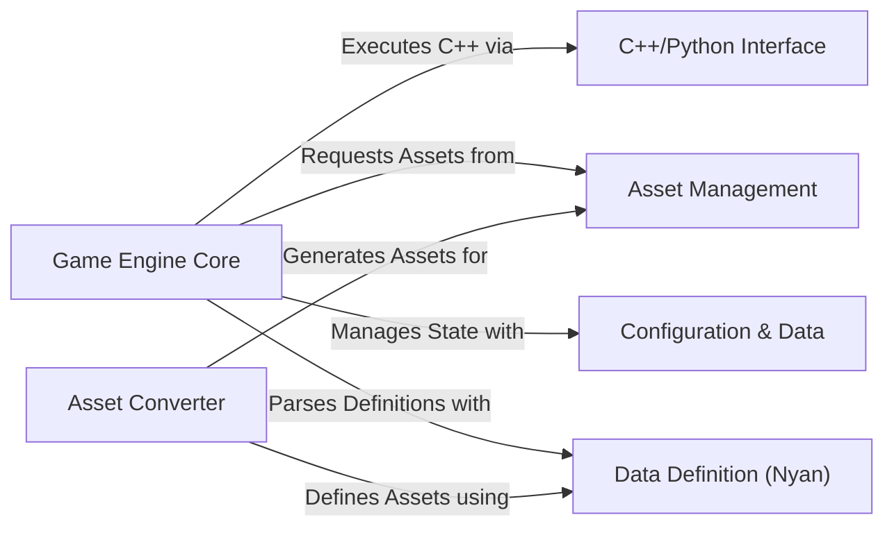

## Details

One paragraph explaining the functionality which is represented by this graph. What the main flow is and what is its purpose.

### Game Engine Core [[Expand]](./Game_Engine_Core.md)
The central orchestrator of the game. It initializes all systems, runs the main game loop, and manages the overall game state and flow.

**Related Classes/Methods**:

- `openage/main/main.py`
- `openage/game/main.py`

### C++/Python Interface [[Expand]](./C_Python_Interface.md)
A critical bridge that allows the Python-based scripting and logic layers to communicate with the high-performance C++ backend, enabling efficient execution of core engine functionalities.

**Related Classes/Methods**:

- `openage/cppinterface/`

### Asset Management
Provides a unified system for managing and accessing game assets. It uses a virtual file system (`fslike`) to abstract asset sources, allowing the engine to load resources like graphics and sounds seamlessly.

**Related Classes/Methods**:

- `openage/assets/`
- `openage/util/fslike/`

### Data Definition (Nyan) [[Expand]](./Data_Definition_Nyan_.md)
Implements the engine's custom "Not Your Average Notation" (Nyan) data language. It is responsible for parsing `.nyan` files that define game objects, rules, and configurations.

**Related Classes/Methods**:

- `openage/nyan/`

### Asset Converter [[Expand]](./Asset_Converter.md)
A standalone tool responsible for processing and converting raw game assets (e.g., from Age of Empires) into the engine's optimized format.

**Related Classes/Methods**:

- `openage/convert/main.py`
- `openage/convert/tool/driver.py`

### Configuration & Data [[Expand]](./Configuration_Data.md)
Manages game configuration variables (`cvar`) and other dynamic game data. This allows for easy modification of settings and game state at runtime.

**Related Classes/Methods**:

- `openage/cvar/`

### [FAQ](https://github.com/CodeBoarding/GeneratedOnBoardings/tree/main?tab=readme-ov-file#faq)