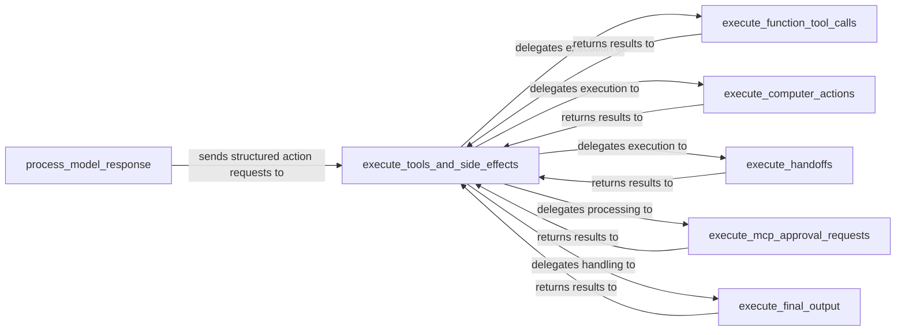

## Details

This subsystem encapsulates the agent's internal decision-making and execution logic, interpreting model responses and translating them into executable actions such as tool calls, handoffs, or computer actions. It forms the core of how an AI agent interacts with its environment and other agents.

### process_model_response
Interprets the raw output from the language model, translating it into structured action requests (e.g., ToolRunHandoff, ToolRunFunction, ToolRunComputer, ToolRunFinalOutput, ToolRunMcpApproval). This function embodies the agent's immediate decision-making process based on the LLM's output.

**Related Classes/Methods**:

- <a href="https://github.com/openai/openai-agents-python/blob/main/src/agents/_run_impl.py#L383-L535" target="_blank" rel="noopener noreferrer">`process_model_response`:383-535</a>

### execute_tools_and_side_effects
Acts as the central dispatcher and orchestrator for executing various actions based on the structured requests received from process_model_response. It manages the flow of control to specific action handlers and aggregates their results.

**Related Classes/Methods**:

- <a href="https://github.com/openai/openai-agents-python/blob/main/src/agents/_run_impl.py#L230-L369" target="_blank" rel="noopener noreferrer">`execute_tools_and_side_effects`:230-369</a>

### execute_function_tool_calls
Invokes external functions registered as tools, handling their execution and capturing their results. This component is crucial for extending the agent's capabilities through predefined functionalities.

**Related Classes/Methods**:

- <a href="https://github.com/openai/openai-agents-python/blob/main/src/agents/_run_impl.py#L537-L610" target="_blank" rel="noopener noreferrer">`execute_function_tool_calls`:537-610</a>

### execute_computer_actions
Manages the execution of actions that interact with the computer environment, such as browser automation or shell commands. This enables the agent to perform operations directly on the host system.

**Related Classes/Methods**:

- <a href="https://github.com/openai/openai-agents-python/blob/main/src/agents/_run_impl.py#L636-L683" target="_blank" rel="noopener noreferrer">`execute_computer_actions`:636-683</a>

### execute_handoffs
Facilitates the transfer of control or information to other agents or systems, enabling multi-agent collaboration or integration with external workflows. This is key for complex, multi-step processes involving multiple agents.

**Related Classes/Methods**:

- <a href="https://github.com/openai/openai-agents-python/blob/main/src/agents/_run_impl.py#L685-L815" target="_blank" rel="noopener noreferrer">`execute_handoffs`:685-815</a>

### execute_mcp_approval_requests
Processes requests for human or system approvals within the Multi-Component Protocol (MCP), ensuring necessary validations or human-in-the-loop interventions before proceeding with certain actions.

**Related Classes/Methods**:

- <a href="https://github.com/openai/openai-agents-python/blob/main/src/agents/_run_impl.py#L817-L849" target="_blank" rel="noopener noreferrer">`execute_mcp_approval_requests`:817-849</a>

### execute_final_output
Manages the generation of the agent's final output and triggers any associated post-processing hooks or termination logic. This component concludes an agent's execution cycle.

**Related Classes/Methods**:

- <a href="https://github.com/openai/openai-agents-python/blob/main/src/agents/_run_impl.py#L851-L873" target="_blank" rel="noopener noreferrer">`execute_final_output`:851-873</a>

### [FAQ](https://github.com/CodeBoarding/GeneratedOnBoardings/tree/main?tab=readme-ov-file#faq)