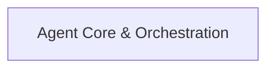

## Details

One paragraph explaining the functionality which is represented by this graph. What the main flow is and what is its purpose.

### Agent Core & Orchestration [[Expand]](./Agent_Core_Orchestration.md)
The central component responsible for defining, executing, and managing the lifecycle of AI agents. It handles the core execution flow, processes inputs, structures outputs, and integrates input and output guardrail functionalities to ensure safe and compliant agent behavior. It also facilitates multi-agent coordination within the SDK.

**Related Classes/Methods**:

- <a href="https://github.com/sandeshwar/openai-agents-python/blob/main/src/agents/lifecycle.py#L1-L1" target="_blank" rel="noopener noreferrer">`src/agents/lifecycle.py` (1:1)</a>

### [FAQ](https://github.com/CodeBoarding/GeneratedOnBoardings/tree/main?tab=readme-ov-file#faq)