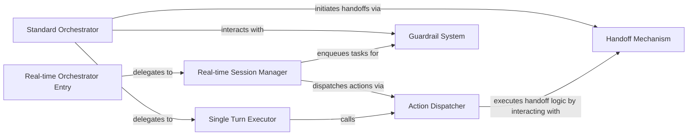

## Details

The agent orchestration subsystem is designed to manage both synchronous and asynchronous agent interactions. The Standard Orchestrator handles turn-based execution, processing inputs, applying Guardrail System checks, and executing individual turns via the Single Turn Executor. For real-time scenarios, the Real-time Orchestrator Entry initiates a Real-time Session Manager, which oversees the asynchronous event loop, dispatches actions through the Action Dispatcher, and integrates with the Guardrail System. Both orchestration paths can leverage the Handoff Mechanism to transfer control or tasks, enabling complex multi-agent workflows. The Action Dispatcher serves as a central hub for processing various agent outputs, including tool calls and handoffs, ensuring flexible and extensible agent behavior.

### Standard Orchestrator
Manages the overall flow for standard, turn-based agent execution. This includes input preparation, applying guardrails, executing single turns, and saving results. It acts as the primary orchestrator for synchronous agent interactions.

**Related Classes/Methods**:

- <a href="https://github.com/openai/openai-agents-python/blob/main/src/agents/guardrail.py#L160-L180" target="_blank" rel="noopener noreferrer">`run`:160-180</a>

### Real-time Orchestrator Entry
Serves as the initial entry point for real-time agent execution. Its main role is to initialize and delegate control to a Real-time Session Manager, setting up the asynchronous environment.

**Related Classes/Methods**:

- <a href="https://github.com/openai/openai-agents-python/blob/main/src/agents/guardrail.py#L160-L180" target="_blank" rel="noopener noreferrer">`run`:160-180</a>

### Real-time Session Manager
Manages the asynchronous event loop and state for a real-time agent conversation. It handles incoming events, dispatches tool calls, and updates model settings, central to event-driven, asynchronous orchestration.

**Related Classes/Methods**:

- <a href="https://github.com/openai/openai-agents-python/blob/main/src/agents/realtime/session.py#L52-L602" target="_blank" rel="noopener noreferrer">`RealtimeSession`:52-602</a>

### Single Turn Executor
Executes a single turn of the agent's interaction. This involves obtaining a response from the LLM and processing the resulting actions. It's a key part of the agent's internal pipeline for a single step within the orchestration flow.

**Related Classes/Methods**:

- <a href="https://github.com/openai/openai-agents-python/blob/main/src/agents/run.py#L920-L982" target="_blank" rel="noopener noreferrer">`_run_single_turn`:920-982</a>

### Action Dispatcher
A central component for processing various actions (e.g., tool calls, handoffs, computer actions, final outputs) that result from a model's response. It dispatches to different handlers based on the action type, supporting extensibility in agent behavior.

**Related Classes/Methods**:

- <a href="https://github.com/openai/openai-agents-python/blob/main/src/agents/_run_impl.py#L230-L369" target="_blank" rel="noopener noreferrer">`execute_tools_and_side_effects`:230-369</a>

### Guardrail System [[Expand]](./Guardrail_System.md)
Handles input/output validation and applies predefined guardrails to ensure agent responses and actions adhere to specified constraints and safety policies.

**Related Classes/Methods**:

- <a href="https://github.com/openai/openai-agents-python/blob/main/src/agents/guardrail.py#L71-L125" target="_blank" rel="noopener noreferrer">`InputGuardrail`:71-125</a>
- <a href="https://github.com/openai/openai-agents-python/blob/main/src/agents/guardrail.py#L128-L180" target="_blank" rel="noopener noreferrer">`OutputGuardrail`:128-180</a>

### Handoff Mechanism [[Expand]](./Handoff_Mechanism.md)
Manages the process of handing off control or tasks between agents or to external systems, facilitating complex multi-agent workflows and integrations.

**Related Classes/Methods**:

- <a href="https://github.com/openai/openai-agents-python/blob/main/src/agents/lifecycle.py#L80-L88" target="_blank" rel="noopener noreferrer">`Handoff`:80-88</a>

### [FAQ](https://github.com/CodeBoarding/GeneratedOnBoardings/tree/main?tab=readme-ov-file#faq)