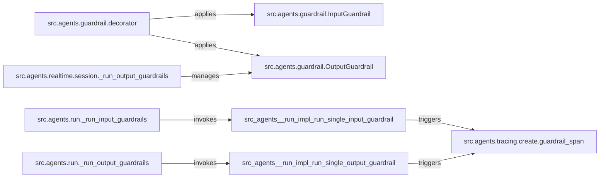

## Details

The Guardrail subsystem in `openai-agents-python` is designed to enforce validation policies on agent inputs and outputs, ensuring adherence to predefined safety and compliance standards. It comprises core `InputGuardrail` and `OutputGuardrail` definitions, a `decorator` for declarative policy application, and orchestration components (`_run_input_guardrails`, `_run_output_guardrails`) that manage their execution. A specialized `RealtimeAgentSession` handles guardrails in real-time contexts, while `guardrail_span` provides crucial observability through tracing. This modular design allows for flexible and robust validation within the agent's lifecycle.

### src.agents.guardrail.InputGuardrail
Defines the structure and rules for validating agent inputs. It encapsulates the policies that must be satisfied before an agent processes information. This is fundamental for an SDK to allow developers to specify input constraints.

**Related Classes/Methods**:

- <a href="https://github.com/openai/openai-agents-python/blob/main/src/agents/guardrail.py#L71-L125" target="_blank" rel="noopener noreferrer">`src.agents.guardrail.InputGuardrail`:71-125</a>

### src.agents.guardrail.OutputGuardrail
Defines the structure and rules for validating agent outputs. It encapsulates the policies that must be satisfied after an agent generates a response. Essential for ensuring agent outputs adhere to safety and compliance standards.

**Related Classes/Methods**:

- <a href="https://github.com/openai/openai-agents-python/blob/main/src/agents/guardrail.py#L128-L180" target="_blank" rel="noopener noreferrer">`src.agents.guardrail.OutputGuardrail`:128-180</a>

### src.agents.guardrail.decorator
A higher-order function (decorator) that provides a declarative way for developers to attach InputGuardrail and OutputGuardrail policies to agent functions or methods. It acts as the primary interface for guardrail configuration, crucial for an extensible SDK.

**Related Classes/Methods**:

- <a href="https://github.com/openai/openai-agents-python/blob/main/src/agents/guardrail.py#L218-L256" target="_blank" rel="noopener noreferrer">`src.agents.guardrail.input_guardrail`:218-256</a>
- <a href="https://github.com/openai/openai-agents-python/blob/main/src/agents/guardrail.py#L291-L329" target="_blank" rel="noopener noreferrer">`src.agents.guardrail.output_guardrail`:291-329</a>

### src.agents.run._run_input_guardrails
Orchestrates the execution of all configured input guardrails during the agent's standard execution flow. It ensures that pre-processing validation is systematically applied, acting as a key control point in the agent's pipeline.

**Related Classes/Methods**:

- <a href="https://github.com/openai/openai-agents-python/blob/main/src/agents/_run_impl.py#L860-L888" target="_blank" rel="noopener noreferrer">`src.agents._run_impl.RunImpl._run_input_guardrails`:860-888</a>

### src.agents.run._run_output_guardrails
Orchestrates the execution of all configured output guardrails during the agent's standard execution flow, after an agent produces a response. It ensures post-processing validation, completing the enforcement cycle.

**Related Classes/Methods**:

- <a href="https://github.com/openai/openai-agents-python/blob/main/src/agents/_run_impl.py#L904-L937" target="_blank" rel="noopener noreferrer">`src.agents._run_impl.RunImpl._run_output_guardrails`:904-937</a>

### src.agents.realtime.session._run_output_guardrails
Manages and applies output guardrails specifically within the context of a real-time agent session. It integrates with the real-time event system to process guardrail checks asynchronously, addressing specific requirements of real-time agent interactions.

**Related Classes/Methods**:

- <a href="https://github.com/openai/openai-agents-python/blob/main/src/agents/realtime/session.py#L200-L259" target="_blank" rel="noopener noreferrer">`src.agents.realtime.session.RealtimeAgentSession._run_output_guardrails`:200-259</a>

### src.agents.tracing.create.guardrail_span
Creates and manages tracing spans for guardrail operations. This component is vital for observability in an SDK, enabling detailed monitoring, debugging, and performance analysis of guardrail execution within the overall agent trace.

**Related Classes/Methods**:

- <a href="https://github.com/openai/openai-agents-python/blob/main/src/agents/tracing/create.py#L288-L313" target="_blank" rel="noopener noreferrer">`src.agents.tracing.create.guardrail_span`:288-313</a>

### [FAQ](https://github.com/CodeBoarding/GeneratedOnBoardings/tree/main?tab=readme-ov-file#faq)