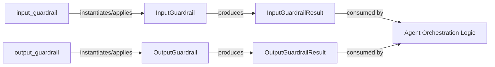

## Details

Abstract Components Overview

### InputGuardrail
Serves as the core policy enforcement mechanism for validating and sanitizing incoming data or prompts. Its `run` method encapsulates the primary validation logic, ensuring that all agent inputs comply with predefined safety and operational policies. This is fundamental for preventing malicious or malformed inputs from affecting agent behavior.

**Related Classes/Methods**: _None_

### OutputGuardrail
Symmetrically handles the validation and policy enforcement for data or responses generated by an agent. Its `run` method ensures that agent outputs adhere to defined safety guidelines and format requirements before being released, preventing the generation of harmful or non-compliant responses.

**Related Classes/Methods**: _None_

### InputGuardrailResult
A structured data container that encapsulates the outcome of an `InputGuardrail`'s execution. It provides a standardized way to communicate validation success or failure, along with any associated messages or modified input, offering clear feedback to developers integrating the SDK.

**Related Classes/Methods**: _None_

### OutputGuardrailResult
Similar to `InputGuardrailResult`, this component encapsulates the outcome of an `OutputGuardrail`'s execution. It provides a clear and consistent way to report on output validation results, including success, failure, and any modified output, which is vital for debugging and ensuring output integrity.

**Related Classes/Methods**: _None_

### input_guardrail
This component acts as a high-level abstraction (likely a decorator or factory function) that simplifies the integration of input guardrails into agent functions or methods. It allows developers to easily apply input validation logic without manually instantiating and managing `InputGuardrail` objects, promoting reusability and reducing boilerplate in an SDK context.

**Related Classes/Methods**: _None_

### output_guardrail
Analogous to `input_guardrail`, this component streamlines the application of output validation. As a decorator or factory function, it makes it easy for developers to integrate output safety mechanisms into their agent's response generation, ensuring that all outputs are automatically checked for compliance.

**Related Classes/Methods**: _None_

### Agent Orchestration Logic
This central component is responsible for managing the overall flow and execution of agents. It orchestrates the sequence of operations, including the application of input and output guardrails, processing agent actions, and managing the agent's lifecycle. It consumes the results from guardrails to determine subsequent actions or to halt execution if policies are violated.

**Related Classes/Methods**: _None_

### [FAQ](https://github.com/CodeBoarding/GeneratedOnBoardings/tree/main?tab=readme-ov-file#faq)