```mermaid
graph LR
    Handoff_Core["Handoff Core"]
    Agent_Orchestrator["Agent Orchestrator"]
    Execution_Implementer["Execution Implementer"]
    Real_time_Session_Manager["Real-time Session Manager"]
    Model_Interface["Model Interface"]
    Tracing_API["Tracing API"]
    Tracing_Data_Structures["Tracing Data Structures"]
    Tracing_Implementation["Tracing Implementation"]
    Agent_Orchestrator -- "instructs" --> Execution_Implementer
    Real_time_Session_Manager -- "instructs" --> Execution_Implementer
    Execution_Implementer -- "invokes" --> Handoff_Core
    Handoff_Core -- "utilizes" --> Tracing_API
    Handoff_Core -- "reports errors via" --> Tracing_Implementation
    Model_Interface -- "influences decisions of" --> Agent_Orchestrator
    Model_Interface -- "influences decisions of" --> Real_time_Session_Manager
    Tracing_API -- "structures data with" --> Tracing_Data_Structures
    Tracing_API -- "relies on" --> Tracing_Implementation
    click Agent_Orchestrator href "https://github.com/CodeBoarding/GeneratedOnBoardings/blob/main/openai-agents-python/Agent_Orchestrator.md" "Details"
```

## Details

The Handoff Mechanism subsystem is central to enabling complex multi-agent workflows and task delegation within the project. It facilitates the seamless transfer of control and context between different agents or external systems.

### Handoff Core
Defines the fundamental logic and data structures for initiating and managing handoffs. It acts as the central point for executing a handoff operation.

**Related Classes/Methods**:

- <a href="https://github.com/openai/openai-agents-python/blob/main/src/agents/lifecycle.py#L80-L88" target="_blank" rel="noopener noreferrer">`handoff`:80-88</a>
- <a href="https://github.com/openai/openai-agents-python/blob/main/src/agents/handoffs.py" target="_blank" rel="noopener noreferrer">`_invoke_handoff`</a>
- <a href="https://github.com/openai/openai-agents-python/blob/main/src/agents/lifecycle.py#L80-L88" target="_blank" rel="noopener noreferrer">`Handoff`:80-88</a>

### Agent Orchestrator [[Expand]](./Agent_Orchestrator.md)
Manages the overall execution flow of an agent, including the high-level decision-making process for identifying and preparing for handoffs.

**Related Classes/Methods**:

- <a href="https://github.com/openai/openai-agents-python/blob/main/src/agents/run.py#L1195-L1217" target="_blank" rel="noopener noreferrer">`_get_handoffs`:1195-1217</a>
- <a href="https://github.com/openai/openai-agents-python/blob/main/src/agents/run.py#L1206-L1213" target="_blank" rel="noopener noreferrer">`_check_handoff_enabled`:1206-1213</a>

### Execution Implementer
Carries out the concrete steps of an agent's run, specifically responsible for invoking the core handoff mechanism when a handoff is required.

**Related Classes/Methods**:

- <a href="https://github.com/openai/openai-agents-python/blob/main/src/agents/_run_impl.py#L685-L815" target="_blank" rel="noopener noreferrer">`execute_handoffs`:685-815</a>
- <a href="https://github.com/openai/openai-agents-python/blob/main/src/agents/_run_impl.py#L178-L180" target="_blank" rel="noopener noreferrer">`NextStepHandoff`:178-180</a>

### Real-time Session Manager
Integrates handoff capabilities into interactive, real-time agent sessions, allowing for dynamic handoff decisions based on live interactions or tool calls.

**Related Classes/Methods**:

- <a href="https://github.com/openai/openai-agents-python/blob/main/src/agents/realtime/session.py#L299-L392" target="_blank" rel="noopener noreferrer">`_handle_tool_call`:299-392</a>
- <a href="https://github.com/openai/openai-agents-python/blob/main/src/agents/run.py#L1195-L1217" target="_blank" rel="noopener noreferrer">`_get_handoffs`:1195-1217</a>
- <a href="https://github.com/openai/openai-agents-python/blob/main/src/agents/run.py#L1206-L1213" target="_blank" rel="noopener noreferrer">`_check_handoff_enabled`:1206-1213</a>

### Model Interface
Translates internal representations of handoff capabilities into a format compatible with external Large Language Models (LLMs), allowing models to understand and utilize handoff tools.

**Related Classes/Methods**:

- <a href="https://github.com/openai/openai-agents-python/blob/main/src/agents/models/openai_responses.py#L376-L398" target="_blank" rel="noopener noreferrer">`convert_tools`:376-398</a>
- <a href="https://github.com/openai/openai-agents-python/blob/main/src/agents/models/openai_responses.py#L461-L469" target="_blank" rel="noopener noreferrer">`_convert_handoff_tool`:461-469</a>

### Tracing API
Provides the interface for creating specific tracing spans related to handoff events, enabling observability and debugging.

**Related Classes/Methods**:

- <a href="https://github.com/openai/openai-agents-python/blob/main/src/agents/tracing/create.py#L225-L253" target="_blank" rel="noopener noreferrer">`handoff_span`:225-253</a>

### Tracing Data Structures
Defines the data models for capturing detailed information about handoff events within the tracing system.

**Related Classes/Methods**:

- <a href="https://github.com/openai/openai-agents-python/blob/main/src/agents/tracing/span_data.py#L168-L189" target="_blank" rel="noopener noreferrer">`HandoffSpanData`:168-189</a>

### Tracing Implementation
Provides the underlying mechanisms for tracing spans, particularly for reporting errors that occur during handoff operations.

**Related Classes/Methods**:

- <a href="https://github.com/openai/openai-agents-python/blob/main/src/agents/tracing/spans.py#L18-L20" target="_blank" rel="noopener noreferrer">`SpanError`:18-20</a>

### [FAQ](https://github.com/CodeBoarding/GeneratedOnBoardings/tree/main?tab=readme-ov-file#faq)