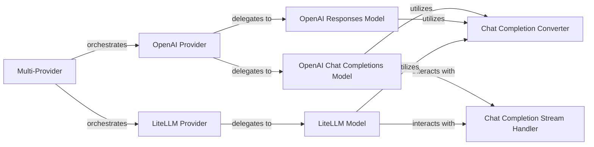

## Details

The LLM Integration subsystem provides a robust abstraction layer for interacting with various Large Language Models (LLMs), managing provider-specific details, and ensuring consistent model access and response processing within the openai-agents-python project.

### Multi-Provider
Acts as the central orchestrator and facade for the entire LLM integration subsystem. It selects and provides the appropriate LLM model from different underlying providers based on configuration or runtime context, including fallback mechanisms.

**Related Classes/Methods**:

- <a href="https://github.com/openai/openai-agents-python/blob/main/src/agents/models/multi_provider.py" target="_blank" rel="noopener noreferrer">`Multi-Provider`</a>

### OpenAI Provider
Manages the integration with OpenAI models. It serves as the primary entry point for OpenAI-specific LLM interactions, translating generic requests into OpenAI-compatible calls.

**Related Classes/Methods**:

- <a href="https://github.com/openai/openai-agents-python/blob/main/src/agents/models/openai_provider.py" target="_blank" rel="noopener noreferrer">`OpenAI Provider`</a>

### LiteLLM Provider
Provides a unified abstraction layer for interacting with various LLMs via the LiteLLM library. It translates generic requests into LiteLLM-compatible calls.

**Related Classes/Methods**:

- <a href="https://github.com/openai/openai-agents-python/blob/main/src/agents/extensions/models/litellm_provider.py" target="_blank" rel="noopener noreferrer">`LiteLLM Provider`</a>

### OpenAI Chat Completions Model
Handles the specifics of interacting directly with OpenAI's chat completions API, including constructing requests and fetching raw responses.

**Related Classes/Methods**:

- <a href="https://github.com/openai/openai-agents-python/blob/main/src/agents/models/openai_chatcompletions.py" target="_blank" rel="noopener noreferrer">`OpenAI Chat Completions Model`</a>

### OpenAI Responses Model
Focuses on processing and converting responses received from OpenAI models, particularly for extracting structured information like tool definitions and usage.

**Related Classes/Methods**:

- <a href="https://github.com/openai/openai-agents-python/blob/main/src/agents/models/openai_responses.py" target="_blank" rel="noopener noreferrer">`OpenAI Responses Model`</a>

### LiteLLM Model
Implements the core logic for sending requests to and processing responses from LiteLLM, handling message format conversions specific to LiteLLM.

**Related Classes/Methods**:

- <a href="https://github.com/openai/openai-agents-python/blob/main/src/agents/extensions/models/litellm_model.py" target="_blank" rel="noopener noreferrer">`LiteLLM Model`</a>

### Chat Completion Converter
A utility component for converting various message and item types to and from the format required by chat completion models (e.g., OpenAI's message format, LiteLLM's message format).

**Related Classes/Methods**:

- <a href="https://github.com/openai/openai-agents-python/blob/main/src/agents/models/chatcmpl_converter.py" target="_blank" rel="noopener noreferrer">`Chat Completion Converter`</a>

### Chat Completion Stream Handler
Manages the state and processing of streamed responses from chat completion models, reconstructing the full response from incoming chunks.

**Related Classes/Methods**:

- <a href="https://github.com/openai/openai-agents-python/blob/main/src/agents/models/chatcmpl_stream_handler.py" target="_blank" rel="noopener noreferrer">`Chat Completion Stream Handler`</a>

### [FAQ](https://github.com/CodeBoarding/GeneratedOnBoardings/tree/main?tab=readme-ov-file#faq)