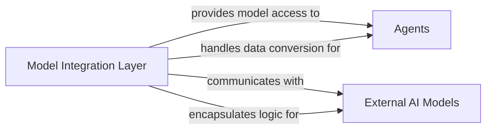

## Details

One paragraph explaining the functionality which is represented by this graph. What the main flow is and what is its purpose.

### Model Integration Layer [[Expand]](./Model_Integration_Layer.md)
This component provides a standardized and extensible interface for integrating with various underlying AI models (e.g., OpenAI, LiteLLM). It manages data conversions between the framework's internal formats and specific model APIs, ensuring seamless interaction for agents and other components requiring AI model capabilities.

**Related Classes/Methods**: _None_

### Agents
Components that use the Model Integration Layer to interact with AI models.

**Related Classes/Methods**: _None_

### External AI Models
External AI models such as OpenAI and LiteLLM that the Model Integration Layer communicates with.

**Related Classes/Methods**: _None_

### [FAQ](https://github.com/CodeBoarding/GeneratedOnBoardings/tree/main?tab=readme-ov-file#faq)