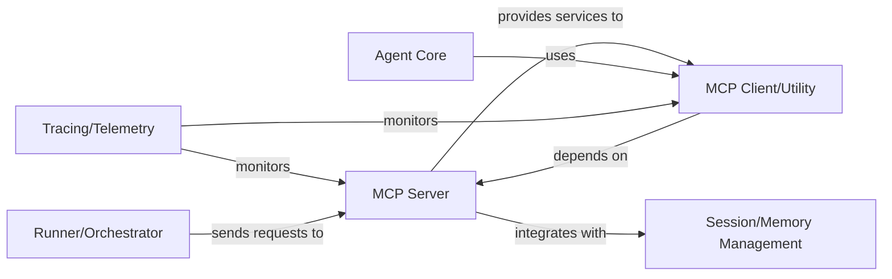

## Details

The openai-agents-python project is structured around a central Multi-Agent Communication Protocol (MCP) Server, which acts as the core for inter-agent communication and tool management. The MCP Client/Utility provides a simplified interface for various agents and system components to interact with this server, abstracting the underlying communication complexities. The Agent Core leverages this client utility for discovering and utilizing tools, forming the fundamental building block of the agent system. The Runner/Orchestrator component is responsible for executing operations, primarily by sending requests to the MCP Server for tool invocations. Session/Memory Management integrates with the MCP Server to provide context-specific tools and manage session-related data. Finally, the Tracing/Telemetry component provides essential monitoring capabilities, observing the activities of both the MCP Server and Client/Utility to ensure system observability and performance tracking. This architecture promotes modularity and clear separation of concerns, with the MCP Server facilitating centralized tool access and communication.

### MCP Server
Acts as the central hub for the Multi-Agent Communication Protocol. It manages the lifecycle of the MCP server, including establishing and cleaning up connections. Its core functionality involves registering and listing available tools, and handling tool invocation requests from various agents or system components. It also incorporates internal logic for filtering tools based on defined criteria.

**Related Classes/Methods**:

- <a href="https://github.com/openai/openai-agents-python/blob/main/src/agents/mcp/server.py" target="_blank" rel="noopener noreferrer">`src/agents/mcp/server.py`</a>

### MCP Client/Utility
Provides a high-level abstraction layer for agents and other system parts to interact with the MCP Server. It offers helper functions that abstract the direct communication details with the server, facilitating operations like retrieving all available function tools, getting specific function tools, and invoking MCP-managed tools.

**Related Classes/Methods**:

- <a href="https://github.com/openai/openai-agents-python/blob/main/src/agents/mcp/util.py" target="_blank" rel="noopener noreferrer">`src/agents/mcp/util.py`</a>

### Runner/Orchestrator
Responsible for running or orchestrating operations, interacting with the MCP Server for tool invocations.

**Related Classes/Methods**:

- <a href="https://github.com/openai/openai-agents-python/blob/main/src/agents/_run_impl.py" target="_blank" rel="noopener noreferrer">`src/agents/_run_impl.py`</a>

### Agent Core
The core component of the agent system, utilizing the MCP Client/Utility for tool discovery and utilization.

**Related Classes/Methods**:

- <a href="https://github.com/openai/openai-agents-python/blob/main/src/agents/agent.py" target="_blank" rel="noopener noreferrer">`src/agents/agent.py`</a>

### Session/Memory Management
Responsible for managing sessions and memory, integrating with the MCP Server to provide tools within specific session contexts.

**Related Classes/Methods**:

- <a href="https://github.com/openai/openai-agents-python/blob/main/src/agents/realtime/openai_realtime.py" target="_blank" rel="noopener noreferrer">`src/agents/realtime/openai_realtime.py`</a>

### Tracing/Telemetry
Responsible for monitoring and tracing system activities, including the MCP Server and Client/Utility.

**Related Classes/Methods**:

- <a href="https://github.com/openai/openai-agents-python/blob/main/src/agents/tracing/__init__.py" target="_blank" rel="noopener noreferrer">`src/agents/tracing/__init__.py`</a>

### [FAQ](https://github.com/CodeBoarding/GeneratedOnBoardings/tree/main?tab=readme-ov-file#faq)