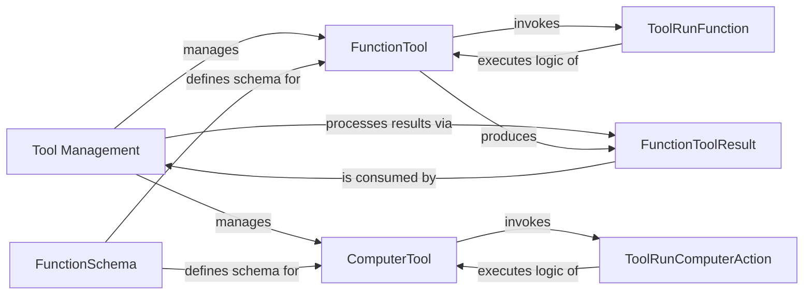

## Details

The feedback indicates that the "Tool Management" component lacks source code references, making it difficult to understand its responsibilities. The `getClassHierarchy` output for the `agents` package does not explicitly show a class named "Tool Management" or a similar overarching component. However, it does show `agents.items.ToolCallItem` and `agents.items.ToolCallOutputItem`, which suggests that tool calls and their outputs are managed within the `agents.items` module. Additionally, `agents.tool.ComputerTool` and `agents.tool.FunctionTool` are present, indicating that the `agents.tool` module defines the tools themselves.

Given this, the "Tool Management" component is likely an abstract concept representing the coordination of these various tool-related classes and modules rather than a single, explicit class. The original analysis correctly identifies the related classes and their interactions. The feedback is valid in pointing out the lack of a direct source code reference for "Tool Management," but it's because this component is a conceptual grouping of functionalities rather than a concrete class.

Therefore, the original analysis is largely correct in its conceptualization of "Tool Management" as an orchestrating component. No architectural changes are required, as the current analysis accurately reflects the distributed nature of tool management within the `agents` package. The existing component definitions and relationships are sufficient to describe the subsystem.

### Tool Management [[Expand]](./Tool_Management.md)
The overarching component responsible for orchestrating the lifecycle of tools within the multi-agent system. It manages the registration, discovery, and high-level execution flow of various tool types, ensuring agents can seamlessly leverage external capabilities. This component acts as the central hub for tool-related operations, conceptually encompassing the interactions between `agents.tool`, `agents.items`, and `agents._run_impl` modules.

**Related Classes/Methods**: _None_

### FunctionTool
Represents a generic callable Python function exposed as a tool. It encapsulates the function's metadata (name, description, parameters) and a reference to its execution logic, making it discoverable and invokable by agents. This component is fundamental for integrating custom Python logic as tools.

**Related Classes/Methods**:

- <a href="https://github.com/sandeshwar/openai-agents-python/blob/main/src/agents/tool.py#L45-L72" target="_blank" rel="noopener noreferrer">`agents.tool.FunctionTool` (45:72)</a>

### ComputerTool
A specialized tool type designed for interacting with the underlying computer system or environment. This includes functionalities like file system operations, command execution, or other system-level interactions, providing agents with capabilities beyond pure function calls.

**Related Classes/Methods**:

- <a href="https://github.com/sandeshwar/openai-agents-python/blob/main/src/agents/tool.py#L119-L129" target="_blank" rel="noopener noreferrer">`agents.tool.ComputerTool` (119:129)</a>

### FunctionToolResult
A standardized data structure used to encapsulate the outcome of a tool's execution. It holds the return value, output, or any error information, providing a consistent way for the system to process and interpret the results of tool invocations.

**Related Classes/Methods**:

- <a href="https://github.com/sandeshwar/openai-agents-python/blob/main/src/agents/tool.py#L33-L41" target="_blank" rel="noopener noreferrer">`agents.tool.FunctionToolResult` (33:41)</a>

### ToolRunFunction
Responsible for the actual execution of the underlying Python function associated with a `FunctionTool`. It handles the invocation of the callable and captures its direct output or exceptions. This component isolates the execution details from the tool definition.

**Related Classes/Methods**:

- <a href="https://github.com/sandeshwar/openai-agents-python/blob/main/src/agents/_run_impl.py#L103-L105" target="_blank" rel="noopener noreferrer">`agents._run_impl.ToolRunFunction` (103:105)</a>

### ToolRunComputerAction
Executes the specific system-level actions defined by a `ComputerTool`. This component contains the implementation details for interacting with the operating system or environment, ensuring secure and controlled execution of computer-related tasks.

**Related Classes/Methods**:

- <a href="https://github.com/sandeshwar/openai-agents-python/blob/main/src/agents/_run_impl.py#L109-L111" target="_blank" rel="noopener noreferrer">`agents._run_impl.ToolRunComputerAction` (109:111)</a>

### FunctionSchema
Defines and validates the input and output schemas for tools, ensuring they conform to expected formats (e.g., OpenAI Chat Completions API format). This component is critical for maintaining data integrity and enabling proper communication between agents and tools.

**Related Classes/Methods**:

- <a href="https://github.com/sandeshwar/openai-agents-python/blob/main/src/agents/function_schema.py#L1-L1" target="_blank" rel="noopener noreferrer">`agents.function_schema.FunctionSchema` (1:1)</a>

### [FAQ](https://github.com/CodeBoarding/GeneratedOnBoardings/tree/main?tab=readme-ov-file#faq)