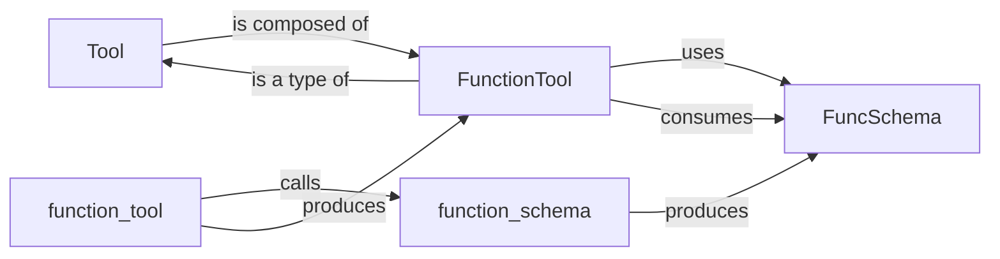

## Details

The `Tool Management` subsystem is designed for the robust definition, creation, and schema management of external functionalities. The `function_schema` component is foundational, responsible for generating `FuncSchema` objects by analyzing Python functions. These `FuncSchema` objects are then utilized by `FunctionTool` to formally define its input parameters, ensuring type safety and clarity. The `function_tool` helper streamlines the developer experience by orchestrating the creation of `FunctionTool` instances, internally calling `function_schema` to handle the schema generation. Finally, all concrete tool implementations, such as `FunctionTool`, are unified under the `Tool` abstraction, providing a consistent and extensible interface for the broader AI agent orchestration framework. This structure ensures that tools are well-defined, easily creatable, and uniformly accessible to agents.

### Tool
Serves as the abstract interface or union type for all supported tool implementations within the framework. It provides a unified way for agents to interact with diverse external functionalities.

**Related Classes/Methods**:

- <a href="https://github.com/openai/openai-agents-python/blob/main/src/agents/tool.py#L61-L98" target="_blank" rel="noopener noreferrer">`src.agents.tool.FunctionTool`:61-98</a>

### FunctionTool
A concrete implementation of a tool that wraps a standard Python function, encapsulating its name, description, parameter schema, and asynchronous invocation logic. It's the primary mechanism for exposing Python functions as agent tools.

**Related Classes/Methods**:

- <a href="https://github.com/openai/openai-agents-python/blob/main/src/agents/function_schema.py#L20-L74" target="_blank" rel="noopener noreferrer">`src.agents.function_schema.FuncSchema`:20-74</a>
- <a href="https://github.com/openai/openai-agents-python/blob/main/src/agents/tool.py" target="_blank" rel="noopener noreferrer">`src.agents.tool.Tool`</a>

### function_tool
A utility function (often used as a decorator) that simplifies the creation of `FunctionTool` instances. It automates the process of extracting metadata and generating the necessary schema from a given Python function.

**Related Classes/Methods**:

- <a href="https://github.com/openai/openai-agents-python/blob/main/src/agents/function_schema.py#L188-L356" target="_blank" rel="noopener noreferrer">`src.agents.function_schema.function_schema`:188-356</a>
- <a href="https://github.com/openai/openai-agents-python/blob/main/src/agents/tool.py#L61-L98" target="_blank" rel="noopener noreferrer">`src.agents.tool.FunctionTool`:61-98</a>

### FuncSchema
A data structure (dataclass) that holds the extracted and validated schema information for a Python function, including its name, description, and a Pydantic model representation of its parameters. This schema is crucial for tool introspection and validation.

**Related Classes/Methods**:

- <a href="https://github.com/openai/openai-agents-python/blob/main/src/agents/function_schema.py#L188-L356" target="_blank" rel="noopener noreferrer">`src.agents.function_schema.function_schema`:188-356</a>
- <a href="https://github.com/openai/openai-agents-python/blob/main/src/agents/tool.py#L61-L98" target="_blank" rel="noopener noreferrer">`src.agents.tool.FunctionTool`:61-98</a>

### function_schema
A core utility function responsible for analyzing a Python function's signature, type hints, and docstrings to automatically generate a `FuncSchema` object. It leverages Pydantic for robust and standardized schema creation.

**Related Classes/Methods**:

- <a href="https://github.com/openai/openai-agents-python/blob/main/src/agents/function_schema.py#L20-L74" target="_blank" rel="noopener noreferrer">`src.agents.function_schema.FuncSchema`:20-74</a>
- <a href="https://github.com/openai/openai-agents-python/blob/main/src/agents/tool.py#L329-L470" target="_blank" rel="noopener noreferrer">`src.agents.tool.function_tool`:329-470</a>

### [FAQ](https://github.com/CodeBoarding/GeneratedOnBoardings/tree/main?tab=readme-ov-file#faq)