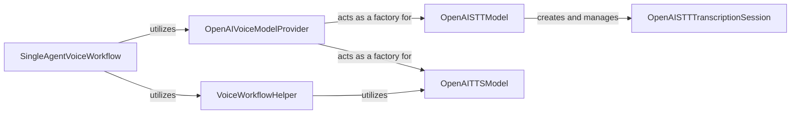

## Details

Abstract Components Overview

### SingleAgentVoiceWorkflow
The primary orchestration component for managing the end-to-end voice interaction lifecycle for a single agent. It serves as the high-level entry point for developers to initiate and control voice-based conversations, coordinating between STT, TTS, and agent logic.

**Related Classes/Methods**:

- `SingleAgentVoiceWorkflow` (1:1)

### OpenAIVoiceModelProvider
A centralized provider responsible for managing and instantiating various OpenAI voice models, including both Speech-to-Text (STT) and Text-to-Speech (TTS) capabilities. It abstracts the underlying model specifics, offering a unified interface for model access.

**Related Classes/Methods**:

- `OpenAIVoiceModelProvider` (1:1)

### OpenAISTTModel
The dedicated interface for OpenAI's Speech-to-Text (STT) functionality. It handles the initial setup and management of STT operations, serving as a gateway to individual transcription sessions.

**Related Classes/Methods**:

- `OpenAISTTModel` (1:1)

### OpenAISTTTranscriptionSession
Manages the detailed lifecycle of a single, ongoing Speech-to-Text transcription session. This includes handling real-time audio streaming, maintaining websocket connections, processing transcription events, and managing conversational turns.

**Related Classes/Methods**:

- `OpenAISTTTranscriptionSession` (1:1)

### OpenAITTSModel
The dedicated interface for OpenAI's Text-to-Speech (TTS) functionality. It is responsible for converting textual responses from agents into natural-sounding speech, enabling voice output.

**Related Classes/Methods**:

- `OpenAITTSModel` (1:1)

### VoiceWorkflowHelper
A utility component providing helper functions specifically designed to assist in voice workflows. Its primary role is to facilitate the streaming of text, likely for efficient Text-to-Speech (TTS) conversion and delivery.

**Related Classes/Methods**:

- `VoiceWorkflowHelper` (1:1)

### [FAQ](https://github.com/CodeBoarding/GeneratedOnBoardings/tree/main?tab=readme-ov-file#faq)