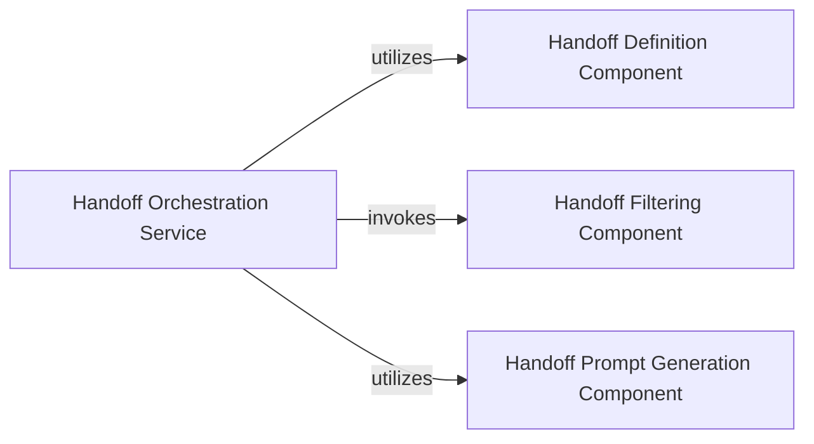

## Details

This subsystem is central to enabling collaborative and sequential tasks in multi-agent systems by managing the transfer of control and context. It adheres to the SDK's modular and extensible design principles, providing developers with clear APIs and configurable mechanisms for handoff processes.

### Handoff Definition Component
Defines the standardized data structure and metadata for handoff events within the SDK. It serves as the blueprint for developers to specify parameters and behaviors for various handoff types, ensuring consistency and clarity in multi-agent workflows. This component is fundamental for developers to programmatically interact with and configure handoffs.

**Related Classes/Methods**:

- <a href="https://github.com/sandeshwar/openai-agents-python/blob/main/src/agents/handoffs.py#L52-L113" target="_blank" rel="noopener noreferrer">`src.agents.handoffs.Handoff` (52:113)</a>

### Handoff Orchestration Service
Provides the core API for initiating and managing the transfer of control, context, and information between agents or system components. It leverages the Handoff Definition Component to execute handoffs according to defined parameters, enabling the creation and execution of complex multi-agent workflows. This is the primary entry point for developers to trigger handoffs.

**Related Classes/Methods**:

- <a href="https://github.com/sandeshwar/openai-agents-python/blob/main/src/agents/handoffs.py#L117-L123" target="_blank" rel="noopener noreferrer">`src.agents.handoffs.handoff` (117:123)</a>

### Handoff Filtering Component
Offers mechanisms to control and sanitize the data (e.g., tools, context) exchanged during a handoff. This component is crucial for security, privacy, and ensuring that only relevant and permissible information is passed between agents, providing developers with fine-grained control over data flow within the SDK. It encapsulates specific filtering utilities like tool type and item-based removal.

**Related Classes/Methods**:

- <a href="https://github.com/sandeshwar/openai-agents-python/blob/main/src/agents/extensions/handoff_filters.py#L1-L1" target="_blank" rel="noopener noreferrer">`src.agents.extensions.handoff_filters` (1:1)</a>

### Handoff Prompt Generation Component
Responsible for dynamically generating or modifying prompts related to the handoff process. This component allows for flexible customization of agent instructions or contextual information during the transfer of control, enhancing the adaptability and clarity of multi-agent interactions within the SDK. It acts as an extension point for tailoring handoff communication.

**Related Classes/Methods**:

- <a href="https://github.com/sandeshwar/openai-agents-python/blob/main/src/agents/extensions/handoff_prompt.py#L1-L1" target="_blank" rel="noopener noreferrer">`src.agents.extensions.handoff_prompt` (1:1)</a>

### [FAQ](https://github.com/CodeBoarding/GeneratedOnBoardings/tree/main?tab=readme-ov-file#faq)