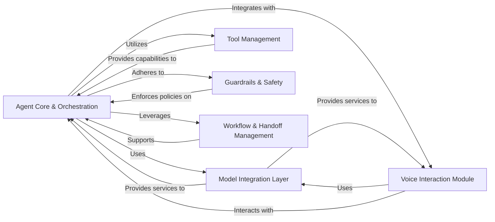

## Details

One paragraph explaining the functionality which is represented by this graph. What the main flow is and what is its purpose.

### Agent Core & Orchestration [[Expand]](./Agent_Core_Orchestration.md)
The central component responsible for defining, executing, and managing the lifecycle of AI agents. It handles the core execution flow, processes inputs, structures outputs, and facilitates multi-agent coordination.

**Related Classes/Methods**:

- `src/agents/agent.py`
- `src/agents/run.py`
- <a href="https://github.com/sandeshwar/openai-agents-python/blob/main/src/agents/lifecycle.py#L1-L1" target="_blank" rel="noopener noreferrer">`src/agents/lifecycle.py` (1:1)</a>
- `src/agents/mcp/server.py`

### Model Integration Layer [[Expand]](./Model_Integration_Layer.md)
Provides a standardized and extensible interface for integrating with various underlying AI models (e.g., OpenAI, LiteLLM). It manages data conversions between the framework's internal formats and specific model APIs, ensuring seamless interaction.

**Related Classes/Methods**:

- <a href="https://github.com/sandeshwar/openai-agents-python/blob/main/src/agents/models/interface.py#L1-L1" target="_blank" rel="noopener noreferrer">`src/agents/models/interface.py` (1:1)</a>
- <a href="https://github.com/sandeshwar/openai-agents-python/blob/main/src/agents/models/openai_provider.py#L1-L1" target="_blank" rel="noopener noreferrer">`src/agents/models/openai_provider.py` (1:1)</a>
- <a href="https://github.com/sandeshwar/openai-agents-python/blob/main/src/agents/extensions/models/litellm_model.py#L1-L1" target="_blank" rel="noopener noreferrer">`src/agents/extensions/models/litellm_model.py` (1:1)</a>

### Tool Management [[Expand]](./Tool_Management.md)
Manages the definition, registration, and execution of external tools or functionalities that agents can leverage to interact with the environment or perform specific tasks.

**Related Classes/Methods**:

- `src/agents/tool.py`
- `src/agents/function_schema.py`

### Guardrails & Safety [[Expand]](./Guardrails_Safety.md)
Implements mechanisms and policies to ensure agents operate within defined boundaries, adhere to safety guidelines, and prevent undesirable or harmful behaviors.

**Related Classes/Methods**:

- <a href="https://github.com/sandeshwar/openai-agents-python/blob/main/src/agents/guardrail.py#L1-L1" target="_blank" rel="noopener noreferrer">`src/agents/guardrail.py` (1:1)</a>

### Workflow & Handoff Management [[Expand]](./Workflow_Handoff_Management.md)
Facilitates the seamless transfer of control, context, or information between different agents or system components, enabling the creation of complex multi-agent workflows and collaborative tasks.

**Related Classes/Methods**:

- `src/agents/handoffs.py`
- <a href="https://github.com/sandeshwar/openai-agents-python/blob/main/src/agents/extensions/handoff_filters.py#L1-L1" target="_blank" rel="noopener noreferrer">`src/agents/extensions/handoff_filters.py` (1:1)</a>
- <a href="https://github.com/sandeshwar/openai-agents-python/blob/main/src/agents/extensions/handoff_prompt.py#L1-L1" target="_blank" rel="noopener noreferrer">`src/agents/extensions/handoff_prompt.py` (1:1)</a>

### Voice Interaction Module [[Expand]](./Voice_Interaction_Module.md)
A specialized component dedicated to handling real-time voice interactions, including Speech-to-Text (STT) and Text-to-Speech (TTS) functionalities. It integrates with voice-specific AI models and manages workflows for agents interacting via voice.

**Related Classes/Methods**:

- <a href="https://github.com/sandeshwar/openai-agents-python/blob/main/src/agents/voice/workflow.py#L1-L1" target="_blank" rel="noopener noreferrer">`src/agents/voice/workflow.py` (1:1)</a>
- <a href="https://github.com/sandeshwar/openai-agents-python/blob/main/src/agents/voice/model.py#L1-L1" target="_blank" rel="noopener noreferrer">`src/agents/voice/model.py` (1:1)</a>
- <a href="https://github.com/sandeshwar/openai-agents-python/blob/main/src/agents/voice/models/openai_stt.py#L1-L1" target="_blank" rel="noopener noreferrer">`src/agents/voice/models/openai_stt.py` (1:1)</a>
- <a href="https://github.com/sandeshwar/openai-agents-python/blob/main/src/agents/voice/models/openai_tts.py#L1-L1" target="_blank" rel="noopener noreferrer">`src/agents/voice/models/openai_tts.py` (1:1)</a>

### [FAQ](https://github.com/CodeBoarding/GeneratedOnBoardings/tree/main?tab=readme-ov-file#faq)