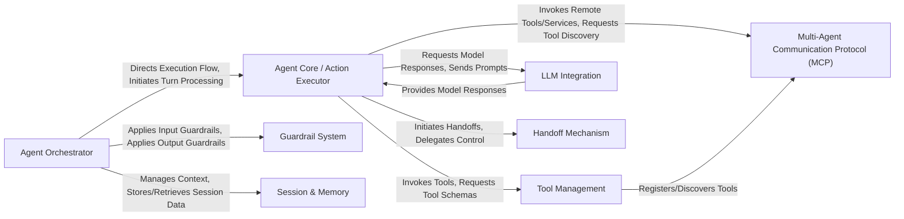

## Details

The openai-agents-python architecture is designed as a modular SDK for orchestrating AI agents, emphasizing a clear separation of concerns to facilitate extensibility and maintainability. At its core, the Agent Orchestrator directs the flow, managing the agent's turn-based execution and interacting with the Agent Core / Action Executor for decision-making. This core component leverages LLM Integration for model interactions, Tool Management for external capabilities, and the Handoff Mechanism for inter-agent communication. The system is fortified by a Guardrail System for safety and a Session & Memory component for statefulness. The Multi-Agent Communication Protocol (MCP) extends capabilities to distributed multi-agent environments. This structure promotes a pipeline-like flow, where inputs are processed, actions are decided and executed, and outputs are generated, all while maintaining context and adhering to defined policies.

### Agent Orchestrator [[Expand]](./Agent_Orchestrator.md)
The central control plane managing the lifecycle and execution flow of agents, including turn-based processing, guardrail application, and overall agent execution, adaptable for both standard and real-time interactions.

**Related Classes/Methods**:

- <a href="https://github.com/openai/openai-agents-python/blob/main/src/agents/run.py" target="_blank" rel="noopener noreferrer">`src/agents/run.py`</a>
- <a href="https://github.com/openai/openai-agents-python/blob/main/src/agents/realtime/runner.py" target="_blank" rel="noopener noreferrer">`src/agents/realtime/runner.py`</a>

### Agent Core / Action Executor [[Expand]](./Agent_Core_Action_Executor.md)
Encapsulates the agent's internal decision-making and execution logic, interpreting model responses and translating them into executable actions (tool calls, handoffs, computer actions).

**Related Classes/Methods**:

- <a href="https://github.com/openai/openai-agents-python/blob/main/src/agents/_run_impl.py" target="_blank" rel="noopener noreferrer">`src/agents/_run_impl.py`</a>

### Tool Management [[Expand]](./Tool_Management.md)
Manages the definition, registration, and invocation of external functionalities (tools) available to agents, providing a standardized interface for interaction with external systems.

**Related Classes/Methods**:

- <a href="https://github.com/openai/openai-agents-python/blob/main/src/agents/tool.py" target="_blank" rel="noopener noreferrer">`src/agents/tool.py`</a>
- <a href="https://github.com/openai/openai-agents-python/blob/main/src/agents/function_schema.py" target="_blank" rel="noopener noreferrer">`src/agents/function_schema.py`</a>

### Guardrail System [[Expand]](./Guardrail_System.md)
Enforces predefined constraints and policies on agent inputs and outputs to ensure safe, compliant, and desired operational behavior throughout the agent's execution.

**Related Classes/Methods**:

- <a href="https://github.com/openai/openai-agents-python/blob/main/src/agents/guardrail.py" target="_blank" rel="noopener noreferrer">`src/agents/guardrail.py`</a>

### Session & Memory
Manages the conversational context and state across multiple turns or interactions, ensuring continuity and coherence by storing and retrieving relevant information for agents.

**Related Classes/Methods**:

- <a href="https://github.com/openai/openai-agents-python/blob/main/src/agents/memory/session.py" target="_blank" rel="noopener noreferrer">`src/agents/memory/session.py`</a>

### LLM Integration [[Expand]](./LLM_Integration.md)
Provides an abstraction layer for interacting with various Large Language Models (LLMs), handling provider-specific details and ensuring consistent model access and response processing.

**Related Classes/Methods**:

- <a href="https://github.com/openai/openai-agents-python/blob/main/src/agents/models/openai_provider.py" target="_blank" rel="noopener noreferrer">`src/agents/models/openai_provider.py`</a>
- <a href="https://github.com/openai/openai-agents-python/blob/main/src/agents/extensions/models/litellm_provider.py" target="_blank" rel="noopener noreferrer">`src/agents/extensions/models/litellm_provider.py`</a>

### Handoff Mechanism [[Expand]](./Handoff_Mechanism.md)
Facilitates the transfer of control or context between different agents or external systems, enabling complex multi-agent workflows and task delegation.

**Related Classes/Methods**:

- <a href="https://github.com/openai/openai-agents-python/blob/main/src/agents/handoffs.py" target="_blank" rel="noopener noreferrer">`src/agents/handoffs.py`</a>

### Multi-Agent Communication Protocol (MCP) [[Expand]](./Multi_Agent_Communication_Protocol_MCP_.md)
Provides a framework for agents to discover, list, and invoke tools managed by a central server or other agents, enabling collaborative multi-agent systems and distributed tool access.

**Related Classes/Methods**:

- <a href="https://github.com/openai/openai-agents-python/blob/main/src/agents/mcp/server.py" target="_blank" rel="noopener noreferrer">`src/agents/mcp/server.py`</a>
- <a href="https://github.com/openai/openai-agents-python/blob/main/src/agents/mcp/util.py" target="_blank" rel="noopener noreferrer">`src/agents/mcp/util.py`</a>

### [FAQ](https://github.com/CodeBoarding/GeneratedOnBoardings/tree/main?tab=readme-ov-file#faq)