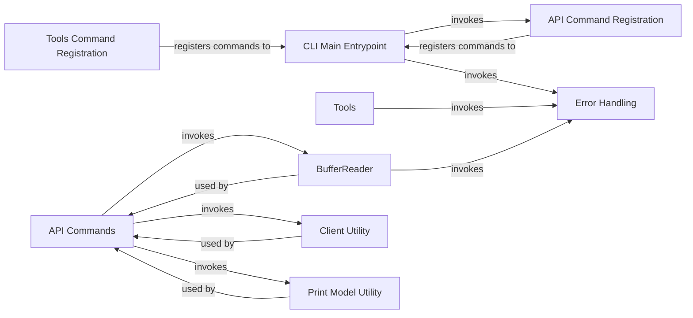

## Component Details

The OpenAI CLI provides a command-line interface for interacting with the OpenAI API. It handles argument parsing, command dispatch, API interaction, and output formatting. The CLI supports various API functionalities, including models, audio, files, completions, images, and chat, as well as tools for migration and data preparation. It streamlines the process of accessing OpenAI's services directly from the terminal.

### CLI Main Entrypoint
The main entry point of the OpenAI CLI. It parses command-line arguments, handles errors, and dispatches commands to the appropriate subcommands.

**Related Classes/Methods**:

- <a href="https://github.com/openai/openai-python/blob/master/src/openai/cli/_cli.py#L126-L135" target="_blank" rel="noopener noreferrer">`openai.cli._cli.main` (126:135)</a>
- <a href="https://github.com/openai/openai-python/blob/master/src/openai/cli/_cli.py#L162-L229" target="_blank" rel="noopener noreferrer">`openai.cli._cli._main` (162:229)</a>

### API Command Registration
Registers all the API-related subcommands (chat, image, audio, files, models, completions) to the CLI parser. It acts as a central point for adding new API endpoints to the CLI.

**Related Classes/Methods**:

- <a href="https://github.com/openai/openai-python/blob/master/src/openai/cli/_api/_main.py#L8-L16" target="_blank" rel="noopener noreferrer">`openai.cli._api._main.register_commands` (8:16)</a>

### API Commands
A collection of classes implementing the CLI commands for interacting with the OpenAI APIs, including models, audio, files, completions, images, and chat.

**Related Classes/Methods**:

- `openai.cli._api.models.CLIModels:get` (full file reference)
- `openai.cli._api.models.CLIModels:delete` (full file reference)
- `openai.cli._api.models.CLIModels:list` (full file reference)
- `openai.cli._api.audio.CLIAudio:transcribe` (full file reference)
- `openai.cli._api.audio.CLIAudio:translate` (full file reference)
- `openai.cli._api.files.CLIFile:create` (full file reference)
- `openai.cli._api.files.CLIFile:get` (full file reference)
- `openai.cli._api.files.CLIFile:delete` (full file reference)
- `openai.cli._api.files.CLIFile:list` (full file reference)
- `openai.cli._api.completions.CLICompletions:create` (full file reference)
- `openai.cli._api.image.CLIImage:create` (full file reference)
- `openai.cli._api.image.CLIImage:create_variation` (full file reference)
- `openai.cli._api.image.CLIImage:edit` (full file reference)
- <a href="https://github.com/openai/openai-python/blob/master/src/openai/cli/_api/chat/completions.py#L97-L122" target="_blank" rel="noopener noreferrer">`openai.cli._api.chat.completions.CLIChatCompletion:create` (97:122)</a>
- <a href="https://github.com/openai/openai-python/blob/master/src/openai/cli/_api/chat/completions.py#L125-L138" target="_blank" rel="noopener noreferrer">`openai.cli._api.chat.completions.CLIChatCompletion:_create` (125:138)</a>
- <a href="https://github.com/openai/openai-python/blob/master/src/openai/cli/_api/chat/completions.py#L141-L160" target="_blank" rel="noopener noreferrer">`openai.cli._api.chat.completions.CLIChatCompletion:_stream_create` (141:160)</a>
- <a href="https://github.com/openai/openai-python/blob/master/src/openai/cli/_api/chat/completions.py#L25-L76" target="_blank" rel="noopener noreferrer">`openai.cli._api.chat:register` (25:76)</a>

### Tools Command Registration
Registers the 'tools' subcommand, which includes functionalities like migrating configurations and preparing data for fine-tuning.

**Related Classes/Methods**:

- <a href="https://github.com/openai/openai-python/blob/master/src/openai/cli/_tools/migrate.py#L12-L15" target="_blank" rel="noopener noreferrer">`openai.cli._tools._main.register_commands` (12:15)</a>

### Tools
A collection of classes implementing the CLI tools, including migrate and fine_tunes.

**Related Classes/Methods**:

- <a href="https://github.com/openai/openai-python/blob/master/src/openai/cli/_tools/migrate.py#L35-L43" target="_blank" rel="noopener noreferrer">`openai.cli._tools.migrate:grit` (35:43)</a>
- <a href="https://github.com/openai/openai-python/blob/master/src/openai/cli/_tools/migrate.py#L51-L59" target="_blank" rel="noopener noreferrer">`openai.cli._tools.migrate:migrate` (51:59)</a>
- <a href="https://github.com/openai/openai-python/blob/master/src/openai/cli/_tools/migrate.py#L82-L142" target="_blank" rel="noopener noreferrer">`openai.cli._tools.migrate:install` (82:142)</a>
- <a href="https://github.com/openai/openai-python/blob/master/src/openai/cli/_tools/migrate.py#L145-L150" target="_blank" rel="noopener noreferrer">`openai.cli._tools.migrate:_move_files_recursively` (145:150)</a>
- `openai.cli._tools.fine_tunes:prepare_data` (full file reference)

### BufferReader
A buffer reader that displays a progress bar while reading data from a stream. It's used for file uploads and other operations where progress needs to be tracked.

**Related Classes/Methods**:

- `openai.cli._progress.BufferReader:__init__` (full file reference)
- `openai.cli._progress.BufferReader:read` (full file reference)

### Client Utility
Provides a utility function to get the OpenAI client, which is used to make API requests.

**Related Classes/Methods**:

- `openai.cli._utils:get_client` (full file reference)

### Print Model Utility
Provides a utility function to print the model in JSON format.

**Related Classes/Methods**:

- `openai.cli._utils:print_model` (full file reference)

### Error Handling
Handles and displays errors that occur during CLI execution.

**Related Classes/Methods**:

- `openai.cli._errors:display_error` (full file reference)