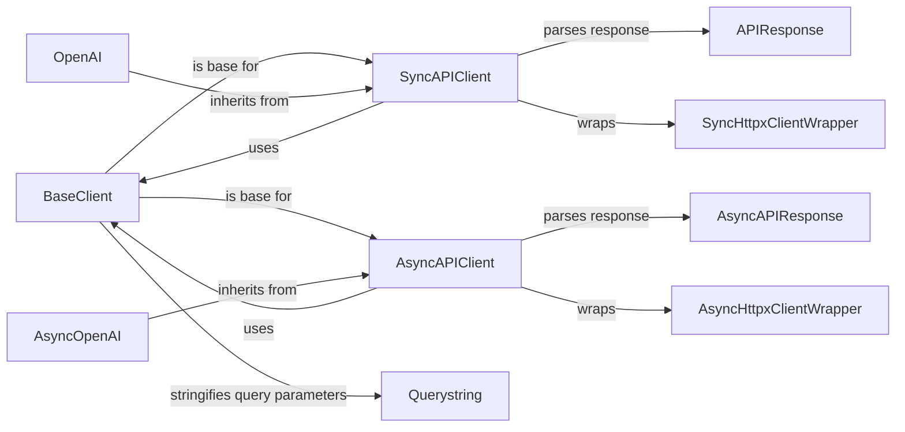

## Component Details

The Core Client component provides the fundamental building blocks for interacting with the OpenAI API. It manages authentication, constructs requests, processes responses, and handles errors. It includes synchronous and asynchronous client implementations, as well as utilities for building headers and processing response data. Its main responsibility is to provide a low-level interface for making API calls. The main flow involves creating a client (either synchronous or asynchronous), constructing a request with appropriate headers and data, sending the request to the OpenAI API, processing the response, and handling any errors that occur. The purpose is to provide a clean and consistent interface for interacting with the OpenAI API, abstracting away the complexities of HTTP requests and response handling.

### BaseClient
The BaseClient class provides the foundation for interacting with the OpenAI API. It handles tasks such as building headers, constructing requests, serializing data, processing responses, and managing retries. It defines the core logic for making API calls, including error handling and response parsing. It interacts with Querystring for query parameter serialization, Files for handling file uploads, and Exceptions for raising custom exceptions.

**Related Classes/Methods**:

- <a href="https://github.com/openai/openai-python/blob/master/src/openai/_streaming.py#L29-L224" target="_blank" rel="noopener noreferrer">`openai._base_client.BaseClient` (29:224)</a>
- `openai._base_client.BaseClient.__init__` (full file reference)
- `openai._base_client.BaseClient:_make_status_error_from_response` (full file reference)
- `openai._base_client.BaseClient:_build_headers` (full file reference)
- `openai._base_client.BaseClient:_make_sse_decoder` (full file reference)
- `openai._base_client.BaseClient:_build_request` (full file reference)
- `openai._base_client.BaseClient:_serialize_multipartform` (full file reference)
- `openai._base_client.BaseClient:_maybe_override_cast_to` (full file reference)
- `openai._base_client.BaseClient:_process_response_data` (full file reference)
- `openai._base_client.BaseClient:qs` (full file reference)
- `openai._base_client.BaseClient:default_headers` (full file reference)
- `openai._base_client.BaseClient:base_url` (full file reference)
- `openai._base_client.BaseClient:platform_headers` (full file reference)
- `openai._base_client.BaseClient:_calculate_retry_timeout` (full file reference)

### SyncAPIClient
The SyncAPIClient class extends BaseClient to provide a synchronous interface for making API requests. It handles the specifics of preparing requests, processing responses, and managing retries in a synchronous context. It uses httpx via SyncHttpxClientWrapper for making HTTP requests and interacts with the BaseClient for core functionality. It also uses LegacyAPIResponse and APIResponse for parsing responses.

**Related Classes/Methods**:

- <a href="https://github.com/openai/openai-python/blob/master/src/openai/_streaming.py#L227-L230" target="_blank" rel="noopener noreferrer">`openai._base_client.SyncAPIClient` (227:230)</a>
- `openai._base_client.SyncAPIClient.__init__` (full file reference)
- `openai._base_client.SyncAPIClient.__exit__` (full file reference)
- `openai._base_client.SyncAPIClient.request` (full file reference)
- `openai._base_client.SyncAPIClient:_sleep_for_retry` (full file reference)
- `openai._base_client.SyncAPIClient:_process_response` (full file reference)
- `openai._base_client.SyncAPIClient:_request_api_list` (full file reference)
- `openai._base_client.SyncAPIClient.get` (full file reference)
- `openai._base_client.SyncAPIClient.post` (full file reference)
- `openai._base_client.SyncAPIClient.patch` (full file reference)
- `openai._base_client.SyncAPIClient.put` (full file reference)
- `openai._base_client.SyncAPIClient.delete` (full file reference)
- `openai._base_client.SyncAPIClient.get_api_list` (full file reference)

### AsyncAPIClient
The AsyncAPIClient class extends BaseClient to provide an asynchronous interface for making API requests. It handles the specifics of preparing requests, processing responses, and managing retries in an asynchronous context. It uses httpx via AsyncHttpxClientWrapper for making HTTP requests and interacts with the BaseClient for core functionality. It also uses LegacyAPIResponse and AsyncAPIResponse for parsing responses.

**Related Classes/Methods**:

- <a href="https://github.com/openai/openai-python/blob/master/src/openai/_streaming.py#L233-L236" target="_blank" rel="noopener noreferrer">`openai._base_client.AsyncAPIClient` (233:236)</a>
- `openai._base_client.AsyncAPIClient.__init__` (full file reference)
- `openai._base_client.AsyncAPIClient.__aexit__` (full file reference)
- `openai._base_client.AsyncAPIClient.request` (full file reference)
- `openai._base_client.AsyncAPIClient:_sleep_for_retry` (full file reference)
- `openai._base_client.AsyncAPIClient:_process_response` (full file reference)
- `openai._base_client.AsyncAPIClient:_request_api_list` (full file reference)
- `openai._base_client.AsyncAPIClient.get` (full file reference)
- `openai._base_client.AsyncAPIClient.post` (full file reference)
- `openai._base_client.AsyncAPIClient.patch` (full file reference)
- `openai._base_client.AsyncAPIClient.put` (full file reference)
- `openai._base_client.AsyncAPIClient.delete` (full file reference)
- `openai._base_client.AsyncAPIClient.get_api_list` (full file reference)

### SyncHttpxClientWrapper
The SyncHttpxClientWrapper class wraps the httpx client to provide a synchronous interface for making HTTP requests. It handles tasks such as building headers, constructing requests, processing responses, and managing retries. It is used by SyncAPIClient to make synchronous HTTP requests.

**Related Classes/Methods**:

- <a href="https://github.com/openai/openai-python/blob/master/src/openai/_streaming.py#L239-L301" target="_blank" rel="noopener noreferrer">`openai._base_client.SyncHttpxClientWrapper` (239:301)</a>

### AsyncHttpxClientWrapper
The AsyncHttpxClientWrapper class wraps the httpx client to provide an asynchronous interface for making HTTP requests. It handles tasks such as building headers, constructing requests, processing responses, and managing retries. It is used by AsyncAPIClient to make asynchronous HTTP requests.

**Related Classes/Methods**:

- <a href="https://github.com/openai/openai-python/blob/master/src/openai/_streaming.py#L304-L366" target="_blank" rel="noopener noreferrer">`openai._base_client.AsyncHttpxClientWrapper` (304:366)</a>

### OpenAI
The OpenAI class is a client for interacting with the OpenAI API. It inherits from SyncAPIClient and provides a synchronous interface for making API requests. It initializes the API client with the provided configuration and handles any errors that may occur during initialization. It serves as the main entry point for synchronous API calls.

**Related Classes/Methods**:

- <a href="https://github.com/openai/openai-python/blob/master/src/openai/_streaming.py#L40-L43" target="_blank" rel="noopener noreferrer">`openai._client.OpenAI` (40:43)</a>
- `openai._client.OpenAI.__init__` (full file reference)

### AsyncOpenAI
The AsyncOpenAI class is an asynchronous client for interacting with the OpenAI API. It inherits from AsyncAPIClient and provides an asynchronous interface for making API requests. It initializes the API client with the provided configuration and handles any errors that may occur during initialization. It serves as the main entry point for asynchronous API calls.

**Related Classes/Methods**:

- <a href="https://github.com/openai/openai-python/blob/master/src/openai/_streaming.py#L46-L49" target="_blank" rel="noopener noreferrer">`openai._client.AsyncOpenAI` (46:49)</a>
- `openai._client.AsyncOpenAI.__init__` (full file reference)

### APIResponse
The APIResponse class is responsible for parsing the response from the OpenAI API when the response is not a stream. It provides methods for reading the response as text or JSON. It is used by SyncAPIClient and AsyncAPIClient to parse API responses.

**Related Classes/Methods**:

- `openai._response.APIResponse` (full file reference)
- `openai._response.APIResponse:parse` (full file reference)
- `openai._response.APIResponse:read` (full file reference)
- `openai._response.APIResponse:text` (full file reference)
- `openai._response.APIResponse:json` (full file reference)

### AsyncAPIResponse
The AsyncAPIResponse class is responsible for parsing the asynchronous response from the OpenAI API when the response is not a stream. It provides methods for reading the response as text or JSON. It is used by AsyncAPIClient to parse API responses.

**Related Classes/Methods**:

- `openai._response.AsyncAPIResponse` (full file reference)
- `openai._response.AsyncAPIResponse:parse` (full file reference)
- `openai._response.AsyncAPIResponse:read` (full file reference)
- `openai._response.AsyncAPIResponse:text` (full file reference)
- `openai._response.AsyncAPIResponse:json` (full file reference)

### Querystring
The Querystring class is responsible for stringifying the query parameters for the API call. It provides methods for converting query parameters into a string format suitable for inclusion in the API request URL. It is used by BaseClient to serialize query parameters.

**Related Classes/Methods**:

- `openai._qs.Querystring` (full file reference)
- `openai._base_client.BaseClient:qs` (full file reference)
- `openai._qs.Querystring:stringify` (full file reference)
- `openai._qs.Querystring:stringify_items` (full file reference)
- `openai._qs.Querystring:_stringify_item` (full file reference)