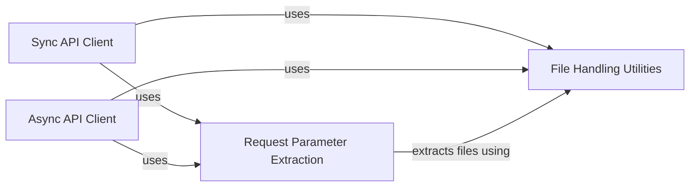

## Component Details

The File Management subsystem in the OpenAI Python library handles the preparation and processing of files for API requests. It encompasses utilities for transforming file-like objects into a format suitable for HTTP transmission, extracting file parameters from request data, and integrating with both synchronous and asynchronous API clients to send file data to the OpenAI API. The core functionality revolves around converting various file representations (file paths, file-like objects, bytes) into httpx.File instances, which are then included in the request body.

### File Handling Utilities
This component provides utilities for handling files, including converting file content to a format suitable for HTTP requests. It includes functions for both synchronous and asynchronous operations, as well as checks to ensure the content is a valid file. It transforms file-like objects into httpx.File instances, which are suitable for sending via HTTP requests.

**Related Classes/Methods**:

- <a href="https://github.com/openai/openai-python/blob/master/src/openai/_streaming.py#L89-L92" target="_blank" rel="noopener noreferrer">`openai._files.assert_is_file_content` (89:92)</a>
- <a href="https://github.com/openai/openai-python/blob/master/src/openai/_streaming.py#L11-L31" target="_blank" rel="noopener noreferrer">`openai._files.to_httpx_files` (11:31)</a>
- <a href="https://github.com/openai/openai-python/blob/master/src/openai/_streaming.py#L57-L70" target="_blank" rel="noopener noreferrer">`openai._files._transform_file` (57:70)</a>
- <a href="https://github.com/openai/openai-python/blob/master/src/openai/_streaming.py#L34-L54" target="_blank" rel="noopener noreferrer">`openai._files.async_to_httpx_files` (34:54)</a>
- <a href="https://github.com/openai/openai-python/blob/master/src/openai/_streaming.py#L73-L86" target="_blank" rel="noopener noreferrer">`openai._files._async_transform_file` (73:86)</a>
- `openai._files.is_file_content` (full file reference)
- `openai._files._read_file_content` (full file reference)
- `openai._files._async_read_file_content` (full file reference)

### Request Parameter Extraction
This component focuses on extracting file-like parameters from request data structures (dicts, lists) and flattening nested structures. It helps to identify and prepare file data for sending in API requests. It traverses the request parameters to locate file-like objects.

**Related Classes/Methods**:

- `openai._utils._utils.extract_files` (full file reference)
- `openai._utils._utils:_extract_items` (full file reference)
- `openai._utils._utils.is_list` (full file reference)
- `openai._utils._utils.is_dict` (full file reference)
- `openai._utils._utils.flatten` (full file reference)
- `openai._utils._utils.is_sequence_t` (full file reference)
- `openai._utils._utils.is_tuple_t` (full file reference)
- `openai._utils._utils.is_mapping_t` (full file reference)

### Sync API Client
This component defines the synchronous API client, responsible for making synchronous requests to the OpenAI API. It handles constructing request options and utilizes the file handling utilities to prepare file data for transmission. It uses the Request Parameter Extraction component to identify files within the request and the File Handling Utilities to convert them to the appropriate format.

**Related Classes/Methods**:

- `openai._base_client.SyncAPIClient:post` (full file reference)
- `openai._base_client.SyncAPIClient:put` (full file reference)
- `openai._base_client.SyncAPIClient.request` (full file reference)
- `openai._models.FinalRequestOptions.construct` (full file reference)

### Async API Client
This component defines the asynchronous API client, responsible for making asynchronous requests to the OpenAI API. It handles constructing request options and utilizes the asynchronous file handling utilities to prepare file data for transmission. Similar to the Sync API Client, it uses Request Parameter Extraction and File Handling Utilities, but in their asynchronous versions.

**Related Classes/Methods**:

- `openai._base_client.AsyncAPIClient:post` (full file reference)
- `openai._base_client.AsyncAPIClient:put` (full file reference)
- `openai._base_client.AsyncAPIClient.request` (full file reference)