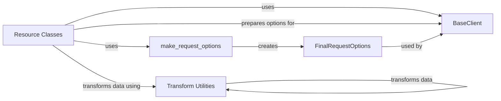

## Component Details

The OpenAI API request preparation process involves several key components working together to construct and transform request options before sending them to the API. Resource classes initiate the process by calling specific API methods. The `make_request_options` function then builds the request options, potentially transforming the data using the transform utilities. Finally, the `BaseClient` uses these options to make the actual API call. This flow ensures that all requests are properly formatted and configured before being sent to the OpenAI API.

### BaseClient
The BaseClient class provides the foundation for interacting with the OpenAI API. It handles request building and configuration, setting up the necessary infrastructure for making API calls. It contains methods for both synchronous and asynchronous API calls.

**Related Classes/Methods**:

- `openai._base_client.BaseClient` (full file reference)
- `openai._base_client.SyncAPIClient` (full file reference)
- `openai._base_client.AsyncAPIClient` (full file reference)

### make_request_options
The `make_request_options` function prepares the options for an API request. It takes various parameters and constructs a dictionary containing the necessary information for the request, such as headers, query parameters, and request body. It is used by resource classes to construct the request parameters.

**Related Classes/Methods**:

- `openai._base_client.make_request_options` (full file reference)

### Resource Classes
Resource classes like Models, Images, Files, etc., define the specific API endpoints and operations available. They use `make_request_options` to construct the request parameters and interact with the BaseClient to execute the API calls. Each resource corresponds to a specific API endpoint.

**Related Classes/Methods**:

- <a href="https://github.com/openai/openai-python/blob/master/src/openai/resources/models.py#L23-L133" target="_blank" rel="noopener noreferrer">`openai.resources.models.Models` (23:133)</a>
- <a href="https://github.com/openai/openai-python/blob/master/src/openai/resources/models.py#L136-L246" target="_blank" rel="noopener noreferrer">`openai.resources.models.AsyncModels` (136:246)</a>
- `openai.resources.images.Images` (full file reference)
- `openai.resources.images.AsyncImages` (full file reference)
- `openai.resources.moderations.Moderations` (full file reference)
- `openai.resources.moderations.AsyncModerations` (full file reference)
- `openai.resources.files.Files` (full file reference)
- `openai.resources.files.AsyncFiles` (full file reference)
- `openai.resources.batches.Batches` (full file reference)
- `openai.resources.batches.AsyncBatches` (full file reference)
- `openai.resources.embeddings.Embeddings` (full file reference)
- `openai.resources.embeddings.AsyncEmbeddings` (full file reference)
- `openai.resources.completions.Completions` (full file reference)
- `openai.resources.completions.AsyncCompletions` (full file reference)
- <a href="https://github.com/openai/openai-python/blob/master/src/openai/resources/uploads/parts.py#L22-L94" target="_blank" rel="noopener noreferrer">`openai.resources.uploads.parts.Parts` (22:94)</a>
- <a href="https://github.com/openai/openai-python/blob/master/src/openai/resources/uploads/parts.py#L97-L169" target="_blank" rel="noopener noreferrer">`openai.resources.uploads.parts.AsyncParts` (97:169)</a>
- `openai.resources.uploads.uploads.Uploads` (full file reference)
- `openai.resources.uploads.uploads.AsyncUploads` (full file reference)
- <a href="https://github.com/openai/openai-python/blob/master/src/openai/resources/vector_stores/files.py#L28-L428" target="_blank" rel="noopener noreferrer">`openai.resources.vector_stores.files.Files` (28:428)</a>
- <a href="https://github.com/openai/openai-python/blob/master/src/openai/resources/vector_stores/files.py#L431-L833" target="_blank" rel="noopener noreferrer">`openai.resources.vector_stores.files.AsyncFiles` (431:833)</a>
- `openai.resources.vector_stores.vector_stores.VectorStores` (full file reference)
- `openai.resources.vector_stores.vector_stores.AsyncVectorStores` (full file reference)
- `openai.resources.vector_stores.file_batches.FileBatches` (full file reference)
- `openai.resources.vector_stores.file_batches.AsyncFileBatches` (full file reference)
- <a href="https://github.com/openai/openai-python/blob/master/src/openai/resources/audio/transcriptions.py#L34-L348" target="_blank" rel="noopener noreferrer">`openai.resources.audio.transcriptions.Transcriptions` (34:348)</a>
- <a href="https://github.com/openai/openai-python/blob/master/src/openai/resources/audio/transcriptions.py#L351-L727" target="_blank" rel="noopener noreferrer">`openai.resources.audio.transcriptions.AsyncTranscriptions` (351:727)</a>
- `openai.resources.audio.speech.Speech` (full file reference)
- `openai.resources.audio.speech.AsyncSpeech` (full file reference)
- `openai.resources.audio.translations.Translations` (full file reference)
- `openai.resources.audio.translations.AsyncTranslations` (full file reference)
- `openai.resources.chat.completions.completions.Completions` (full file reference)
- `openai.resources.chat.completions.completions.AsyncCompletions` (full file reference)
- <a href="https://github.com/openai/openai-python/blob/master/src/openai/resources/responses/responses.py#L50-L1150" target="_blank" rel="noopener noreferrer">`openai.resources.responses.responses.Responses` (50:1150)</a>
- <a href="https://github.com/openai/openai-python/blob/master/src/openai/resources/responses/responses.py#L1153-L2251" target="_blank" rel="noopener noreferrer">`openai.resources.responses.responses.AsyncResponses` (1153:2251)</a>
- <a href="https://github.com/openai/openai-python/blob/master/src/openai/resources/containers/containers.py#L34-L227" target="_blank" rel="noopener noreferrer">`openai.resources.containers.containers.Containers` (34:227)</a>
- <a href="https://github.com/openai/openai-python/blob/master/src/openai/resources/containers/containers.py#L230-L423" target="_blank" rel="noopener noreferrer">`openai.resources.containers.containers.AsyncContainers` (230:423)</a>
- `openai.resources.containers.files.files.Files` (full file reference)
- `openai.resources.containers.files.files.AsyncFiles` (full file reference)
- <a href="https://github.com/openai/openai-python/blob/master/src/openai/resources/fine_tuning/jobs/jobs.py#L37-L412" target="_blank" rel="noopener noreferrer">`openai.resources.fine_tuning.jobs.jobs.Jobs` (37:412)</a>
- <a href="https://github.com/openai/openai-python/blob/master/src/openai/resources/fine_tuning/jobs/jobs.py#L415-L790" target="_blank" rel="noopener noreferrer">`openai.resources.fine_tuning.jobs.jobs.AsyncJobs` (415:790)</a>
- <a href="https://github.com/openai/openai-python/blob/master/src/openai/resources/fine_tuning/checkpoints/permissions.py#L26-L191" target="_blank" rel="noopener noreferrer">`openai.resources.fine_tuning.checkpoints.permissions.Permissions` (26:191)</a>
- <a href="https://github.com/openai/openai-python/blob/master/src/openai/resources/fine_tuning/checkpoints/permissions.py#L194-L359" target="_blank" rel="noopener noreferrer">`openai.resources.fine_tuning.checkpoints.permissions.AsyncPermissions` (194:359)</a>
- `openai.resources.fine_tuning.alpha.graders.Graders` (full file reference)
- `openai.resources.fine_tuning.alpha.graders.AsyncGraders` (full file reference)
- `openai.resources.beta.assistants.Assistants` (full file reference)
- `openai.resources.beta.assistants.AsyncAssistants` (full file reference)
- <a href="https://github.com/openai/openai-python/blob/master/src/openai/resources/beta/realtime/sessions.py#L23-L186" target="_blank" rel="noopener noreferrer">`openai.resources.beta.realtime.sessions.Sessions` (23:186)</a>
- <a href="https://github.com/openai/openai-python/blob/master/src/openai/resources/beta/realtime/sessions.py#L189-L352" target="_blank" rel="noopener noreferrer">`openai.resources.beta.realtime.sessions.AsyncSessions` (189:352)</a>
- `openai.resources.beta.threads.threads.Threads` (full file reference)
- `openai.resources.beta.threads.threads.AsyncThreads` (full file reference)
- <a href="https://github.com/openai/openai-python/blob/master/src/openai/resources/beta/threads/runs/runs.py#L61-L1469" target="_blank" rel="noopener noreferrer">`openai.resources.beta.threads.runs.runs.Runs` (61:1469)</a>
- <a href="https://github.com/openai/openai-python/blob/master/src/openai/resources/beta/threads/runs/runs.py#L1472-L2881" target="_blank" rel="noopener noreferrer">`openai.resources.beta.threads.runs.runs.AsyncRuns` (1472:2881)</a>
- <a href="https://github.com/openai/openai-python/blob/master/src/openai/resources/evals/evals.py#L37-L298" target="_blank" rel="noopener noreferrer">`openai.resources.evals.evals.Evals` (37:298)</a>
- <a href="https://github.com/openai/openai-python/blob/master/src/openai/resources/evals/evals.py#L301-L562" target="_blank" rel="noopener noreferrer">`openai.resources.evals.evals.AsyncEvals` (301:562)</a>
- <a href="https://github.com/openai/openai-python/blob/master/src/openai/resources/evals/runs/runs.py#L37-L284" target="_blank" rel="noopener noreferrer">`openai.resources.evals.runs.runs.Runs` (37:284)</a>
- <a href="https://github.com/openai/openai-python/blob/master/src/openai/resources/evals/runs/runs.py#L287-L534" target="_blank" rel="noopener noreferrer">`openai.resources.evals.runs.runs.AsyncRuns` (287:534)</a>

### Transform Utilities
The transform utilities (`maybe_transform`, `transform`, `async_maybe_transform`, `async_transform`) handle data transformations before sending requests to the OpenAI API. They recursively process the input data to ensure it is in the correct format. These utilities are used to convert data types and structures to be compatible with the API requirements.

**Related Classes/Methods**:

- `openai._utils._transform.maybe_transform` (full file reference)
- `openai._utils._transform.transform` (full file reference)
- `openai._utils._transform.async_maybe_transform` (full file reference)
- `openai._utils._transform.async_transform` (full file reference)

### FinalRequestOptions
The `FinalRequestOptions` class encapsulates the final request options after they have been built and transformed. It holds the headers, parameters, timeout, and other settings that will be used when making the API request.

**Related Classes/Methods**:

- `openai._models.FinalRequestOptions` (full file reference)