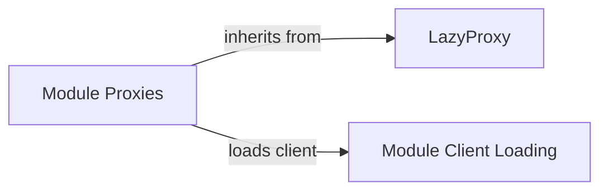

## Component Details

The Resource Proxies component employs lazy proxies to defer the loading of API resources until they are actually accessed. This optimization avoids unnecessary initialization and improves overall performance. It acts as an intermediary, providing access to various API resources through lazy-loaded proxies. The core of this functionality resides in the LazyProxy class, which intercepts attribute access and loads the underlying object only when needed. Specific API resources like audio, batches, chat, etc., are accessed through dedicated proxy classes (e.g., AudioProxy, ChatProxy) that inherit from LazyProxy and define how to load their respective modules. The Module Client Loading component is responsible for determining the appropriate client based on available credentials and is used by the module proxies during the loading process.

### LazyProxy
The LazyProxy class provides a mechanism for lazy loading of attributes. It intercepts attribute access and only loads the underlying object when an attribute is accessed. This improves performance by deferring the loading of resources until they are actually needed.

**Related Classes/Methods**:

- `openai._utils._proxy.LazyProxy` (full file reference)
- `openai._utils._proxy.LazyProxy.__getattr__` (full file reference)
- `openai._utils._proxy.LazyProxy.__repr__` (full file reference)
- `openai._utils._proxy.LazyProxy.__str__` (full file reference)
- `openai._utils._proxy.LazyProxy.__dir__` (full file reference)
- `openai._utils._proxy.LazyProxy.__class__` (full file reference)
- `openai._utils._proxy.LazyProxy.__get_proxied__` (full file reference)

### Module Proxies
These components (AudioProxy, BatchesProxy, BetaProxy, ChatProxy, CompletionsProxy, ContainersProxy, EmbeddingsProxy, EvalsProxy, FilesProxy, FineTuningProxy, ImagesProxy, ModelsProxy, ModerationsProxy, ResponsesProxy, UploadsProxy, VectorStoresProxy) act as lazy-loading proxies for their respective modules. They inherit from LazyProxy and are responsible for deferring the actual loading of the module until it is accessed, improving startup performance. Each proxy defines its own `__load__` method to load the specific module it represents.

**Related Classes/Methods**:

- `openai._module_client.AudioProxy` (full file reference)
- `openai._module_client.AudioProxy.__load__` (full file reference)
- `openai._module_client.BatchesProxy` (full file reference)
- `openai._module_client.BatchesProxy.__load__` (full file reference)
- `openai._module_client.BetaProxy` (full file reference)
- `openai._module_client.BetaProxy.__load__` (full file reference)
- `openai._module_client.ChatProxy` (full file reference)
- `openai._module_client.ChatProxy.__load__` (full file reference)
- `openai._module_client.CompletionsProxy` (full file reference)
- `openai._module_client.CompletionsProxy.__load__` (full file reference)
- `openai._module_client.ContainersProxy` (full file reference)
- `openai._module_client.ContainersProxy.__load__` (full file reference)
- `openai._module_client.EmbeddingsProxy` (full file reference)
- `openai._module_client.EmbeddingsProxy.__load__` (full file reference)
- `openai._module_client.EvalsProxy` (full file reference)
- `openai._module_client.EvalsProxy.__load__` (full file reference)
- `openai._module_client.FilesProxy` (full file reference)
- `openai._module_client.FilesProxy.__load__` (full file reference)
- `openai._module_client.FineTuningProxy` (full file reference)
- `openai._module_client.FineTuningProxy.__load__` (full file reference)
- `openai._module_client.ImagesProxy` (full file reference)
- `openai._module_client.ImagesProxy.__load__` (full file reference)
- `openai._module_client.ModelsProxy` (full file reference)
- `openai._module_client.ModelsProxy.__load__` (full file reference)
- `openai._module_client.ModerationsProxy` (full file reference)
- `openai._module_client.ModerationsProxy.__load__` (full file reference)
- `openai._module_client.ResponsesProxy` (full file reference)
- `openai._module_client.ResponsesProxy.__load__` (full file reference)
- `openai._module_client.UploadsProxy` (full file reference)
- `openai._module_client.UploadsProxy.__load__` (full file reference)
- `openai._module_client.VectorStoresProxy` (full file reference)
- `openai._module_client.VectorStoresProxy.__load__` (full file reference)

### Module Client Loading
This component is responsible for loading the appropriate client based on the available credentials (OpenAI, Azure, or Azure AD). It determines which client to use and initializes it. It also handles cases where there are ambiguous credential configurations.

**Related Classes/Methods**:

- `openai._load_client` (full file reference)