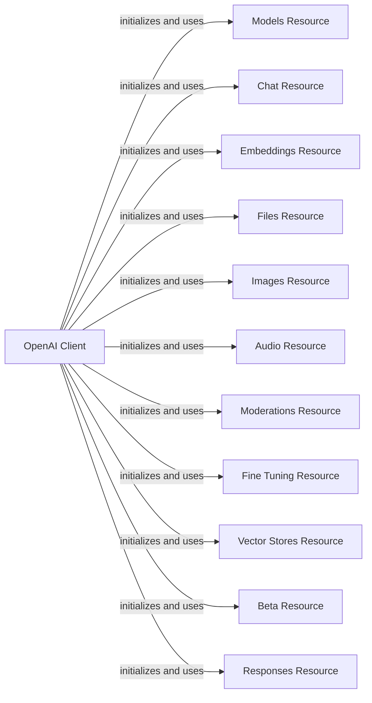

## Component Details

The OpenAI Resources component provides a structured and accessible interface to the OpenAI API. It encompasses various API resources such as Models, Chat, Audio, Images, Moderations, Fine-tuning, Embeddings, Files, Vector Stores, Beta Features, Realtime, and Responses. The Resources component simplifies common API operations by exposing the OpenAI API's functionalities in an organized manner. The main flow involves the OpenAI client initializing and utilizing these resource classes to interact with the OpenAI API.

### OpenAI Client
The OpenAI client serves as the main entry point for interacting with the OpenAI API. It initializes and holds references to various resource classes and handles authentication and request building.

**Related Classes/Methods**:

- `openai._client.OpenAI` (full file reference)
- `openai._client.AsyncOpenAI` (full file reference)

### Models Resource
The Models resource provides methods for listing and retrieving models available on the OpenAI platform. It interacts with the OpenAI client to send requests and receive responses.

**Related Classes/Methods**:

- <a href="https://github.com/openai/openai-python/blob/master/src/openai/resources/models.py#L23-L133" target="_blank" rel="noopener noreferrer">`openai.resources.models.Models` (23:133)</a>
- <a href="https://github.com/openai/openai-python/blob/master/src/openai/resources/models.py#L136-L246" target="_blank" rel="noopener noreferrer">`openai.resources.models.AsyncModels` (136:246)</a>

### Chat Resource
The Chat resource provides methods for interacting with the OpenAI Chat API, enabling conversational AI experiences. It interacts with the OpenAI client to send requests and receive responses.

**Related Classes/Methods**:

- <a href="https://github.com/openai/openai-python/blob/master/src/openai/resources/chat/chat.py#L19-L41" target="_blank" rel="noopener noreferrer">`openai.resources.chat.chat.Chat` (19:41)</a>
- <a href="https://github.com/openai/openai-python/blob/master/src/openai/resources/chat/chat.py#L44-L66" target="_blank" rel="noopener noreferrer">`openai.resources.chat.chat.AsyncChat` (44:66)</a>
- `openai.resources.chat.completions.completions.Completions` (full file reference)
- `openai.resources.chat.completions.completions.AsyncCompletions` (full file reference)

### Audio Resource
The Audio resource provides methods for transcribing and translating audio using the OpenAI API. It interacts with the OpenAI client to send requests and receive responses, and further interacts with sub-resources like transcriptions, translations and speech.

**Related Classes/Methods**:

- `openai.resources.audio.audio.Audio` (full file reference)
- `openai.resources.audio.audio.AsyncAudio` (full file reference)
- <a href="https://github.com/openai/openai-python/blob/master/src/openai/resources/audio/transcriptions.py#L34-L348" target="_blank" rel="noopener noreferrer">`openai.resources.audio.transcriptions.Transcriptions` (34:348)</a>
- <a href="https://github.com/openai/openai-python/blob/master/src/openai/resources/audio/transcriptions.py#L351-L727" target="_blank" rel="noopener noreferrer">`openai.resources.audio.transcriptions.AsyncTranscriptions` (351:727)</a>
- `openai.resources.audio.translations.Translations` (full file reference)
- `openai.resources.audio.translations.AsyncTranslations` (full file reference)

### Images Resource
The Images resource provides methods for generating and manipulating images using the OpenAI API. It interacts with the OpenAI client to send requests and receive responses.

**Related Classes/Methods**:

- `openai.resources.images.Images` (full file reference)
- `openai.resources.images.AsyncImages` (full file reference)

### Moderations Resource
The Moderations resource provides methods for moderating text content using the OpenAI API. It interacts with the OpenAI client to send requests and receive responses.

**Related Classes/Methods**:

- `openai.resources.moderations.Moderations` (full file reference)
- `openai.resources.moderations.AsyncModerations` (full file reference)

### Fine Tuning Resource
The Fine Tuning resource provides methods for fine-tuning models on the OpenAI platform. It interacts with the OpenAI client to send requests and receive responses.

**Related Classes/Methods**:

- `openai.resources.fine_tuning.fine_tuning.FineTuning` (full file reference)
- `openai.resources.fine_tuning.fine_tuning.AsyncFineTuning` (full file reference)
- <a href="https://github.com/openai/openai-python/blob/master/src/openai/resources/fine_tuning/jobs/jobs.py#L37-L412" target="_blank" rel="noopener noreferrer">`openai.resources.fine_tuning.jobs.jobs.Jobs` (37:412)</a>
- <a href="https://github.com/openai/openai-python/blob/master/src/openai/resources/fine_tuning/jobs/jobs.py#L415-L790" target="_blank" rel="noopener noreferrer">`openai.resources.fine_tuning.jobs.jobs.AsyncJobs` (415:790)</a>

### Embeddings Resource
The Embeddings resource provides methods for creating vector embeddings of text, useful for semantic search and other NLP tasks. It interacts with the OpenAI client to send requests and receive responses.

**Related Classes/Methods**:

- `openai.resources.embeddings.Embeddings` (full file reference)
- `openai.resources.embeddings.AsyncEmbeddings` (full file reference)

### Files Resource
The Files resource provides methods for managing files on the OpenAI platform, including uploading, downloading, and deleting files. It interacts with the OpenAI client to send requests and receive responses.

**Related Classes/Methods**:

- `openai.resources.files.Files` (full file reference)
- `openai.resources.files.AsyncFiles` (full file reference)

### Vector Stores Resource
The Vector Stores resource provides methods for managing vector stores on the OpenAI platform. It interacts with the OpenAI client to send requests and receive responses and further interacts with sub-resources like files and file_batches.

**Related Classes/Methods**:

- `openai.resources.vector_stores.vector_stores.VectorStores` (full file reference)
- `openai.resources.vector_stores.vector_stores.AsyncVectorStores` (full file reference)
- <a href="https://github.com/openai/openai-python/blob/master/src/openai/resources/vector_stores/files.py#L28-L428" target="_blank" rel="noopener noreferrer">`openai.resources.vector_stores.files.Files` (28:428)</a>
- <a href="https://github.com/openai/openai-python/blob/master/src/openai/resources/vector_stores/files.py#L431-L833" target="_blank" rel="noopener noreferrer">`openai.resources.vector_stores.files.AsyncFiles` (431:833)</a>

### Beta Resource
The Beta resource provides access to beta features on the OpenAI platform. It interacts with the OpenAI client to send requests and receive responses.

**Related Classes/Methods**:

- <a href="https://github.com/openai/openai-python/blob/master/src/openai/resources/beta/beta.py#L36-L70" target="_blank" rel="noopener noreferrer">`openai.resources.beta.beta.Beta` (36:70)</a>
- <a href="https://github.com/openai/openai-python/blob/master/src/openai/resources/beta/beta.py#L73-L107" target="_blank" rel="noopener noreferrer">`openai.resources.beta.beta.AsyncBeta` (73:107)</a>
- `openai.resources.beta.assistants.Assistants` (full file reference)
- `openai.resources.beta.assistants.AsyncAssistants` (full file reference)
- `openai.resources.beta.threads.threads.Threads` (full file reference)
- `openai.resources.beta.threads.threads.AsyncThreads` (full file reference)
- `openai.resources.beta.realtime.realtime.Realtime` (full file reference)
- `openai.resources.beta.realtime.realtime.AsyncRealtime` (full file reference)

### Responses Resource
The Responses resource provides methods for managing responses on the OpenAI platform. It interacts with the OpenAI client to send requests and receive responses.

**Related Classes/Methods**:

- <a href="https://github.com/openai/openai-python/blob/master/src/openai/resources/responses/responses.py#L50-L1150" target="_blank" rel="noopener noreferrer">`openai.resources.responses.responses.Responses` (50:1150)</a>
- <a href="https://github.com/openai/openai-python/blob/master/src/openai/resources/responses/responses.py#L1153-L2251" target="_blank" rel="noopener noreferrer">`openai.resources.responses.responses.AsyncResponses` (1153:2251)</a>
- `openai.resources.responses.input_items.InputItems` (full file reference)
- `openai.resources.responses.input_items.AsyncInputItems` (full file reference)