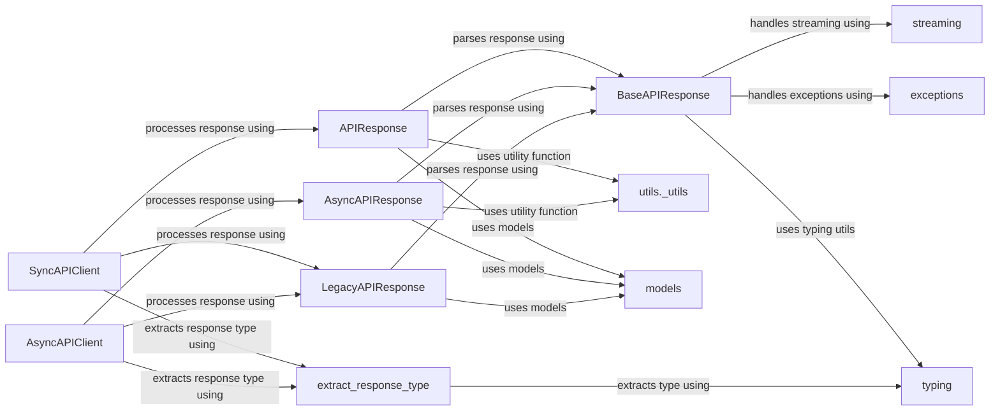

## Component Details

The Response Handler component is responsible for parsing and processing responses from the OpenAI API. It includes classes for handling different response types, such as JSON, binary, and streamed responses. Its main responsibility is to ensure that API responses are correctly parsed and processed, handling both successful responses and errors. It also provides compatibility with older versions of the API.

### SyncAPIClient
The SyncAPIClient class defines the base client for synchronous API calls. It is responsible for processing the API response and returning the appropriate data.

**Related Classes/Methods**:

- `openai._base_client.SyncAPIClient:_process_response` (full file reference)

### AsyncAPIClient
The AsyncAPIClient class defines the base client for asynchronous API calls. It is responsible for processing the API response and returning the appropriate data.

**Related Classes/Methods**:

- `openai._base_client.AsyncAPIClient:_process_response` (full file reference)

### APIResponse
The APIResponse class represents the API response and provides methods for parsing the response data. It handles both successful responses and errors.

**Related Classes/Methods**:

- `openai._response.APIResponse` (full file reference)
- `openai._response.APIResponse.parse` (full file reference)
- `openai._response.APIResponse.read` (full file reference)

### AsyncAPIResponse
The AsyncAPIResponse class represents the asynchronous API response and provides methods for parsing the response data. It handles both successful responses and errors.

**Related Classes/Methods**:

- `openai._response.AsyncAPIResponse` (full file reference)
- `openai._response.AsyncAPIResponse.parse` (full file reference)
- `openai._response.AsyncAPIResponse.read` (full file reference)

### LegacyAPIResponse
The LegacyAPIResponse class handles responses from older versions of the API, providing compatibility with previous response formats.

**Related Classes/Methods**:

- `openai._legacy_response.LegacyAPIResponse` (full file reference)
- `openai._legacy_response.LegacyAPIResponse:parse` (full file reference)
- `openai._legacy_response.LegacyAPIResponse._parse` (full file reference)

### BaseAPIResponse
The BaseAPIResponse abstract class defines the base functionality for API response parsing, including handling type aliases, annotated types, and streaming responses.

**Related Classes/Methods**:

- `openai._response.BaseAPIResponse:_parse` (full file reference)

### extract_response_type
The extract_response_type function extracts the response type from the API response.

**Related Classes/Methods**:

- `openai._response:extract_response_type` (full file reference)

### utils._utils
This module contains utility functions, such as `is_given`, used in the parsing of API responses.

**Related Classes/Methods**:

- `openai._utils._utils.is_given` (full file reference)

### models
This module contains functions for working with data models, such as adding request IDs.

**Related Classes/Methods**:

- `openai._models.add_request_id` (full file reference)
- `openai._models.is_basemodel` (full file reference)

### exceptions
This module defines custom exceptions, such as APIResponseValidationError, used for handling errors during API response processing.

**Related Classes/Methods**:

- `openai._exceptions.APIResponseValidationError` (full file reference)

### streaming
This module provides functionality for handling streaming responses, including checking for stream class types and extracting stream chunk types.

**Related Classes/Methods**:

- <a href="https://github.com/openai/openai-python/blob/master/src/openai/_streaming.py#L382-L385" target="_blank" rel="noopener noreferrer">`openai._streaming.is_stream_class_type` (382:385)</a>
- <a href="https://github.com/openai/openai-python/blob/master/src/openai/_streaming.py#L388-L410" target="_blank" rel="noopener noreferrer">`openai._streaming.extract_stream_chunk_type` (388:410)</a>

### typing
This module provides utility functions for working with types, such as checking for type aliases and extracting type arguments.

**Related Classes/Methods**:

- `openai._utils._typing.is_type_alias_type` (full file reference)
- `openai._utils._typing.is_annotated_type` (full file reference)
- `openai._utils._typing.extract_type_arg` (full file reference)