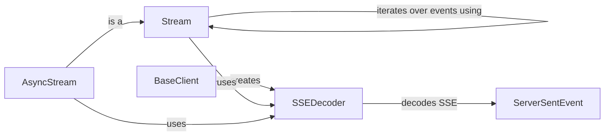

## Component Details

The Streaming Handler component is responsible for managing the streaming of data from the OpenAI API. It provides classes for handling both synchronous and asynchronous streams, as well as SSE decoding. Its primary role is to efficiently process large responses by streaming data chunks, decoding SSE events, and providing an interface for iterating over these events either synchronously or asynchronously. The component interacts with the API client to initiate streams and with response parsing logic to extract data from the stream.

### Stream
The `Stream` class handles the streaming of data from the OpenAI API in a synchronous manner. It initializes a stream and provides methods for iterating over events, handling errors, and closing the stream. It uses `SSEDecoder` to decode the stream of bytes into individual events.

**Related Classes/Methods**:

- <a href="https://github.com/openai/openai-python/blob/master/src/openai/_streaming.py#L22-L120" target="_blank" rel="noopener noreferrer">`openai._streaming.Stream` (22:120)</a>
- `openai._streaming.Stream.__init__` (full file reference)
- `openai._streaming.Stream.__stream__` (full file reference)
- `openai._streaming.Stream.__exit__` (full file reference)

### AsyncStream
The `AsyncStream` class handles the asynchronous streaming of data from the OpenAI API. It inherits from `Stream` and provides asynchronous methods for iterating over events, handling errors, and closing the stream. It also uses `SSEDecoder` to decode the stream of bytes into individual events.

**Related Classes/Methods**:

- <a href="https://github.com/openai/openai-python/blob/master/src/openai/_streaming.py#L123-L222" target="_blank" rel="noopener noreferrer">`openai._streaming.AsyncStream` (123:222)</a>
- `openai._streaming.AsyncStream.__init__` (full file reference)
- `openai._streaming.AsyncStream.__stream__` (full file reference)
- `openai._streaming.AsyncStream.__aexit__` (full file reference)

### SSEDecoder
The `SSEDecoder` class is responsible for decoding Server-Sent Events (SSE) from the stream of bytes received from the OpenAI API. It provides methods for iterating over bytes and decoding them into individual events. It handles the parsing of SSE formatted data.

**Related Classes/Methods**:

- <a href="https://github.com/openai/openai-python/blob/master/src/openai/_streaming.py#L266-L368" target="_blank" rel="noopener noreferrer">`openai._streaming.SSEDecoder` (266:368)</a>
- `openai._streaming.SSEDecoder.iter_bytes` (full file reference)
- `openai._streaming.SSEDecoder.aiter_bytes` (full file reference)
- `openai._streaming.SSEDecoder.decode` (full file reference)

### BaseClient
The `BaseClient` provides base functionality for making API requests. The `_make_sse_decoder` method is used to instantiate the `SSEDecoder` for handling streaming responses. It acts as the entry point for creating the SSE decoder.

**Related Classes/Methods**:

- `openai._base_client.BaseClient:_make_sse_decoder` (full file reference)