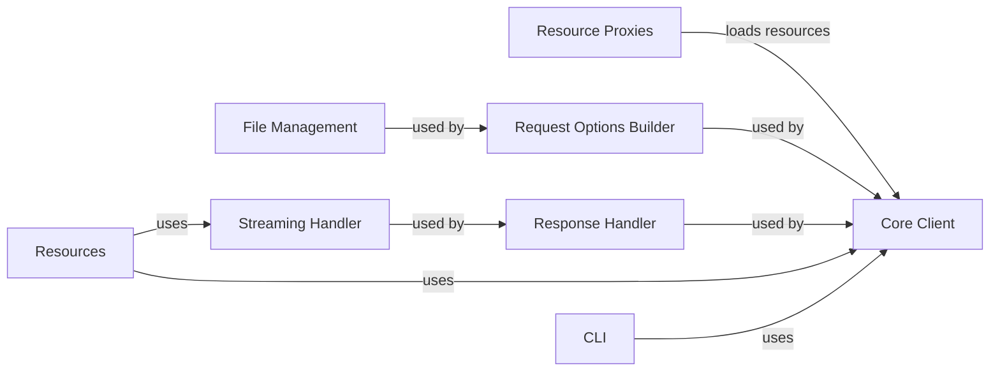

## Component Details

The openai-python library provides a comprehensive interface for interacting with the OpenAI API. It abstracts away the complexities of API communication, offering a set of high-level components for various tasks such as generating text, processing audio, managing files, and more. The core of the library revolves around a client that handles authentication, request construction, and response processing. Resources are exposed through proxy objects, and streaming is supported for large responses. The library also includes utilities for file management, request option building, and response handling. Finally, a CLI is provided for convenient command-line access to the API.

### Core Client
The Core Client component provides the fundamental building blocks for interacting with the OpenAI API. It manages authentication, constructs requests, processes responses, and handles errors. It includes synchronous and asynchronous client implementations, as well as utilities for building headers and processing response data. Its main responsibility is to provide a low-level interface for making API calls.

**Related Classes/Methods**:

- <a href="https://github.com/openai/openai-python/blob/master/src/openai/_streaming.py#L29-L224" target="_blank" rel="noopener noreferrer">`openai._base_client.BaseClient` (29:224)</a>
- <a href="https://github.com/openai/openai-python/blob/master/src/openai/_streaming.py#L227-L230" target="_blank" rel="noopener noreferrer">`openai._base_client.SyncAPIClient` (227:230)</a>
- <a href="https://github.com/openai/openai-python/blob/master/src/openai/_streaming.py#L233-L236" target="_blank" rel="noopener noreferrer">`openai._base_client.AsyncAPIClient` (233:236)</a>
- <a href="https://github.com/openai/openai-python/blob/master/src/openai/_streaming.py#L239-L301" target="_blank" rel="noopener noreferrer">`openai._base_client.SyncHttpxClientWrapper` (239:301)</a>
- <a href="https://github.com/openai/openai-python/blob/master/src/openai/_streaming.py#L304-L366" target="_blank" rel="noopener noreferrer">`openai._base_client.AsyncHttpxClientWrapper` (304:366)</a>
- <a href="https://github.com/openai/openai-python/blob/master/src/openai/_streaming.py#L400-L414" target="_blank" rel="noopener noreferrer">`openai._base_client._build_headers` (400:414)</a>
- <a href="https://github.com/openai/openai-python/blob/master/src/openai/_streaming.py#L417-L444" target="_blank" rel="noopener noreferrer">`openai._base_client._build_request` (417:444)</a>
- <a href="https://github.com/openai/openai-python/blob/master/src/openai/_streaming.py#L447-L468" target="_blank" rel="noopener noreferrer">`openai._base_client._process_response_data` (447:468)</a>
- <a href="https://github.com/openai/openai-python/blob/master/src/openai/_streaming.py#L471-L484" target="_blank" rel="noopener noreferrer">`openai._base_client._make_status_error_from_response` (471:484)</a>
- <a href="https://github.com/openai/openai-python/blob/master/src/openai/_streaming.py#L40-L43" target="_blank" rel="noopener noreferrer">`openai._client.OpenAI` (40:43)</a>
- <a href="https://github.com/openai/openai-python/blob/master/src/openai/_streaming.py#L46-L49" target="_blank" rel="noopener noreferrer">`openai._client.AsyncOpenAI` (46:49)</a>

### Resource Proxies
The Resource Proxies component employs lazy proxies to defer the loading of API resources until they are actually accessed. This optimization avoids unnecessary initialization and improves overall performance. It acts as an intermediary, providing access to various API resources through lazy-loaded proxies.

**Related Classes/Methods**:

- <a href="https://github.com/openai/openai-python/blob/master/src/openai/_streaming.py#L11-L11" target="_blank" rel="noopener noreferrer">`openai._module_client.AudioProxy` (11:11)</a>
- <a href="https://github.com/openai/openai-python/blob/master/src/openai/_streaming.py#L12-L12" target="_blank" rel="noopener noreferrer">`openai._module_client.BatchesProxy` (12:12)</a>
- <a href="https://github.com/openai/openai-python/blob/master/src/openai/_streaming.py#L13-L13" target="_blank" rel="noopener noreferrer">`openai._module_client.BetaProxy` (13:13)</a>
- <a href="https://github.com/openai/openai-python/blob/master/src/openai/_streaming.py#L14-L14" target="_blank" rel="noopener noreferrer">`openai._module_client.ChatProxy` (14:14)</a>
- <a href="https://github.com/openai/openai-python/blob/master/src/openai/_streaming.py#L15-L15" target="_blank" rel="noopener noreferrer">`openai._module_client.CompletionsProxy` (15:15)</a>
- <a href="https://github.com/openai/openai-python/blob/master/src/openai/_streaming.py#L16-L16" target="_blank" rel="noopener noreferrer">`openai._module_client.ContainersProxy` (16:16)</a>
- <a href="https://github.com/openai/openai-python/blob/master/src/openai/_streaming.py#L17-L17" target="_blank" rel="noopener noreferrer">`openai._module_client.EmbeddingsProxy` (17:17)</a>
- <a href="https://github.com/openai/openai-python/blob/master/src/openai/_streaming.py#L18-L18" target="_blank" rel="noopener noreferrer">`openai._module_client.EvalsProxy` (18:18)</a>
- <a href="https://github.com/openai/openai-python/blob/master/src/openai/_streaming.py#L19-L19" target="_blank" rel="noopener noreferrer">`openai._module_client.FilesProxy` (19:19)</a>
- <a href="https://github.com/openai/openai-python/blob/master/src/openai/_streaming.py#L20-L20" target="_blank" rel="noopener noreferrer">`openai._module_client.FineTuningProxy` (20:20)</a>
- <a href="https://github.com/openai/openai-python/blob/master/src/openai/_streaming.py#L21-L21" target="_blank" rel="noopener noreferrer">`openai._module_client.ImagesProxy` (21:21)</a>
- <a href="https://github.com/openai/openai-python/blob/master/src/openai/_streaming.py#L22-L22" target="_blank" rel="noopener noreferrer">`openai._module_client.ModelsProxy` (22:22)</a>
- <a href="https://github.com/openai/openai-python/blob/master/src/openai/_streaming.py#L23-L23" target="_blank" rel="noopener noreferrer">`openai._module_client.ModerationsProxy` (23:23)</a>
- <a href="https://github.com/openai/openai-python/blob/master/src/openai/_streaming.py#L24-L24" target="_blank" rel="noopener noreferrer">`openai._module_client.ResponsesProxy` (24:24)</a>
- <a href="https://github.com/openai/openai-python/blob/master/src/openai/_streaming.py#L25-L25" target="_blank" rel="noopener noreferrer">`openai._module_client.UploadsProxy` (25:25)</a>
- <a href="https://github.com/openai/openai-python/blob/master/src/openai/_streaming.py#L26-L26" target="_blank" rel="noopener noreferrer">`openai._module_client.VectorStoresProxy` (26:26)</a>
- <a href="https://github.com/openai/openai-python/blob/master/src/openai/_utils/_resources_proxy.py#L10-L60" target="_blank" rel="noopener noreferrer">`openai._utils._proxy.LazyProxy` (10:60)</a>

### Streaming Handler
The Streaming Handler component manages the streaming of data from the OpenAI API. It provides classes for handling both synchronous and asynchronous streams, as well as SSE decoding. Its primary role is to efficiently process large responses by streaming data chunks.

**Related Classes/Methods**:

- <a href="https://github.com/openai/openai-python/blob/master/src/openai/_streaming.py#L22-L120" target="_blank" rel="noopener noreferrer">`openai._streaming.Stream` (22:120)</a>
- <a href="https://github.com/openai/openai-python/blob/master/src/openai/_streaming.py#L123-L222" target="_blank" rel="noopener noreferrer">`openai._streaming.AsyncStream` (123:222)</a>
- <a href="https://github.com/openai/openai-python/blob/master/src/openai/_streaming.py#L266-L368" target="_blank" rel="noopener noreferrer">`openai._streaming.SSEDecoder` (266:368)</a>
- `openai._streaming.SSEDecoder.decode` (221:230)
- `openai._streaming.SSEDecoder.iter_bytes` (233:242)
- `openai._streaming.SSEDecoder.aiter_bytes` (245:254)

### File Management
The File Management component provides functionality for handling files, including uploading, downloading, and transforming files to httpx files. It facilitates the interaction with the OpenAI API by managing file-related operations.

**Related Classes/Methods**:

- <a href="https://github.com/openai/openai-python/blob/master/src/openai/_streaming.py#L11-L31" target="_blank" rel="noopener noreferrer">`openai._files.to_httpx_files` (11:31)</a>
- <a href="https://github.com/openai/openai-python/blob/master/src/openai/_streaming.py#L34-L54" target="_blank" rel="noopener noreferrer">`openai._files.async_to_httpx_files` (34:54)</a>
- <a href="https://github.com/openai/openai-python/blob/master/src/openai/_streaming.py#L57-L70" target="_blank" rel="noopener noreferrer">`openai._files._transform_file` (57:70)</a>
- <a href="https://github.com/openai/openai-python/blob/master/src/openai/_streaming.py#L73-L86" target="_blank" rel="noopener noreferrer">`openai._files._async_transform_file` (73:86)</a>
- <a href="https://github.com/openai/openai-python/blob/master/src/openai/_streaming.py#L89-L92" target="_blank" rel="noopener noreferrer">`openai._files.assert_is_file_content` (89:92)</a>

### Request Options Builder
The Request Options Builder component manages the options for making requests to the OpenAI API, including headers, parameters, and request transformations. It provides utilities for constructing and transforming request options before sending them to the API.

**Related Classes/Methods**:

- <a href="https://github.com/openai/openai-python/blob/master/src/openai/_streaming.py#L369-L397" target="_blank" rel="noopener noreferrer">`openai._base_client.make_request_options` (369:397)</a>
- <a href="https://github.com/openai/openai-python/blob/master/src/openai/_streaming.py#L11-L30" target="_blank" rel="noopener noreferrer">`openai._models.FinalRequestOptions` (11:30)</a>
- <a href="https://github.com/openai/openai-python/blob/master/src/openai/_utils/_resources_proxy.py#L10-L20" target="_blank" rel="noopener noreferrer">`openai._utils._transform.maybe_transform` (10:20)</a>
- <a href="https://github.com/openai/openai-python/blob/master/src/openai/_utils/_resources_proxy.py#L23-L33" target="_blank" rel="noopener noreferrer">`openai._utils._transform.async_maybe_transform` (23:33)</a>

### Response Handler
The Response Handler component is responsible for parsing and processing responses from the OpenAI API. It includes classes for handling different response types, such as JSON, binary, and streamed responses. Its main responsibility is to ensure that API responses are correctly parsed and processed.

**Related Classes/Methods**:

- <a href="https://github.com/openai/openai-python/blob/master/src/openai/_streaming.py#L12-L50" target="_blank" rel="noopener noreferrer">`openai._response.APIResponse` (12:50)</a>
- <a href="https://github.com/openai/openai-python/blob/master/src/openai/_streaming.py#L53-L91" target="_blank" rel="noopener noreferrer">`openai._response.AsyncAPIResponse` (53:91)</a>
- <a href="https://github.com/openai/openai-python/blob/master/src/openai/_streaming.py#L94-L110" target="_blank" rel="noopener noreferrer">`openai._response.BinaryAPIResponse` (94:110)</a>
- <a href="https://github.com/openai/openai-python/blob/master/src/openai/_streaming.py#L113-L129" target="_blank" rel="noopener noreferrer">`openai._response.AsyncBinaryAPIResponse` (113:129)</a>
- <a href="https://github.com/openai/openai-python/blob/master/src/openai/_streaming.py#L132-L148" target="_blank" rel="noopener noreferrer">`openai._response.StreamedBinaryAPIResponse` (132:148)</a>
- <a href="https://github.com/openai/openai-python/blob/master/src/openai/_streaming.py#L151-L167" target="_blank" rel="noopener noreferrer">`openai._response.AsyncStreamedBinaryAPIResponse` (151:167)</a>
- `openai._response.APIResponse.parse` (34:49)
- `openai._response.AsyncAPIResponse.parse` (72:90)
- <a href="https://github.com/openai/openai-python/blob/master/src/openai/_streaming.py#L170-L183" target="_blank" rel="noopener noreferrer">`openai._response.extract_response_type` (170:183)</a>

### Resources
The Resources component encompasses various API resources such as Models, Chat, Audio, Images, Moderations, Fine-tuning, Embeddings, Files, Vector Stores, Beta Features, Realtime, and Responses. It provides a high-level interface for interacting with these resources, simplifying common API operations. Its role is to expose the OpenAI API's functionalities in an organized and accessible manner.

**Related Classes/Methods**:

- <a href="https://github.com/openai/openai-python/blob/master/src/openai/resources/models.py#L23-L133" target="_blank" rel="noopener noreferrer">`openai.resources.models.Models` (23:133)</a>
- <a href="https://github.com/openai/openai-python/blob/master/src/openai/resources/models.py#L136-L246" target="_blank" rel="noopener noreferrer">`openai.resources.models.AsyncModels` (136:246)</a>
- <a href="https://github.com/openai/openai-python/blob/master/src/openai/resources/chat/chat.py#L19-L41" target="_blank" rel="noopener noreferrer">`openai.resources.chat.chat.Chat` (19:41)</a>
- <a href="https://github.com/openai/openai-python/blob/master/src/openai/resources/chat/chat.py#L44-L66" target="_blank" rel="noopener noreferrer">`openai.resources.chat.chat.AsyncChat` (44:66)</a>
- <a href="https://github.com/openai/openai-python/blob/master/src/openai/resources/chat/completions/messages.py#L10-L51" target="_blank" rel="noopener noreferrer">`openai.resources.chat.completions.completions.Completions` (10:51)</a>
- <a href="https://github.com/openai/openai-python/blob/master/src/openai/resources/chat/completions/messages.py#L54-L95" target="_blank" rel="noopener noreferrer">`openai.resources.chat.completions.completions.AsyncCompletions` (54:95)</a>
- <a href="https://github.com/openai/openai-python/blob/master/src/openai/resources/audio/transcriptions.py#L7-L10" target="_blank" rel="noopener noreferrer">`openai.resources.audio.audio.Audio` (7:10)</a>
- <a href="https://github.com/openai/openai-python/blob/master/src/openai/resources/audio/transcriptions.py#L13-L16" target="_blank" rel="noopener noreferrer">`openai.resources.audio.audio.AsyncAudio` (13:16)</a>
- <a href="https://github.com/openai/openai-python/blob/master/src/openai/resources/audio/transcriptions.py#L34-L348" target="_blank" rel="noopener noreferrer">`openai.resources.audio.transcriptions.Transcriptions` (34:348)</a>
- <a href="https://github.com/openai/openai-python/blob/master/src/openai/resources/audio/transcriptions.py#L351-L727" target="_blank" rel="noopener noreferrer">`openai.resources.audio.transcriptions.AsyncTranscriptions` (351:727)</a>
- <a href="https://github.com/openai/openai-python/blob/master/src/openai/resources/audio/transcriptions.py#L9-L46" target="_blank" rel="noopener noreferrer">`openai.resources.audio.translations.Translations` (9:46)</a>
- <a href="https://github.com/openai/openai-python/blob/master/src/openai/resources/audio/transcriptions.py#L49-L83" target="_blank" rel="noopener noreferrer">`openai.resources.audio.translations.AsyncTranslations` (49:83)</a>
- <a href="https://github.com/openai/openai-python/blob/master/src/openai/resources/models.py#L7-L60" target="_blank" rel="noopener noreferrer">`openai.resources.images.Images` (7:60)</a>
- <a href="https://github.com/openai/openai-python/blob/master/src/openai/resources/models.py#L63-L116" target="_blank" rel="noopener noreferrer">`openai.resources.images.AsyncImages` (63:116)</a>
- <a href="https://github.com/openai/openai-python/blob/master/src/openai/resources/models.py#L7-L43" target="_blank" rel="noopener noreferrer">`openai.resources.moderations.Moderations` (7:43)</a>
- <a href="https://github.com/openai/openai-python/blob/master/src/openai/resources/models.py#L46-L82" target="_blank" rel="noopener noreferrer">`openai.resources.moderations.AsyncModerations` (46:82)</a>
- <a href="https://github.com/openai/openai-python/blob/master/src/openai/resources/fine_tuning/__init__.py#L7-L10" target="_blank" rel="noopener noreferrer">`openai.resources.fine_tuning.fine_tuning.FineTuning` (7:10)</a>
- <a href="https://github.com/openai/openai-python/blob/master/src/openai/resources/fine_tuning/__init__.py#L13-L16" target="_blank" rel="noopener noreferrer">`openai.resources.fine_tuning.fine_tuning.AsyncFineTuning` (13:16)</a>
- <a href="https://github.com/openai/openai-python/blob/master/src/openai/resources/fine_tuning/jobs/jobs.py#L37-L412" target="_blank" rel="noopener noreferrer">`openai.resources.fine_tuning.jobs.jobs.Jobs` (37:412)</a>
- <a href="https://github.com/openai/openai-python/blob/master/src/openai/resources/fine_tuning/jobs/jobs.py#L415-L790" target="_blank" rel="noopener noreferrer">`openai.resources.fine_tuning.jobs.jobs.AsyncJobs` (415:790)</a>
- <a href="https://github.com/openai/openai-python/blob/master/src/openai/resources/models.py#L7-L43" target="_blank" rel="noopener noreferrer">`openai.resources.embeddings.Embeddings` (7:43)</a>
- <a href="https://github.com/openai/openai-python/blob/master/src/openai/resources/models.py#L46-L82" target="_blank" rel="noopener noreferrer">`openai.resources.embeddings.AsyncEmbeddings` (46:82)</a>
- <a href="https://github.com/openai/openai-python/blob/master/src/openai/resources/models.py#L7-L60" target="_blank" rel="noopener noreferrer">`openai.resources.files.Files` (7:60)</a>
- <a href="https://github.com/openai/openai-python/blob/master/src/openai/resources/models.py#L63-L116" target="_blank" rel="noopener noreferrer">`openai.resources.files.AsyncFiles` (63:116)</a>
- <a href="https://github.com/openai/openai-python/blob/master/src/openai/resources/vector_stores/files.py#L7-L10" target="_blank" rel="noopener noreferrer">`openai.resources.vector_stores.vector_stores.VectorStores` (7:10)</a>
- <a href="https://github.com/openai/openai-python/blob/master/src/openai/resources/vector_stores/files.py#L13-L16" target="_blank" rel="noopener noreferrer">`openai.resources.vector_stores.vector_stores.AsyncVectorStores` (13:16)</a>
- <a href="https://github.com/openai/openai-python/blob/master/src/openai/resources/vector_stores/files.py#L28-L428" target="_blank" rel="noopener noreferrer">`openai.resources.vector_stores.files.Files` (28:428)</a>
- <a href="https://github.com/openai/openai-python/blob/master/src/openai/resources/vector_stores/files.py#L431-L833" target="_blank" rel="noopener noreferrer">`openai.resources.vector_stores.files.AsyncFiles` (431:833)</a>
- <a href="https://github.com/openai/openai-python/blob/master/src/openai/resources/beta/beta.py#L36-L70" target="_blank" rel="noopener noreferrer">`openai.resources.beta.beta.Beta` (36:70)</a>
- <a href="https://github.com/openai/openai-python/blob/master/src/openai/resources/beta/beta.py#L73-L107" target="_blank" rel="noopener noreferrer">`openai.resources.beta.beta.AsyncBeta` (73:107)</a>
- <a href="https://github.com/openai/openai-python/blob/master/src/openai/resources/beta/beta.py#L9-L46" target="_blank" rel="noopener noreferrer">`openai.resources.beta.assistants.Assistants` (9:46)</a>
- <a href="https://github.com/openai/openai-python/blob/master/src/openai/resources/beta/beta.py#L49-L83" target="_blank" rel="noopener noreferrer">`openai.resources.beta.assistants.AsyncAssistants` (49:83)</a>
- <a href="https://github.com/openai/openai-python/blob/master/src/openai/resources/beta/threads/messages.py#L7-L43" target="_blank" rel="noopener noreferrer">`openai.resources.beta.threads.threads.Threads` (7:43)</a>
- <a href="https://github.com/openai/openai-python/blob/master/src/openai/resources/beta/threads/messages.py#L46-L82" target="_blank" rel="noopener noreferrer">`openai.resources.beta.threads.threads.AsyncThreads` (46:82)</a>
- <a href="https://github.com/openai/openai-python/blob/master/src/openai/resources/beta/realtime/sessions.py#L7-L10" target="_blank" rel="noopener noreferrer">`openai.resources.beta.realtime.realtime.Realtime` (7:10)</a>
- <a href="https://github.com/openai/openai-python/blob/master/src/openai/resources/beta/realtime/sessions.py#L13-L16" target="_blank" rel="noopener noreferrer">`openai.resources.beta.realtime.realtime.AsyncRealtime` (13:16)</a>
- <a href="https://github.com/openai/openai-python/blob/master/src/openai/resources/responses/responses.py#L50-L1150" target="_blank" rel="noopener noreferrer">`openai.resources.responses.responses.Responses` (50:1150)</a>
- <a href="https://github.com/openai/openai-python/blob/master/src/openai/resources/responses/responses.py#L1153-L2251" target="_blank" rel="noopener noreferrer">`openai.resources.responses.responses.AsyncResponses` (1153:2251)</a>
- <a href="https://github.com/openai/openai-python/blob/master/src/openai/resources/responses/responses.py#L7-L43" target="_blank" rel="noopener noreferrer">`openai.resources.responses.input_items.InputItems` (7:43)</a>
- <a href="https://github.com/openai/openai-python/blob/master/src/openai/resources/responses/responses.py#L46-L82" target="_blank" rel="noopener noreferrer">`openai.resources.responses.input_items.AsyncInputItems` (46:82)</a>

### CLI
The CLI component provides a command-line interface for interacting with the OpenAI API. It allows users to access various API functionalities directly from the command line. Its role is to provide a convenient way for users to interact with the OpenAI API without writing code.

**Related Classes/Methods**:

- <a href="https://github.com/openai/openai-python/blob/master/src/openai/cli/_cli.py#L126-L135" target="_blank" rel="noopener noreferrer">`openai.cli._cli.main` (126:135)</a>
- <a href="https://github.com/openai/openai-python/blob/master/src/openai/cli/_cli.py#L162-L229" target="_blank" rel="noopener noreferrer">`openai.cli._cli._main` (162:229)</a>
- <a href="https://github.com/openai/openai-python/blob/master/src/openai/cli/_api/_main.py#L8-L16" target="_blank" rel="noopener noreferrer">`openai.cli._api._main.register_commands` (8:16)</a>
- <a href="https://github.com/openai/openai-python/blob/master/src/openai/cli/_tools/migrate.py#L12-L15" target="_blank" rel="noopener noreferrer">`openai.cli._tools._main.register_commands` (12:15)</a>