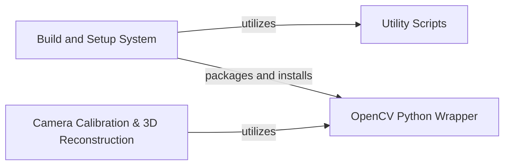

## Component Details

This graph illustrates the architecture of the opencv-python project, highlighting key components and their interdependencies. The `Build and Setup System` is central to the project's distribution, relying on `Utility Scripts` and packaging the `OpenCV Python Wrapper`. The `Camera Calibration & 3D Reconstruction` component, which provides core computer vision functionalities, directly utilizes the `OpenCV Python Wrapper` to access the underlying OpenCV library.

### OpenCV Python Wrapper
This component serves as the primary Python interface to the underlying OpenCV library. It handles the loading of the compiled OpenCV modules and exposes their functionalities to Python users. It also manages the data files associated with OpenCV.

**Related Classes/Methods**:

- `cv2.__init__` (full file reference)

### Build and Setup System
This component is responsible for the build, installation, and packaging of the opencv-python library. It defines how the package is built from source, handles dependencies, and prepares the distribution for installation.

**Related Classes/Methods**:

- `setup` (full file reference)
- `_build_backend.backend` (full file reference)

### Utility Scripts
This component encompasses various utility scripts used within the opencv-python project, such as those for finding the version, patching auditwheel whitelists, and potentially other helper functions for development or testing.

**Related Classes/Methods**:

- `find_version` (full file reference)
- `patch_auditwheel_whitelist` (full file reference)
- `scripts.__init__` (full file reference)

### Camera Calibration & 3D Reconstruction
Deals with camera parameters, undistortion, stereo vision, and 3D scene understanding, utilizing the core functionalities provided by the OpenCV library through its Python wrapper.

**Related Classes/Methods**:

- `cv2.calibrateCamera` (full file reference)
- `cv2.findHomography` (full file reference)
- `cv2.stereoCalibrate` (full file reference)

### [FAQ](https://github.com/CodeBoarding/GeneratedOnBoardings/tree/main?tab=readme-ov-file#faq)