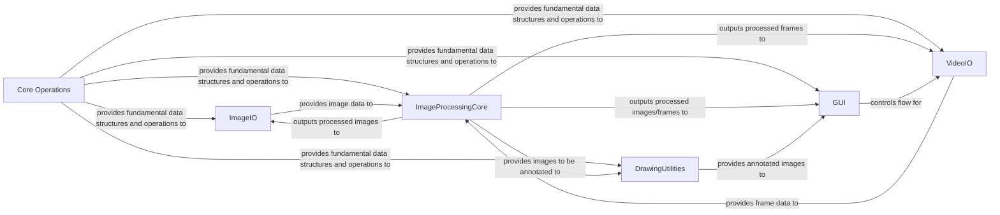

## Component Details

This architecture outlines the core components of an image and video processing system using OpenCV. It details how fundamental data structures and operations are provided, how images and videos are handled for input/output, how core image processing functions are applied, and how results are displayed and annotated.

### Core Operations
Provides fundamental data structures like `cv2.Mat` and basic array manipulation functions essential for all image and video processing tasks.

**Related Classes/Methods**:

- `cv2.Mat` (full file reference)
- `cv2.add` (full file reference)
- `cv2.subtract` (full file reference)

### ImageIO
This component is responsible for handling the loading of images from various file formats into memory and saving processed images back to disk. It acts as the primary interface for static image data persistence.

**Related Classes/Methods**:

- `cv2.imread` (full file reference)
- `cv2.imwrite` (full file reference)

### VideoIO
This component manages the acquisition of video frames from cameras or video files and the writing of video frames to output files. It provides the necessary functionalities for real-time video stream processing.

**Related Classes/Methods**:

- `cv2.VideoCapture` (full file reference)
- `cv2.VideoWriter` (full file reference)

### ImageProcessingCore
This central component provides a wide array of fundamental image manipulation and transformation functions. It includes operations like resizing, color space conversion, and basic filtering, forming the backbone for more complex computer vision tasks.

**Related Classes/Methods**:

- `cv2.cvtColor` (full file reference)
- `cv2.resize` (full file reference)
- `cv2.GaussianBlur` (full file reference)
- `cv2.Canny` (full file reference)

### GUI
This component handles the display of images and video frames in windows, and manages user interactions such as keyboard presses. It is crucial for visualizing processing results and controlling application flow.

**Related Classes/Methods**:

- `cv2.imshow` (full file reference)
- `cv2.waitKey` (full file reference)
- `cv2.destroyAllWindows` (full file reference)
- `cv2.namedWindow` (full file reference)

### DrawingUtilities
This component provides functions for drawing various geometric shapes, text, and other annotations directly onto image frames. It is commonly used for visualizing detected features, bounding boxes, or adding informational overlays.

**Related Classes/Methods**:

- `cv2.line` (full file reference)
- `cv2.rectangle` (full file reference)
- `cv2.circle` (full file reference)
- `cv2.putText` (full file reference)

### [FAQ](https://github.com/CodeBoarding/GeneratedOnBoardings/tree/main?tab=readme-ov-file#faq)